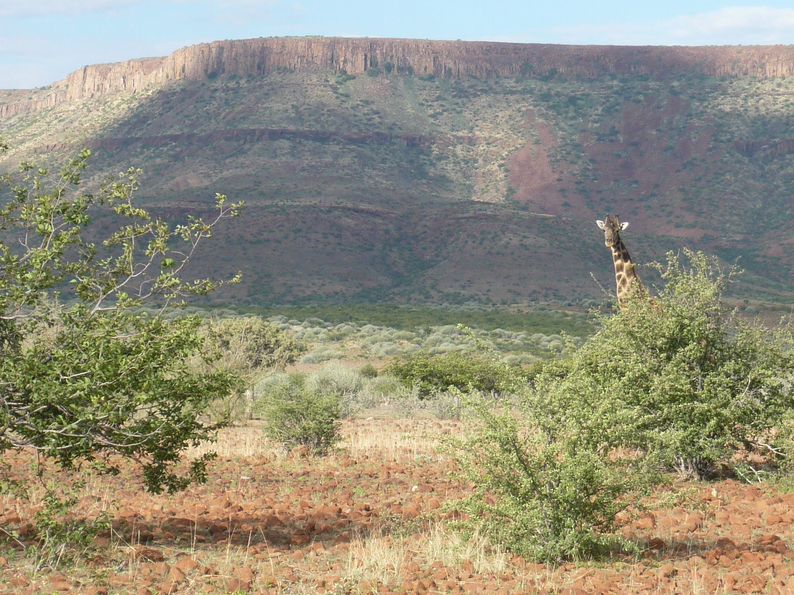

## SHLectures

## Lecture materials at SHU

  
&nbsp; &nbsp; 
  

[R package installation instruction](https://seiroito.github.io/SHLectures/InstallPackagesInR.html).

Lecture slides etc. 2024 will be placed here.  

* Lecture 01  
   * [01](https://seiroito.github.io/SHLectures/lec_slides/2024/01.html)  
   * [RP01](https://seiroito.github.io/SHLectures/lec_slides/2024/RP/RP01.html)  
   * [hw02](https://seiroito.github.io/SHLectures/homeworks/2024/2/hw2_tufte.html)  

