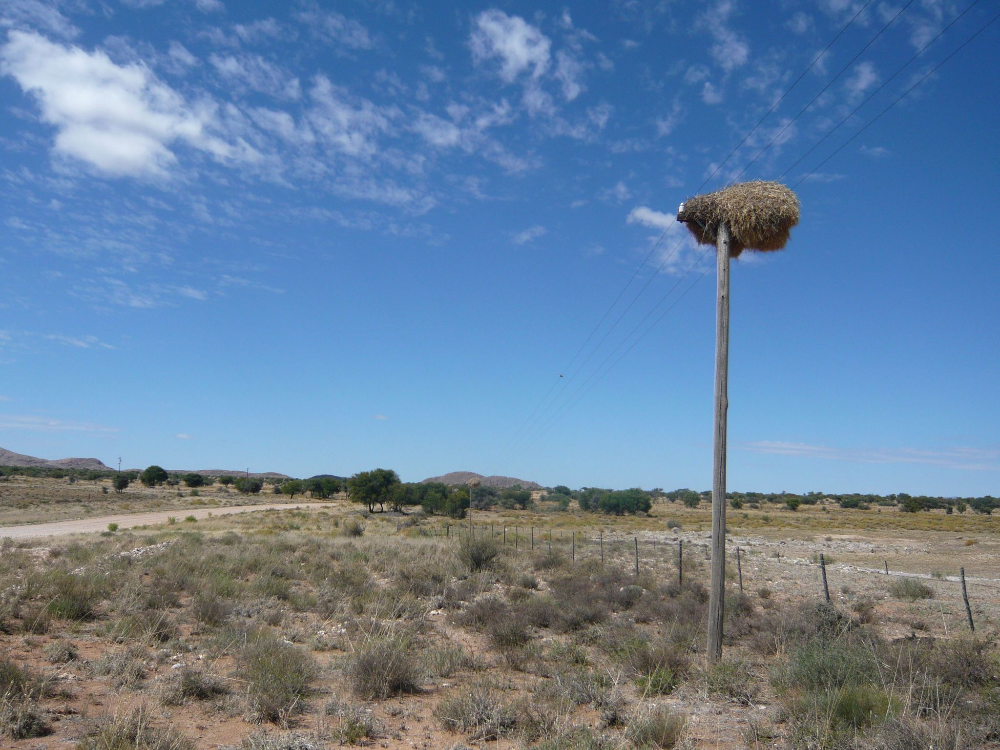

## SHLectures

## Lecture materials at SHU

  
&nbsp; &nbsp; 
  

[R package installation instruction](https://seiroito.github.io/SHLectures/CommonFiles/1/InstallPackagesInR.html).

Lecture slides etc. (2024 are placed [here](README2024.md)).  

* Lecture 01  
   * [01](https://seiroito.github.io/SHLectures/lec_slides/2026/01.html)  
   * [RP01](https://seiroito.github.io/SHLectures/lec_slides/2026/RP/RP01.html)  
