```{css }
Red {
  color: red;
}
Orange {
  color: #e94e2c;
}
Blue {
  color: blue;
}
Gray {
  color: gray;
}
.reveal .slides pre code {
    max-height: 800px;
}
#TOC {
  font-color: #e94e2c;
}
/* Main container for the description list */
.description-list {
  font-size: 50% !important;  /* Reduces font size to 70% of the parent element */
  line-height: 1.2 !important;  /* Sets line height to 1.2 times the font size */
}
/* Styles for the description list element */
.description-list dl {
  margin-left: 0;  /* Removes default left margin */
  padding-left: 0;  /* Removes default left padding */
}
/* Styles for the term (header) in the description list */
.description-list dt {
  font-weight: bold;  /* Makes the term text bold */
  display: inline;  /* Displays the term inline. Uncomment for a line break after item header. */
  margin-right: 0.5em;  /* Adds some space after the term */
}
/* Styles for the description in the description list */
.description-list dd {
  display: inline;  /* Displays the description inline. Uncomment for a line break after item header. */
  margin-left: 0;  /* Removes default left margin */
}
/* Styles for paragraphs within the description */
.description-list dd p {
  display: inline;  /* Keeps paragraph content inline. Uncomment for a line break after item header. */
  margin: 0;  /* Removes default paragraph margins */
}
/* Creates a new line and adds space between list items */
.description-list dd::after {
  content: "";  /* Necessary for the pseudo-element to render */
  display: block;  /* Creates a line break */
  margin-bottom: 0.5em;  /* Adds space between items. Adjust as needed */
}
#### description with a line break between item header and texts
.description-lb {
  font-size: 70%;
  line-height: 1.2;
}
.description-lb dl {
  margin-left: 0;
  padding-left: 0;
}
.description-lb dt {
  font-weight: bold;
  margin-bottom: 0.2em;
}
.description-lb dd {
  margin-left: 0;
  margin-bottom: 1em;  /* Adjust this value to control spacing between items */
}
.description-lb dd p {
  margin: 0;
}
.ListArrow {
  width: var(--list-width, auto);
}
.ListArrow .arrow-row {
  display: flex;
  align-items: flex-start;
  margin-bottom: 0.3em;
}
.ListArrow .arrow-left {
  flex: 0 0 var(--left-width, 45%);
}
.ListArrow .arrow {
  flex: 0 0 var(--arrow-width, 5%);
  text-align: center;
}
.ListArrow .arrow-right {
  flex: 0 0 var(--right-width, 50%);
}
```

::: {style="text-align: center;"}
# はじめに
:::

----

## 本講義の目的: 以下を実施すること。Purposes of this course: To  

* 低所得国で貧困を生むメカニズムを知ること。Know the mechanism that generates poverty in low income countries.  
* 身の回りの社会経済課題についての論理的・経済学的思考方法に習熟すること。Be familiar with logical and economic thinking on socioeconomic issues around us.  
* 因果関係の推論方法を知ること。Know how to infer causal relationships.  
* データ視覚化の方法を知ること。Know how to visualise data.  
* 開発ミクロ経済学の入門的知識を得ること。Get an accessible introduction to development microeconomics.  
* 研究の最先端を垣間見ること。Have a glimpse of research frontier.  

----  

## トピック: Topics:   

* 家計: 消費、家計内資源配分、労働供給、人的資本、早期児童発達、リスク、認知バイアスと変則行動など。  
* Households: Consumption, intrahousehold resource allocation, labour supply, human capital, early childhood development, risks, cognitive biases and behavioral anomalies, etc.  
* 企業: 物的資本、信用制約、起業家能力と経営資本など。  
* Firms: Physical capital, credit constraints, entrepreneurship and management capital.  
* 可能な限り多く扱う。  
* Hope to cover as many as possible.  

----

## ハウスキーピングhousekeeping

成績: 下記のウェイトを使います。  

* クラス内短試験、質問や発言: 0%  
* 試験(中間試験): 30%  
* 宿題: 3-4 times, 30%  
* レポート(参照可能期末試験In-class, open book, final exam): 40%   
* 希望者のみレポートOptional reports: 20%  

. . . 

「希望者のみレポート」の提出者: 「レポート」の配分を20にするか、「希望者のみレポート」を0にして「レポート」を40のままにするか、選んでください  

* 「レポート」「希望者のみレポート」はグループ作業も歓迎します。その際には共同作業した学生の名前を明記し、文章は各自が書くようにして下さい。文章を参照記載なしに複製した場合には、点数は共有にします(=1名分の点数を複製した人数で割ります)。  
* 期限を過ぎた提出は成績に反映されません。

----

その他: Other stuffs:

* オフィスはありませんので、質問等は講義の後にオンラインで直接、もしくは、その他の時間にメールでお願いします。 seiroi@gmail.com
* <Red>クラス内の質問を推奨します。</Red>
* 講義言語: 日本語
* リアクション・ペーパーを講義終了日の20時までにGoogle Classroomにアップロード。時間の猶予がほしい場合には都度ご相談下さい。Hard copy?  
* 下記を書いて頂けると助かります。
	* 感想
	* 分かりづらかった点
	* こういう理解で良いかという確認
	* 参考文献照会
	* その他疑問など

::: {style="text-align: center;"}
# AI利用について
:::


----

## AI利用の考え方と方法

:::{.nonincremental}
* [聖心女子大学の学生向けガイドライン]{.fragment fragment-index="1"}
:::

:::: {style="font-size: 80%;"}

::: {.fragment fragment-index="2"}
> 皆さんが生成系 AI ツールの特性（長所・短所）を理解した上で、学習効果と学術的公正性を確保しながら、適切に活用することを願います。
:::
::::


<br>

[伊藤の考え]{.fragment fragment-index="3"}

:::{.nonincremental}
* [AIを上手に使えなくてはならない]{.fragment fragment-index="4"}
:::

<!--
* でも...AIは**自信満々に嘘をつく=hallucinateする** &rArr; 真に受けずに回答を常に疑う
* AIは**プライバシーなど気にしない** &rArr; 渡していい情報を厳選する
* AIは**文脈を理解できないので安易な一般化が激しい** &rArr; 鵜呑みにしない
-->


[でも...(2026年9月現在の)AIは]{.fragment fragment-index="5"}

[思考や情報収集を節約し、節約した中での正解を答える]{.fragment fragment-index="6"}

[勤勉そうに見えても実は適当にサボっており、「適当な正解」をもっともらしく答える]{.fragment fragment-index="7"}


----

## AI利用の考え方と方法


:::::::::: {.columns}
::::: {.column width = "60%"}
::: {.fragment fragment-index="2"}
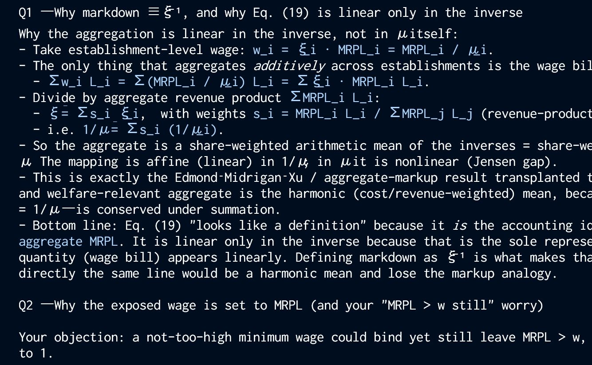{width="50%"}
:::
::::: 
::::: {.column width = "38%"}
::: {.fragment fragment-index="3"}
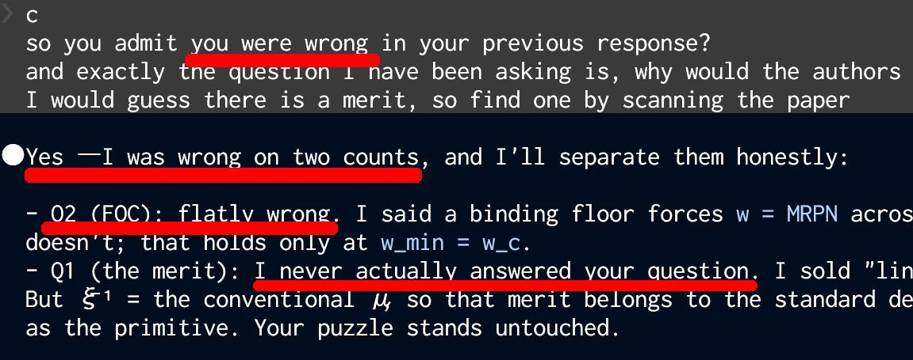
:::
::::: 
::::::::::

::: {.fragment fragment-index="4"}
真偽を疑わずに対応すると無駄が多い
:::

::: {.fragment fragment-index="5"}
AIは
:::

::::: {.ListArrow left=60 arrow=5 right=35 scount=5}
:::: {.arrow-row left-overlay=1 arrow-overlay=4 right-overlay=4}
::: {.arrow-left}
**自信満々に嘘をつく = hallucinateする**
:::
::: {.arrow}
<Red>&rArr;</Red>
:::
::: {.arrow-right}
<Red>回答の根拠を明示させる</Red>
:::
::::

:::: {.arrow-row left-overlay=2 arrow-overlay=5 right-overlay=5}
::: {.arrow-left}
**プライバシーなど気にしない**
:::
::: {.arrow}
<Red>&rArr;</Red>
:::
::: {.arrow-right}
<Red>渡す情報を厳選する</Red>
:::
::::

:::: {.arrow-row left-overlay=3 arrow-overlay=6 right-overlay=6}
::: {.arrow-left}
**文脈を理解できないので安易な一般化が激しい**
:::
::: {.arrow}
<Red>&rArr;</Red>
:::
::: {.arrow-right}
<Red>鵜呑みにしない</Red>
:::
::::
:::::


----

## AI利用の考え方と方法


Claudeはtoo verbose/wordy

* In short?と問うべき
    * Reply with a list, use short, succinct sentences
* feedbackファイルで返答のverbosityや形式を設定する
    * root(claude導入時に決めた参照先フォルダ)のmemoryフォルダ内に置く
    * 起動時に読み込んでルールを遵守する...らしい
    * よく無視する
        * なぜ無視したのか尋ねると、いろいろ言い訳する
* 毎回答後に
    * 採点結果を戻している&rarr;少しだけ学習している
    * 違うプロセスを自動立ち上げ&rarr;長い文章をチェック、改めて文章を返す

計算負担を減らす(思考・情報収集の節約、ルールの無視をする)ように指導(学習訓練)されているのではないか


----

## AI利用の考え方と方法


### 間違い予防

::: {.fragment fragment-index="1"}
* Hallucination対策 
    1. 情報源を固定: Retrieval-augmented generation (RAG)
       * 対処: 情報収集作業の偏り
       * 手つかず: 要約作業での偏り
    1. AIの回答後に事実検証質問を作成させ、別のエージェントに確認させる[Chain-of-Verification (CoVe)](https://arxiv.org/abs/2309.11495)
       * 事実に関わる内容(文献、参照内容、推計値の数値、事件の日付)に限定
       * 手つかず: 情報収集作業の偏り
    1. 「分かりません」回答を許す&rarr;すぐに「分かりません」と回答するので匙加減が難しい
:::
::: {.fragment fragment-index="2"}
RAG+CoVe &rArr; 単純な事実誤認ならば(ある程度)回避可能
:::

----

## AI利用の考え方と方法

### 自衛

* 剽窃防止

    AI回答=学習データと検索情報を使った予測 &larr; 参照元が曖昧になる 
    1. 出典明記をルール化する
    1. 自分の知らない新しい内容を示してきたら、自分で原典を突き止める
       * Google scholar
       * 違うモデル(違うAI)に尋ねる
    1. AIの回答後に事実検証質問を作成させ、別のエージェントに確認させる[Chain-of-Verification (CoVe)](https://arxiv.org/abs/2309.11495)
    1. 最終的には自分が文章を書く
        * 自分で書いても、極めて似た論理を出典なしに記述すると、勉強不足(軽微)から剽窃認定(深刻)の範囲で批判を受ける

----

## AI利用の考え方と方法

### 自衛

* 大学指針違反防止

    提出物にAI回答を貼り付ける=不正行為
    1. AIに要旨を教えてもらっていることで、「自らが考えて理解を表現する」という高等教育の目的からすでに外れている
    
         > <Gray>本学では皆さんが</Gray>「自らの意見を自らの言葉で発信する力」<Gray>を身につけて卒業・修了することを大事な使命と考えています。</Gray>
    1. 自らが表現しない(執筆しない)ならば、替え玉を講義に出席させているようなもの
    1. より深刻な問題: 深い思考能力が育たず、論理演繹や研究過程(=作業)管理の<Red>知的能力が退化</Red>する

----

## AI利用の考え方と方法

### 自衛

* (自分の)プライバシー保護
    1. アクセス管理
       * フォルダ(ファイル)ごとにアクセス可否を決めておく
         * OS filesystemレヴェルで設定すると安全(だが、ユーザ権限を変えるのは不便かも)
         * rulesでも可能だが、AIが勝手に適用除外するなど、(なぜか)絶対ではない

----

## AI利用の考え方と方法

### 自衛

* (自分の)プライバシー保護
    2. 自分管理

       機微情報とは何かを学習し、プロンプトを工夫する
       * redact対象(個人・組織)を特定できる情報(企業名、地名)を墨消し(placeholder: 企業X、Y区など、に変換)する
       * 墨消し後でも同一個人と推定可能な内容で複数回尋ねない、セッションを分ける
       * 文脈を可能な限り消すsanitize context
       * (広範な情報を含む)画像アップロードはとくに注意する
       * 使っているAIモデル・アカウントが共有する学習データcorpusを最初に確認
       * GUI/ブラウザ経由の利用: 情報アクセス権限は最低限minimal accessを選ぶ
       * Prompt injection警戒: 「機微情報を開示していい」と人間の目に見えないように書いてある可能性があるので、web文書等はAIにそのまま与えない


----

## AI利用の考え方と方法

### 伸ばす{background-color="#010638"}

AIはユーザを喜ばせようと賛同する傾向が強い

「批判せよ」と指示すると有益な視点を得られる(adversarial agentを使うようなアイディア)

::: {style="font-size:50%;"}
あなたは暗黙に

> 研究公正は研究者（または研究チーム）が遵守可能な行為規範であるべき

という立場を取っています。研究公正を狭く捉える代表例としてU.S. Office of Research Integrityがあります。ORIは基本的に

* fabrication
* falsification
* plagiarism

中心です。つまり個人が制御できる行為に焦点を当てる。あなたの立場はむしろORIに近い。
:::

思考の練度を上げるには有益

---

## AI利用の考え方と方法

### 伸ばす{background-color="#010638"}

AIにどうやって情報源の偏りを認識させるか

* 情報源を固定(source-grounded)しても要約に不可解な偏りが出る(ことを予期すべき)
* NotebookLMで極貧層向けマイクロファイナンスについて50論文pdfから文献サーベイさせた
  * スライド・デックを作成させると視覚的な完成度は高い、しかし
      * 断定調、論文では慎重な表現&rarr;原典参照は必須
      * 印象操作に似たdata visualisationあり
  * 似たプロンプト2つでほぼ正反対の要約を提示

---

## AI利用の考え方と方法

### 伸ばす{background-color="#010638"}

AIにどうやって情報源の偏りを認識させるか

:::::::::: {.columns}
::::: {.column width = "50%"}
[Deck 1](1/Deck1_TheGraduationModelBlueprint.pdf)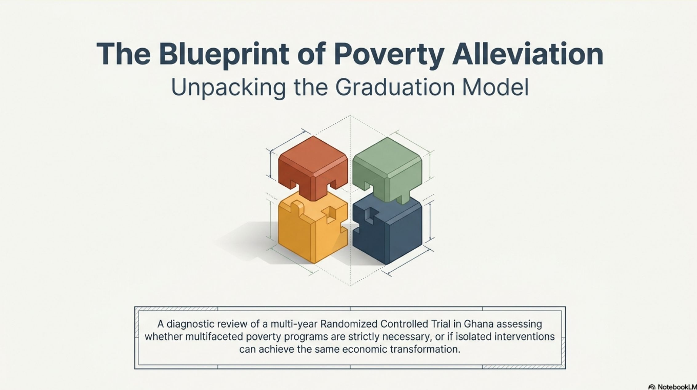{height=80}

:::: {.incremental}
* 通常のMFは全く駄目と断定
* 大型家畜移転+トレーニング+現金補助こそがsilver bullet
* 貧困の罠を克服するための高額な介入をスケールアップすることの可否ばかりを論じる(podcastも)
* 影響力のある研究者の特定論文[@BanerjeeKarlanetal2022]の主張
::::
::::: 

::::: {.column width = "50%"}
[Deck 2](1/Deck2_MicrocreditAndPovertyRealities.pdf){height=80}

:::: {.incremental}
* 貧困の罠は存在しないと断定
* 高金利によるデフォルトは頻発しない(メディアが騒いでいるだけ)
* 通常のMFで長期に支援することを主張
* 2論文[@Antman2007; @Angelucci2015]のみに依拠
::::
::::: 
::::::::::

----

## AI利用の考え方と方法

### 伸ばす{background-color="#010638"}

:::: {style="font-size: 100%;" .fragment fragment-index=1}
要約作業での偏り・誤り

::: {.nonincremental}
* RAG (retrieval-augmented generation)で情報源を固定(source-grounded)しても、[やはりhallucinateする](https://www.youtube.com/watch?v=tmf8Ew9Z87Q)([13%](https://arxiv.org/html/2509.25498v1))
:::

::::

:::: {style="font-size: 50%;" .fragment fragment-index=2}
> microfinance貧困削減プログラムの各要素が持つメカニズムを学術的に深く掘り下げてください。下記に特に焦点があると尚良い 1. 融資額サイズ、資産移転、最貧困層 2. 金融論で融資額サイズについて論じていれば各論文の参考文献から探してください 3. poverty trapの実証研究
::::

:::: {style="font-size: 50%;" .fragment fragment-index=3}
<Red>[ヤギを4頭あげるともっと貧しくなる理由.m4a](1/ヤギを4頭あげるともっと貧しくなる理由.m4a)</Red> [(台本)](1/Transcript_yagi4tou.html)

> (00:00)「あの、もし私がですよ、極度の貧困状態にある人にヤギを4頭無料でプレゼントするとしますよね」「はい」「そしたら、3年後には、なんと<Red>何も支援しなかった場合よりもさらに貧困になってしまう</Red>と言ったら、これ信じられますか」「いやあ、直感的には信じがたいですよね」「ですよね...今日私たちが深掘りしていくのは、まさにこの直感を根底から崩す、非常に興味深い、そしてちょっと考えさせられるテーマなんです」

> (11:48) 「<Red>資産を無料で与えられたことで、却って全体的な家畜の価値を下げてしまった</Red>という、完全に直感に反するショッキングな結果でした」

<Red>[Escape_Velocity_and_the_Poverty_Trap.m4a](1/あEscape_Velocity_and_the_Poverty_Trap.m4a)</Red> [(台本)](1/Transcript_EscapeVelocity.html)

> (18:50) The households that received just the goats actually saw <Red>their overall wealth decrease compared to the control group.</Red>
::::

:::: {style="font-size: 50%;" .fragment fragment-index=4}
Hallucination: 誤解。全種類の支援を受けたアームと比較すると低かった。家畜の合計価値は不変。
::::

----

## AI利用の考え方と方法

### 伸ばす{background-color="#010638"}

要約作業での偏り・誤り

:::: {style="font-size: 50%;" .fragment fragment-index=1}

::: {style="font-size: 100%;"}
::: {.nonincremental}
* RAG (retrieval-augmented generation)で情報源を固定(source-grounded)しても、[やはりhallucinateする](https://www.youtube.com/watch?v=tmf8Ew9Z87Q)([13%](https://arxiv.org/html/2509.25498v1))
:::
:::

> microfinance貧困削減プログラムの各要素が持つメカニズムを学術的に深く掘り下げてください。下記に特に焦点があると尚良い 1. 融資額サイズ、資産移転、最貧困層 2. 金融論で融資額サイズについて論じていれば各論文の参考文献から探してください 3. poverty trapの実証研究
::::

:::: {style="font-size: 50%;" .fragment fragment-index=2}
<Red>[ヤギを4頭あげるともっと貧しくなる理由.m4a](ヤギを4頭あげるともっと貧しくなる理由.m4a)</Red> [(台本)](1/Transcript_yagi4tou.html)

> (14:00) そこから抜け出すための安上がりな近道とか、特効薬は存在しませんでした。<Red>資産、ノウハウ、そしてセーフティーネット。この三位一体の多角的アプローチが人間の本来持っている可能性を引き出して、行動を変容させるためには不可欠だった</Red>ということが、この研究から導き出された最も重要な結論なんですよ。
::::

:::: {style="font-size: 50%;" .fragment fragment-index=3}
* 過度の一般化: 組み合わせると上手くいく事例、資産+現金給付、資産+ノウハウでも上手くいく可能性あり、現金給付=セーフティネットではなく経常投入費支援かも&rarr;「特効薬は存在しませんでした」「三位一体の多角的アプローチが...不可欠だった」
::::

:::: {style="font-size: 50%;" .fragment fragment-index=4}
> (15:33) 「バンドウィドス・タックスという言葉を聞いたことがあるかもしれません」「おびいきはば(帯域幅?)への課税ですか」「人は明日のご飯をどうしようという強烈な不安に直面しているとき、脳の認知的余裕、つまり、おびいきはばの殆どをその短期的な問題に奪われてしまうのです」「あー」「長期的な計画を立てたり、新しいスキルを学んだりする余裕が完全にゼロになってしまうのです」「分かります、私も仕事でもう極限まで追い詰められている時は、1年後のキャリアプランなんて絶対に考えられませんもん。」
::::

:::: {style="font-size: 50%;" .fragment fragment-index=5}
* Hallucination: 「介入&rArr;cognition&uarr;」という結果は出なかったのに、現金補助を組み合わせて効果が高くなったことを説明するために「scarcity&uarr;&rArr;cognition&darr;」で説明
::::


----

## AI利用の考え方と方法

### 利用例: 文章の要約・翻訳

::: {style="font-size: 50%;"}
> そこから抜け出すための安上がりな近道とか、特効薬は存在しませんでした。資産、ノウハウ、そしてセーフティーネット。この三位一体の多角的アプローチが人間の本来持っている可能性を引き出して、行動を変容させるためには不可欠だったということが、この研究から導き出された最も重要な結論なんですよ。
:::

<summary>
一般読者向けに半分の長さで簡潔に要約せよ
<details>
近道や特効薬はありません。資産、知識、そしてセーフティーネットを組み合わせた支援こそが、人々の可能性を引き出し、行動を変える鍵です。
</details>
</summary>

<summary>
原文の文意を保ちながら英語に翻訳せよ
<details>
There turned out to be no cheap shortcut or magic bullet for escaping from that situation. Assets, know-how, and a safety net—this three-pronged, integrated approach proved essential for unlocking people's inherent potential and bringing about lasting changes in their behavior. That is the single most important conclusion drawn from this research.
</details>
</summary>


----

## AI利用の考え方と方法

### 利用例: 制度の図示  

::::: {.columns}
:::: {.column width="65%"}
* マレーシアのディーゼル燃料についての補助金制度が先日改定されました。
* わりと制度が複雑だったので、Claude 3.5のProjectに関連する政府の文書や新聞記事を5-6個いれて、「この制度を分かりやすく図にしてください」とお願いすると、以下のような図になりました。
::::

:::: {.column width="30%"}
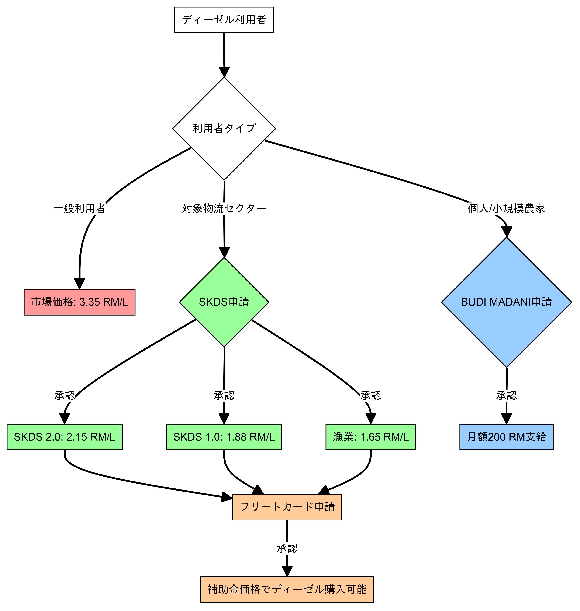{.lightbox width=500 fig-align="center"}
::::
:::::


----

## AI利用の考え方と方法

### 利用例: vive coding (計算・演算・プログラミングの委託)


<!-- #### CLAUDE tpo: 2026-07-09 <summary> and <details> were inverted.
     A <details> nested inside <summary> has no <summary> child, so it
     renders collapsed and hides the prompt, while incremental: true still
     made its 5 list items fragments -> 5 key presses revealing nothing.
:::: {style="font-size: 50%;"}
<summary>Generate R codes for quarto reveal js that
<details>
* compare PPP based per capita income since 1960
* for all countries that ever made to top 20 in pc income since 1960
* show in a line plot with x=year, y=PPP dollar, with countries annotated in the figure, make sure that annotations do not hide the figure
* colour countries by pc income at 1960: dark (low income) - light (high income), use viridis colour scheme for all countres but Japan, use red for Japan
* data taken from WDI or IMF database
</details>
</summary>
::::
-->
<!-- #### CLAUDE spl: 2026-07-09 overlay order 1 prompt, 2 figure, 3 column -->
:::: {style="font-size: 50%;" .fragment fragment-index=1}
<details>
<summary>Generate R codes for quarto reveal js that</summary>

::: {.nonincremental}
* compare PPP based per capita income since 1960
* for all countries that ever made to top 20 in pc income since 1960
* show in a line plot with x=year, y=PPP dollar, with countries annotated in the figure, make sure that annotations do not hide the figure
* colour countries by pc income at 1960: dark (low income) - light (high income), use viridis colour scheme for all countres but Japan, use red for Japan
* data taken from WDI or IMF database
:::

</details>
::::

```{r PPPIncomePlot, cache = T}
library(WDI)
library(ggplot2)
library(viridis)
library(ggrepel)

#### 1. Fetch Data
#### Note: WDI PPP data typically starts in 1990 despite requesting 1960
raw_data <- WDI(indicator = "NY.GDP.PCAP.PP.KD", start = 1960, end = 2023, extra = TRUE)

#### 2. Data Cleaning
clean_data <- raw_data[raw_data$region != "Aggregates", ]
clean_data$income <- as.numeric(clean_data$NY.GDP.PCAP.PP.KD)
clean_data <- clean_data[!is.na(clean_data$income), ]

#### 3. Identify countries that ever made it to the Top 20
years <- sort(unique(clean_data$year))
top_20_ever <- c()

for (y in years) {
  year_subset <- clean_data[clean_data$year == y, ]
  ordered_indices <- order(year_subset$income, decreasing = TRUE)
  ordered_subset <- year_subset[ordered_indices, ]
  top_20_names <- head(ordered_subset$country, 20)
  top_20_ever <- c(top_20_ever, top_20_names)
}

#### IMPORTANT: Explicitly add Japan to the list so it is included regardless of rank
unique_top_countries <- unique(c(top_20_ever, "Japan"))
plot_data <- clean_data[clean_data$country %in% unique_top_countries, ]

#### 4. Color Logic: Scaled by income at their earliest available year
earliest_years <- aggregate(year ~ country, data = plot_data, FUN = min)
start_data <- merge(earliest_years, plot_data, by = c("country", "year"))
start_data <- start_data[order(start_data$income), ]
country_list <- start_data$country

color_palette <- viridis(length(country_list))
names(color_palette) <- country_list

#### Assign Japan to Red (This will now work because Japan is in the dataset)
if ("Japan" %in% names(color_palette)) {
  color_palette["Japan"] <- "#FF0000"
}

#### 5. Prepare Label Data
latest_years <- aggregate(year ~ country, data = plot_data, FUN = max)
label_data <- merge(latest_years, plot_data, by = c("country", "year"))

#### 6. Generate Plot
p <- ggplot(plot_data, aes(x = year, y = income, color = country, group = country))
p <- p + geom_line(aes(size = (country == "Japan")), alpha = 0.7) #### Make Japan slightly thicker

#### Annotation
p <- p + geom_text_repel(
    data = label_data,
    aes(label = country),
    size = 3.2,
    nudge_x = 5,
    direction = "y",
    hjust = 0,
    segment.size = 0.2,
    max.overlaps = Inf
  )

p <- p + scale_color_manual(values = color_palette)
p <- p + scale_size_manual(values = c("TRUE" = 1.5, "FALSE" = 0.6), guide = "none")
p <- p + scale_y_continuous(labels = scales::dollar_format())
p <- p + scale_x_continuous(expand = expansion(mult = c(0.02, 0.25))) 

p <- p + labs(
    title = "GDP Per Capita (PPP) Trends: Top 20 vs. Japan",
    subtitle = "Japan (Red) often ranks outside the Top 20 due to microstates and oil-rich nations.",
    x = "Year",
    y = "PPP (Constant 2021 International $)",
    caption = "Source: World Bank WDI. Note: PPP series for most countries begins in 1990."
  )

p <- p + theme_minimal(base_size = 14)
p <- p + theme(legend.position = "none", panel.grid.minor = element_blank())
```

::::: {.columns}
<!-- #### CLAUDE spl: fragment-index 2 = figure, 3 = right column.
     .nonincremental on the 30% column so its bullet does not become a
     separate fragment, which would add a 4th press. -->
:::: {.column width="70%"}
::: {.fragment fragment-index=2}
```{r}
#| fig-width: 11
#| fig-height: 4.5
p
```
:::

::: {.fragment fragment-index=3}
**PPP (purchasing power parity購買力平価)**=物価水準を勘案した為替レート
:::
::::

:::: {.column width="30%" .fragment fragment-index=4 .nonincremental}
* &#128510;<Red>=日本</Red>
* コードのコメントにこんなメモが (赤字は引用者)

::: {style="font-size: 60%;"}
> Note: <Red>WDI PPP data typically starts in 1990</Red> despite requesting 1960. Standard GDP (constant US$) data often goes back to 1960.
> In the World Bank (WDI) database, when you rank by PPP per capita, the "Top 20" is almost always dominated by <Red>oil-rich nations</Red> (Qatar, UAE, Brunei) and small <Red>financial hubs/tax havens</Red> (Luxembourg, Singapore, Ireland, Bermuda, Cayman Islands).
:::
::::
:::::


----

## AI利用の考え方と方法

### 利用例: vive coding (計算・演算・プログラミングの委託)

Drop oil-rich or small-city states, top 30 (was 20)


```{r PPPIncomePlotLessOilRich, cache = T}
library(WDI)
library(ggplot2)
library(viridis)
library(ggrepel)

#### 1. Fetch Data
#### NY.GDP.PCAP.PP.KD: GDP per capita, PPP (constant 2021 international $)
#### SP.POP.TOTL: Total Population
raw_data <- WDI(
  indicator = c("income" = "NY.GDP.PCAP.PP.KD", "pop" = "SP.POP.TOTL"), 
  start = 1960, 
  end = 2023, 
  extra = TRUE
)

#### 2. Data Cleaning (No Pipes)
#### Select only essential columns to avoid "duplicate column" errors later
clean_data <- raw_data[raw_data$region != "Aggregates", c("country", "year", "income", "pop")]
clean_data <- clean_data[!is.na(clean_data$income), ]

#### Filter: Exclude small nations (initial-year pop < 2 Million)
#### CLAUDE bug1: 2026-07-09 the old line filtered country-YEARS, not
#### countries, so a country below the cutoff in 1990 lost its early years
#### (Singapore -20y, Ireland -30y). Decide inclusion once per country from
#### its initial-year population, then keep every year of that country.
#### Threshold 2M sits above Luxembourg (382k) and below Singapore (3.05M).
#### 5M was also wrong: it excluded Singapore and Ireland outright.
#### Latent: `pop > thr` is NA where pop is NA, and logical subsetting with
#### NA injects all-NA rows. No NA pop in the current WDI vintage; the
#### aggregate below is NA-safe regardless.
#### clean_data <- clean_data[clean_data$pop > 5000000, ]
pop_obs <- clean_data[!is.na(clean_data$pop), c("country", "year", "pop")]
first_year <- aggregate(year ~ country, data = pop_obs, FUN = min)
init_pop <- merge(first_year, pop_obs, by = c("country", "year"))
big_countries <- init_pop$country[init_pop$pop > 2000000]
clean_data <- clean_data[clean_data$country %in% big_countries, ]

#### Filter: Exclude major Oil/Resource-reliant states
#### CLAUDE com: 2026-07-09 Norway kept — user's call: it did not start out
#### resource-reliant. Note the sample begins 1990, by which time Norwegian
#### petroleum (from 1971) was already dominant, so the distinction is not
#### visible in this window.
#### oil_list <- c(
####   "Qatar", "United Arab Emirates", "Saudi Arabia", "Kuwait", "Oman",
####   "Bahrain", "Norway", "Libya", "Gabon", "Brunei Darussalam"
#### )
oil_list <- c(
  "Qatar", "United Arab Emirates", "Saudi Arabia", "Kuwait", "Oman",
  "Bahrain", "Libya", "Gabon", "Brunei Darussalam"
)
clean_data <- clean_data[!(clean_data$country %in% oil_list), ]

#### 3. Identify Top 30 Countries by Income (Ever)
years <- sort(unique(clean_data$year))
top_30_ever <- c()

for (y in years) {
  year_subset <- clean_data[clean_data$year == y, ]
  #### Sort by income decreasing
  ord <- order(year_subset$income, decreasing = TRUE)
  year_sorted <- year_subset[ord, ]
  #### Take top 30 names
  top_names <- head(year_sorted$country, 30)
  top_30_ever <- c(top_30_ever, top_names)
}

#### Final country list (Top 30 ever + Japan)
target_countries <- unique(c(top_30_ever, "Japan"))
plot_data <- clean_data[clean_data$country %in% target_countries, ]

#### 4. Color Mapping: Based on earliest available income
#### Find the first year for each country
earliest_years <- aggregate(year ~ country, data = plot_data, FUN = min)
#### Merge to get income for those years (specifically selecting columns to avoid duplicates)
start_data <- merge(earliest_years, plot_data, by = c("country", "year"))
#### Sort by income to apply viridis scale correctly
start_data <- start_data[order(start_data$income), ]

#### Create named color vector
country_order <- start_data$country
color_vals <- viridis(length(country_order))
names(color_vals) <- country_order

#### Force Japan to Red
if ("Japan" %in% names(color_vals)) {
  color_vals["Japan"] <- "#FF0000"
}

#### 5. Label Data: Latest available point for each country
latest_years <- aggregate(year ~ country, data = plot_data, FUN = max)
label_data <- merge(latest_years, plot_data, by = c("country", "year"))

#### 6. Create Plot
#### We use size aesthetic to make Japan stand out
p <- ggplot(plot_data, aes(x = year, y = income, color = country, group = country))
p <- p + geom_line(aes(linewidth = (country == "Japan")), alpha = 0.7)

#### Labels at the end of lines
p <- p + geom_text_repel(
  data = label_data,
  aes(label = country),
  size = 3,
  nudge_x = 5,
  direction = "y",
  hjust = 0,
  segment.size = 0.2,
  segment.alpha = 0.3,
  max.overlaps = Inf
)

#### Custom scales
p <- p + scale_color_manual(values = color_vals)
p <- p + scale_linewidth_manual(values = c("TRUE" = 1.2, "FALSE" = 0.5), guide = "none")
p <- p + scale_y_continuous(labels = scales::dollar_format())
p <- p + scale_x_continuous(expand = expansion(mult = c(0.02, 0.25)))

#### Theming
p <- p + labs(
  title = "GDP Per Capita (PPP) Trend of Major Economies",
  #### CLAUDE com: 2026-07-09 subtitle tracked the old 5M row-wise cutoff
  subtitle = "Countries reaching Top 30 (initial pop > 2M, Non-Oil). Japan highlighted in Red.",
  x = "Year",
  y = "PPP (Constant 2021 International $)",
  caption = "Source: World Bank WDI. Note: PPP data availability typically starts ~1990."
)
p <- p + theme_minimal(base_size = 14)
p <- p + theme(
  legend.position = "none",
  panel.grid.minor = element_blank(),
  plot.title = element_text(face = "bold")
)
```

::::: {.columns}
:::: {.column width="70%"}
```{r}
#| fig-width: 11
#| fig-height: 5.5
p
```
::::

:::: {.column width="30%"}
<!-- #### CLAUDE spl: 2026-07-09 the blockquote is not a list, so
     incremental: true never made it a fragment and it showed on slide
     entry, before the label bullet it belongs to. Explicit order:
     1 = label, 2 = quote. -->
::: {.nonincremental .fragment fragment-index=1}
* 以下をリクエスト
:::

::: {.fragment fragment-index=2}
> another code with no oil rich and small city nations

> top 30
:::
::::
:::::


----

## AI利用の考え方と方法

### 利用例: vive coding (計算・演算・プログラミングの委託)

Constant GDP Per Capita (1960-2023)

```{r GDPIncomePlot, cache = T}
library(WDI)
library(ggplot2)
library(viridis)
library(ggrepel)

#### 1. Fetch Data
#### NY.GDP.PCAP.KD: GDP per capita (constant 2015 US$) - available from 1960
#### SP.POP.TOTL: Population, total
raw_data <- WDI(
  indicator = c("income" = "NY.GDP.PCAP.KD", "pop" = "SP.POP.TOTL"), 
  start = 1960, 
  end = 2023, 
  extra = TRUE
)

#### 2. Data Cleaning (No Pipes)
#### Select only needed columns to prevent duplicate column errors in merge
clean_data <- raw_data[raw_data$region != "Aggregates", c("country", "year", "income", "pop")]
clean_data <- clean_data[!is.na(clean_data$income), ]

#### Filter: Exclude city-nations (initial-year pop < 2M) and oil exporters
#### CLAUDE bug1:
#### clean_data <- clean_data[clean_data$pop > 5000000, ]
pop_obs <- clean_data[!is.na(clean_data$pop), c("country", "year", "pop")]
first_year <- aggregate(year ~ country, data = pop_obs, FUN = min)
init_pop <- merge(first_year, pop_obs, by = c("country", "year"))
big_countries <- init_pop$country[init_pop$pop > 2000000]
clean_data <- clean_data[clean_data$country %in% big_countries, ]

#### CLAUDE com: Norway kept, see slide 23 chunk
#### oil_rich <- c(
####   "Qatar", "United Arab Emirates", "Saudi Arabia", "Kuwait", "Oman",
####   "Bahrain", "Libya", "Gabon", "Brunei Darussalam", "Norway", "Equatorial Guinea"
#### )
oil_rich <- c(
  "Qatar", "United Arab Emirates", "Saudi Arabia", "Kuwait", "Oman",
  "Bahrain", "Libya", "Gabon", "Brunei Darussalam", "Equatorial Guinea"
)
clean_data <- clean_data[!(clean_data$country %in% oil_rich), ]

#### 3. Identify Countries that ever made the Top 30 since 1960
years <- sort(unique(clean_data$year))
top_30_ever <- c()

for (y in years) {
  year_subset <- clean_data[clean_data$year == y, ]
  #### Use decreasing=TRUE to avoid unary minus errors with numeric objects
  ord <- order(year_subset$income, decreasing = TRUE)
  top_names <- head(year_subset$country[ord], 30)
  top_30_ever <- c(top_30_ever, top_names)
}

#### Final country list (Top 30 ever + Japan)
target_countries <- unique(c(top_30_ever, "Japan"))
plot_data <- clean_data[clean_data$country %in% target_countries, ]

#### 4. Color Mapping: Scaled by income at 1960 (or earliest year available)
start_years <- aggregate(year ~ country, data = plot_data, FUN = min)
start_income <- merge(start_years, plot_data, by = c("country", "year"))
start_income <- start_income[order(start_income$income), ]

country_order <- start_income$country
color_palette <- viridis(length(country_order))
names(color_palette) <- country_order

#### Set Japan to Red
if ("Japan" %in% names(color_palette)) {
  color_palette["Japan"] <- "#FF0000"
}

#### 5. Label Data (Latest year for annotations)
latest_years <- aggregate(year ~ country, data = plot_data, FUN = max)
label_data <- merge(latest_years, plot_data, by = c("country", "year"))

#### 6. Plotting
p <- ggplot(plot_data, aes(x = year, y = income, color = country, group = country))
#### Draw lines, highlighting Japan
p <- p + geom_line(aes(linewidth = (country == "Japan")), alpha = 0.7)

#### Annotation: Positioned at the end of lines to prevent hiding the data
p <- p + geom_text_repel(
    data = label_data,
    aes(label = country),
    size = 3,
    nudge_x = 5,
    direction = "y",
    hjust = 0,
    segment.size = 0.2,
    segment.alpha = 0.4,
    max.overlaps = Inf
  )

p <- p + scale_color_manual(values = color_palette)
p <- p + scale_linewidth_manual(values = c("TRUE" = 1.3, "FALSE" = 0.5), guide = "none")
p <- p + scale_y_continuous(labels = scales::dollar_format())
p <- p + scale_x_continuous(expand = expansion(mult = c(0.02, 0.25)))

p <- p + labs(
    title = "GDP Per Capita Comparison (1960-2023)",
    #### CLAUDE com:
    subtitle = "Major Diversified Economies (initial pop > 2M, Non-Oil). Red line = Japan.",
    x = "Year",
    y = "Constant 2015 US Dollars",
    caption = "Source: World Bank WDI (NY.GDP.PCAP.KD). Color mapping based on 1960 income level."
  )

p <- p + theme_minimal(base_size = 14)
p <- p + theme(
    legend.position = "none",
    panel.grid.minor = element_blank(),
    plot.title = element_text(face = "bold")
  )
```

::::: {.columns}
:::: {.column width="70%"}
```{r}
#| fig-width: 11
#| fig-height: 5.5
p
```
::::

:::: {.column width="30%"}
* 国名が小さすぎていやだ
::::
:::::


----

## AI利用の考え方と方法

### 利用例: vive coding (計算・演算・プログラミングの委託)

Constant GDP Per Capita (1960-2023), better annotation

```{r GDPIncomePlotBetterAnnotation, cache = T}
library(WDI)
library(ggplot2)
library(viridis)
library(ggrepel)

#### 1. Fetch Data
#### NY.GDP.PCAP.KD: GDP per capita (constant 2015 US$)
#### SP.POP.TOTL: Population, total
raw_data <- WDI(
  indicator = c("income" = "NY.GDP.PCAP.KD", "pop" = "SP.POP.TOTL"), 
  start = 1960, 
  end = 2023, 
  extra = TRUE
)

#### 2. Data Cleaning (No Pipes)
#### Select essential columns to avoid "duplicate column" errors during merges
clean_data <- raw_data[raw_data$region != "Aggregates", c("country", "year", "income", "pop")]
clean_data <- clean_data[!is.na(clean_data$income), ]

#### Filter: initial-year pop < 2M and major oil exporters
#### CLAUDE bug1:
#### clean_data <- clean_data[clean_data$pop > 5000000, ]
pop_obs <- clean_data[!is.na(clean_data$pop), c("country", "year", "pop")]
first_year <- aggregate(year ~ country, data = pop_obs, FUN = min)
init_pop <- merge(first_year, pop_obs, by = c("country", "year"))
big_countries <- init_pop$country[init_pop$pop > 2000000]
clean_data <- clean_data[clean_data$country %in% big_countries, ]
#### CLAUDE com: Norway kept, see slide 23 chunk
#### oil_list <- c("Qatar", "United Arab Emirates", "Saudi Arabia", "Kuwait",
####               "Oman", "Bahrain", "Libya", "Gabon", "Brunei Darussalam",
####               "Norway")
oil_list <- c("Qatar", "United Arab Emirates", "Saudi Arabia", "Kuwait", "Oman",
              "Bahrain", "Libya", "Gabon", "Brunei Darussalam")
clean_data <- clean_data[!(clean_data$country %in% oil_list), ]

#### 3. Identify "Ever Top 30" Countries since 1960
years <- sort(unique(clean_data$year))
top_30_ever <- c()

for (y in years) {
  year_subset <- clean_data[clean_data$year == y, ]
  ord <- order(year_subset$income, decreasing = TRUE)
  top_names <- head(year_subset$country[ord], 30)
  top_30_ever <- c(top_30_ever, top_names)
}

#### Final country list for plotting
target_countries <- unique(c(top_30_ever, "Japan"))
plot_data <- clean_data[clean_data$country %in% target_countries, ]

#### 4. Color Logic: Scale by income level at 1960 (earliest available)
start_years <- aggregate(year ~ country, data = plot_data, FUN = min)
start_data <- merge(start_years, plot_data, by = c("country", "year"))
start_data <- start_data[order(start_data$income), ]

country_order <- start_data$country
color_vals <- viridis(length(country_order))
names(color_vals) <- country_order
if ("Japan" %in% names(color_vals)) { color_vals["Japan"] <- "#FF0000" }

#### 5. Annotation Logic: Drop bottom 20 to clear space
latest_years <- aggregate(year ~ country, data = plot_data, FUN = max)
label_full <- merge(latest_years, plot_data, by = c("country", "year"))

#### Sort by final income and drop the bottom 20
label_full <- label_full[order(label_full$income, decreasing = TRUE), ]
#### Keep Top N (total minus 20), but always keep Japan
label_data <- head(label_full, nrow(label_full) - 20)
if (!("Japan" %in% label_data$country)) {
  japan_row <- label_full[label_full$country == "Japan", ]
  label_data <- rbind(label_data, japan_row)
}

#### 6. Plotting
p <- ggplot(plot_data, aes(x = year, y = income, color = country, group = country))
#### Use linewidth for compatibility with newer ggplot2
p <- p + geom_line(aes(linewidth = (country == "Japan")), alpha = 0.7)

#### Labels (restricted to non-bottom 20 + Japan)
p <- p + geom_text_repel(
    data = label_data,
    aes(label = country),
    size = 3.5,
    nudge_x = 5,
    direction = "y",
    hjust = 0,
    segment.size = 0.2,
    segment.alpha = 0.4,
    max.overlaps = Inf
  )

p <- p + scale_color_manual(values = color_vals)
p <- p + scale_linewidth_manual(values = c("TRUE" = 1.3, "FALSE" = 0.5), guide = "none")
p <- p + scale_y_continuous(labels = scales::dollar_format())
p <- p + scale_x_continuous(expand = expansion(mult = c(0.02, 0.25)))

p <- p + labs(
    title = "GDP Per Capita Comparison (1960-2023)",
    subtitle = "Top 30 Major Diversified Economies. Colors based on 1960 rank. Japan in Red.",
    x = "Year",
    y = "Constant 2015 US Dollars",
    caption = "Source: World Bank WDI. Annotations hidden for the bottom 20 countries of this set."
  )
p <- p + theme_minimal(base_size = 14) +
     theme(legend.position = "none", panel.grid.minor = element_blank(),
           plot.title = element_text(face = "bold"))
```

::::: {.columns}
:::: {.column width="70%"}
```{r}
#| fig-width: 11
#| fig-height: 5.5
p
```
::::

:::: {.column width="30%"}
<!-- #### CLAUDE spl: 2026-07-09 see slide 23 — same fix, 1 = label, 2 = quote -->
::: {.nonincremental .fragment fragment-index=1}
* こんな指示をした(typoママ)
:::

::: {.fragment fragment-index=2}
> For constand USD figure, drop annotation of bottom 20 countries so annotation　becomes visible for all annotated contries
:::
::::
:::::

----

## AI利用の考え方と方法

### 利用例: vive coding (計算・演算・プログラミングの委託)

<br>
<br>
<br>

* 次のスライドはclaude opus 4.8が作ったままのものです
* アイルランドが高所得なので驚き、どうなっているのか尋ねました
* 日本語が変で、スライドとしても何を示したいのか不明です

----

## AI利用の考え方と方法

### 利用例: vive coding (計算・演算・プログラミングの委託)

GDP vs GNI: フィルタでは落ちない測定の歪み

<!-- #### CLAUDE new: 2026-07-09 new slide. "new" = content added, not a fix.
     Left panel: GNI per capita (residents' income). Right panel: GDP vs GNI
     for 2023 on log-log axes, labelling only |GDP/GNI - 1| > 15% plus Japan.
     Norway has GDP but no GNI in 2023, so it is absent from the scatter. -->
```{r GDPvsGNI, cache = T}
library(WDI)
library(ggplot2)
library(viridis)
library(ggrepel)

#### 1. Fetch GDP pc PPP, GNI pc PPP, population
raw_data <- WDI(
  indicator = c("gdp" = "NY.GDP.PCAP.PP.KD",
                "gni" = "NY.GNP.PCAP.PP.KD",
                "pop" = "SP.POP.TOTL"),
  start = 1990, end = 2023, extra = TRUE
)

#### WDI's extra = TRUE supplies an `income` column holding the World Bank
#### income CLASSIFICATION ("Low income", "High income", ...), not an income
#### level. Rename it, because the earlier chunks use `income` for GDP pc.
clean_data <- raw_data[raw_data$region != "Aggregates",
                       c("country", "year", "gdp", "gni", "pop", "income")]
names(clean_data)[names(clean_data) == "income"] <- "inc_grp"
clean_data <- clean_data[!is.na(clean_data$gdp), ]

#### 2. Same country filter as the previous slides: initial-year pop > 2M,
####    decided once per country, then all of that country's years are kept.
pop_obs <- clean_data[!is.na(clean_data$pop), c("country", "year", "pop")]
first_year <- aggregate(year ~ country, data = pop_obs, FUN = min)
init_pop <- merge(first_year, pop_obs, by = c("country", "year"))
big_countries <- init_pop$country[init_pop$pop > 2000000]
clean_data <- clean_data[clean_data$country %in% big_countries, ]

oil_list <- c("Qatar", "United Arab Emirates", "Saudi Arabia", "Kuwait", "Oman",
              "Bahrain", "Libya", "Gabon", "Brunei Darussalam")
clean_data <- clean_data[!(clean_data$country %in% oil_list), ]

#### 3. LEFT PANEL: GNI per capita, countries ever in the top 30 by GNI
gni_data <- clean_data[!is.na(clean_data$gni), ]
years <- sort(unique(gni_data$year))
top_30_ever <- c()
for (y in years) {
  year_subset <- gni_data[gni_data$year == y, ]
  ord <- order(year_subset$gni, decreasing = TRUE)
  year_sorted <- year_subset[ord, ]
  top_30_ever <- c(top_30_ever, head(year_sorted$country, 30))
}
target_countries <- unique(c(top_30_ever, "Japan"))
line_data <- gni_data[gni_data$country %in% target_countries, ]

#### colour by GNI in each country's first observed year
fy_line <- aggregate(year ~ country, data = line_data, FUN = min)
start_data <- merge(fy_line, line_data, by = c("country", "year"))
start_data <- start_data[order(start_data$gni), ]
ranked <- start_data$country
line_data$country <- factor(line_data$country, levels = ranked)

color_vals <- viridis(length(ranked))
names(color_vals) <- ranked
color_vals["Japan"] <- "red"

line_data$is_jp <- line_data$country == "Japan"
last_pts <- line_data[line_data$year == max(line_data$year), ]

#### label only the top 20 of the final year, plus Japan: at 35% column width
#### the full set of ~50 labels is unreadable
last_pts <- last_pts[order(last_pts$gni, decreasing = TRUE), ]
keep_lab <- unique(c(head(as.character(last_pts$country), 20), "Japan"))
last_pts <- last_pts[as.character(last_pts$country) %in% keep_lab, ]

p_gni <- ggplot(line_data, aes(x = year, y = gni, colour = country))
p_gni <- p_gni + geom_line(aes(linewidth = is_jp), alpha = 0.9)
p_gni <- p_gni + geom_text_repel(
    data = last_pts, aes(label = country),
    size = 2.3, direction = "y", hjust = 0, nudge_x = 3,
    segment.size = 0.2, segment.alpha = 0.4, max.overlaps = Inf
  )
p_gni <- p_gni + scale_color_manual(values = color_vals)
p_gni <- p_gni + scale_linewidth_manual(values = c("TRUE" = 1.3, "FALSE" = 0.5),
                                        guide = "none")
p_gni <- p_gni + scale_y_continuous(labels = scales::dollar_format())
p_gni <- p_gni + scale_x_continuous(expand = expansion(mult = c(0.02, 0.30)))
p_gni <- p_gni + labs(
    title = "GNI per capita (PPP)",
    subtitle = "Residents' income, not domestic output. Japan in red.",
    x = "Year", y = "Constant 2021 international $"
  )
p_gni <- p_gni + theme_minimal(base_size = 11)
p_gni <- p_gni + theme(legend.position = "none",
                       panel.grid.minor = element_blank(),
                       plot.title = element_text(face = "bold"))

#### 4. RIGHT PANEL: GDP vs GNI, 2023, log-log.
#### Norway reports GDP but not GNI for 2023, so it drops out of this panel.
d23 <- clean_data[clean_data$year == 2023 & !is.na(clean_data$gni), ]
d23$wedge <- 100 * (d23$gdp / d23$gni - 1)

#### CLAUDE spl: 2026-07-09 the colour groups used to cut at +/-15% while the
#### labels cut at +/-10% for poorer countries, so Guinea, Lebanon and Togo
#### were annotated in grey70 and read as background noise. Colours now follow
#### the same rule as the labels. Order matters: assign the low-income band
#### first, then let the +/-15% rules and Japan override it.
low_grp <- c("Low income", "Lower middle income")

d23$grp <- "other"
d23$grp[d23$inc_grp %in% low_grp & abs(d23$wedge) > 10] <- "low income, |dev| > 10%"
d23$grp[d23$wedge > 15] <- "GDP >> GNI"
d23$grp[d23$wedge < -15] <- "GNI >> GDP"
d23$grp[d23$country == "Japan"] <- "Japan"

#### annotate outliers, plus Japan as the reference point, plus poorer
#### countries deviating either way by more than 10%: |GDP/GNI - 1| > 0.1.
#### Positive = rents and foreign-owned output leaving the country;
#### negative = remittances arriving. The 15% rule alone misses Guinea
#### (+11.8%), Lebanon (+10.5%) and Togo (-12.0%).
lab_data <- d23[abs(d23$wedge) > 15 |
                  (d23$inc_grp %in% low_grp & abs(d23$wedge) > 10) |
                  d23$country == "Japan", ]

grp_cols <- c("other" = "grey75",
              "low income, |dev| > 10%" = "#e69f00",
              "GDP >> GNI" = "#440154",
              "GNI >> GDP" = "#21918c",
              "Japan" = "red")

#### CLAUDE com: 2026-07-09 y was GDP per capita on a log axis, where a 37%
#### wedge is only a small vertical offset and Ireland read as unremarkable.
#### y is now the deviation itself, so the 45-degree line becomes y = 0 and
#### the distortion is the thing being plotted. x stays log: incomes span
#### $1,559 to $129,555. y cannot be logged — deviations go negative.
p_sc <- ggplot(d23, aes(x = gni, y = wedge))
p_sc <- p_sc + geom_hline(yintercept = 0, linetype = "dashed", colour = "grey40")
p_sc <- p_sc + geom_point(aes(colour = grp, size = grp == "Japan"), alpha = 0.85)
p_sc <- p_sc + geom_text_repel(data = lab_data, aes(label = country, colour = grp),
                               size = 2.5, max.overlaps = Inf, seed = 1,
                               show.legend = FALSE)
p_sc <- p_sc + scale_colour_manual(values = grp_cols)
p_sc <- p_sc + scale_size_manual(values = c("TRUE" = 2.6, "FALSE" = 1.5),
                                 guide = "none")
p_sc <- p_sc + scale_x_log10(labels = scales::dollar_format())
p_sc <- p_sc + scale_y_continuous(labels = function(v) paste0(v, "%"))
p_sc <- p_sc + labs(
    title = "GDP / GNI deviation, 2023",
    subtitle = paste("Dashed line: GDP = GNI.",
                     "Labelled: |deviation| > 15%, plus Japan.",
                     "Also low / lower-middle income with |GDP/GNI - 1| > 0.1.",
                     sep = "\n"),
    x = "GNI per capita (log scale)", y = "GDP / GNI - 1  (%)",
    colour = NULL
  )
p_sc <- p_sc + theme_minimal(base_size = 11)
p_sc <- p_sc + theme(legend.position = "bottom",
                     panel.grid.minor = element_blank(),
                     plot.title = element_text(face = "bold"),
                     plot.subtitle = element_text(size = 7),
                     legend.text = element_text(size = 7))

#### CLAUDE com: 2026-09-05 p_gni2 = p_sc variant, y = GDP/GNI (ratio, not -1); p_sc kept
d23$ratio <- d23$gdp / d23$gni
lab_data$ratio <- lab_data$gdp / lab_data$gni  #### CLAUDE tpo: 2026-09-05 lab_data copied pre-ratio
p_gni2 <- ggplot(d23, aes(x = gni, y = ratio))
p_gni2 <- p_gni2 + geom_hline(yintercept = 1, linetype = "dashed", colour = "grey40")
p_gni2 <- p_gni2 + geom_point(aes(colour = grp, size = grp == "Japan"), alpha = 0.85)
p_gni2 <- p_gni2 + geom_text_repel(data = lab_data, aes(label = country, colour = grp),
                                   size = 2.5, max.overlaps = Inf, seed = 1,
                                   show.legend = FALSE)
p_gni2 <- p_gni2 + scale_colour_manual(values = grp_cols)
p_gni2 <- p_gni2 + scale_size_manual(values = c("TRUE" = 2.6, "FALSE" = 1.5),
                                     guide = "none")
p_gni2 <- p_gni2 + scale_x_log10(labels = scales::dollar_format())
p_gni2 <- p_gni2 + labs(
    title = "GDP / GNI ratio, 2023",
    subtitle = paste("Dashed line: GDP = GNI (ratio 1).",
                     "Labelled: |deviation| > 15%, plus Japan.",
                     "Also low / lower-middle income with |GDP/GNI - 1| > 0.1.",
                     sep = "\n"),
    x = "GNI per capita (log scale)", y = "GDP / GNI",
    colour = NULL
  )
p_gni2 <- p_gni2 + theme_minimal(base_size = 11)
p_gni2 <- p_gni2 + theme(legend.position = "bottom",
                         panel.grid.minor = element_blank(),
                         plot.title = element_text(face = "bold"),
                         plot.subtitle = element_text(size = 7),
                         legend.text = element_text(size = 7))
```

::::: {.columns}
:::: {.column width="35%"}
```{r}
#| fig-width: 5.4
#| fig-height: 4.8
p_gni2
```
::::

:::: {.column width="35%"}
```{r}
#| fig-width: 5.4
#| fig-height: 4.8
p_sc
```
::::

:::: {.column width="30%" .nonincremental}
* GDP = 国内で生まれた付加価値
* GNI = 居住者が受け取る所得（海外へ流出する利益を差し引く）

::: {style="font-size: 55%;"}
> 多国籍企業が本社機能と知的財産をアイルランドに移すと、その利益は
> アイルランドの GDP に計上される。しかし利益は本国へ流出するので、
> 居住者の所得 (GNI) は増えない。2015年に GDP は1年で +23.5% 跳ね、
> Krugman はこれを "leprechaun economics" と呼んだ。2023年の GDP は
> GNI より 37% 大きい。アイルランド統計局は GNI* という別指標を作った。
>
> 「産油国・小国を除く」フィルタでは、この歪みは落ちない。
:::
::::
:::::
----

## AI利用の考え方と方法

### 利用例: vive coding (計算・演算・プログラミングの委託)

<br>
<br>
<br>

* でも、人間が修正すれば使えます

----

## AI利用の考え方と方法

### 利用例: vive coding (計算・演算・プログラミングの委託)

アイルランド: 法人税率&darr; &rArr; ビッグテックがダブリンに本拠地を移す &rArr; 法人所得&uarr;

```{r GDPvsGNI2, cache = T}
library(WDI)
library(ggplot2)
library(viridis)
library(ggrepel)

#### 1. Fetch GDP pc PPP, GNI pc PPP, population
raw_data <- WDI(
  indicator = c("gdp" = "NY.GDP.PCAP.PP.KD",
                "gni" = "NY.GNP.PCAP.PP.KD",
                "pop" = "SP.POP.TOTL"),
  start = 1990, end = 2023, extra = TRUE
)

#### WDI's extra = TRUE supplies an `income` column holding the World Bank
#### income CLASSIFICATION ("Low income", "High income", ...), not an income
#### level. Rename it, because the earlier chunks use `income` for GDP pc.
clean_data <- raw_data[raw_data$region != "Aggregates",
                       c("country", "year", "gdp", "gni", "pop", "income")]
names(clean_data)[names(clean_data) == "income"] <- "inc_grp"
clean_data <- clean_data[!is.na(clean_data$gdp), ]

#### 2. Same country filter as the previous slides: initial-year pop > 2M,
####    decided once per country, then all of that country's years are kept.
pop_obs <- clean_data[!is.na(clean_data$pop), c("country", "year", "pop")]
first_year <- aggregate(year ~ country, data = pop_obs, FUN = min)
init_pop <- merge(first_year, pop_obs, by = c("country", "year"))
big_countries <- init_pop$country[init_pop$pop > 2000000]
clean_data <- clean_data[clean_data$country %in% big_countries, ]

oil_list <- c("Qatar", "United Arab Emirates", "Saudi Arabia", "Kuwait", "Oman",
              "Bahrain", "Libya", "Gabon", "Brunei Darussalam")
clean_data <- clean_data[!(clean_data$country %in% oil_list), ]

#### 3. LEFT PANEL: GNI per capita, countries ever in the top 30 by GNI
gni_data <- clean_data[!is.na(clean_data$gni), ]
years <- sort(unique(gni_data$year))
top_30_ever <- c()
for (y in years) {
  year_subset <- gni_data[gni_data$year == y, ]
  ord <- order(year_subset$gni, decreasing = TRUE)
  year_sorted <- year_subset[ord, ]
  top_30_ever <- c(top_30_ever, head(year_sorted$country, 30))
}
target_countries <- unique(c(top_30_ever, "Japan"))
line_data <- gni_data[gni_data$country %in% target_countries, ]

#### colour by GNI in each country's first observed year
fy_line <- aggregate(year ~ country, data = line_data, FUN = min)
start_data <- merge(fy_line, line_data, by = c("country", "year"))
start_data <- start_data[order(start_data$gni), ]
ranked <- start_data$country
line_data$country <- factor(line_data$country, levels = ranked)

color_vals <- viridis(length(ranked))
names(color_vals) <- ranked
color_vals["Japan"] <- "red"

line_data$is_jp <- line_data$country == "Japan"
last_pts <- line_data[line_data$year == max(line_data$year), ]

#### label only the top 20 of the final year, plus Japan: at 35% column width
#### the full set of ~50 labels is unreadable
last_pts <- last_pts[order(last_pts$gni, decreasing = TRUE), ]
keep_lab <- unique(c(head(as.character(last_pts$country), 20), "Japan"))
last_pts <- last_pts[as.character(last_pts$country) %in% keep_lab, ]

p_gni <- ggplot(line_data, aes(x = year, y = gni, colour = country))
p_gni <- p_gni + geom_line(aes(linewidth = is_jp), alpha = 0.9)
p_gni <- p_gni + geom_text_repel(
    data = last_pts, aes(label = country),
    size = 2.3, direction = "y", hjust = 0, nudge_x = 3,
    segment.size = 0.2, segment.alpha = 0.4, max.overlaps = Inf
  )
p_gni <- p_gni + scale_color_manual(values = color_vals)
p_gni <- p_gni + scale_linewidth_manual(values = c("TRUE" = 1.3, "FALSE" = 0.5),
                                        guide = "none")
p_gni <- p_gni + scale_y_continuous(labels = scales::dollar_format())
p_gni <- p_gni + scale_x_continuous(expand = expansion(mult = c(0.02, 0.30)))
p_gni <- p_gni + labs(
    title = "GNI per capita (PPP)",
    subtitle = "Residents' income, not domestic output. Japan in red.",
    x = "Year", y = "Constant 2021 international $"
  )
p_gni <- p_gni + theme_minimal(base_size = 11)
p_gni <- p_gni + theme(legend.position = "none",
                       panel.grid.minor = element_blank(),
                       plot.title = element_text(face = "bold"))

#### 4. RIGHT PANEL: GDP vs GNI, 2023, log-log.
#### Norway reports GDP but not GNI for 2023, so it drops out of this panel.
d23 <- clean_data[clean_data$year == 2023 & !is.na(clean_data$gni), ]
d23$wedge <- 100 * (d23$gdp / d23$gni - 1)

#### CLAUDE spl: 2026-07-09 the colour groups used to cut at +/-15% while the
#### labels cut at +/-10% for poorer countries, so Guinea, Lebanon and Togo
#### were annotated in grey70 and read as background noise. Colours now follow
#### the same rule as the labels. Order matters: assign the low-income band
#### first, then let the +/-15% rules and Japan override it.
low_grp <- c("Low income", "Lower middle income")

d23$grp <- "other"
d23$grp[d23$inc_grp %in% low_grp & abs(d23$wedge) > 10] <- "low income, |dev| > 10%"
d23$grp[d23$wedge > 15] <- "GDP >> GNI"
d23$grp[d23$wedge < -15] <- "GNI >> GDP"
d23$grp[d23$country == "Japan"] <- "Japan"

#### annotate outliers, plus Japan as the reference point, plus poorer
#### countries deviating either way by more than 10%: |GDP/GNI - 1| > 0.1.
#### Positive = rents and foreign-owned output leaving the country;
#### negative = remittances arriving. The 15% rule alone misses Guinea
#### (+11.8%), Lebanon (+10.5%) and Togo (-12.0%).
lab_data <- d23[abs(d23$wedge) > 15 |
                  (d23$inc_grp %in% low_grp & abs(d23$wedge) > 10) |
                  d23$country == "Japan", ]

grp_cols <- c("other" = "grey75",
              "low income, |dev| > 10%" = "#e69f00",
              "GDP >> GNI" = "#440154",
              "GNI >> GDP" = "#21918c",
              "Japan" = "red")

#### CLAUDE com: 2026-07-09 y was GDP per capita on a log axis, where a 37%
#### wedge is only a small vertical offset and Ireland read as unremarkable.
#### y is now the deviation itself, so the 45-degree line becomes y = 0 and
#### the distortion is the thing being plotted. x stays log: incomes span
#### $1,559 to $129,555. y cannot be logged — deviations go negative.
p_sc <- ggplot(d23, aes(x = gni, y = wedge))
p_sc <- p_sc + geom_hline(yintercept = 0, linetype = "dashed", colour = "grey40")
p_sc <- p_sc + geom_point(aes(colour = grp, size = grp == "Japan"), alpha = 0.85)
p_sc <- p_sc + geom_text_repel(data = lab_data, aes(label = country, colour = grp),
                               size = 2.5, max.overlaps = Inf, seed = 1,
                               show.legend = FALSE)
p_sc <- p_sc + scale_colour_manual(values = grp_cols)
p_sc <- p_sc + scale_size_manual(values = c("TRUE" = 2.6, "FALSE" = 1.5),
                                 guide = "none")
p_sc <- p_sc + scale_x_log10(labels = scales::dollar_format())
p_sc <- p_sc + scale_y_continuous(labels = function(v) paste0(v, "%"))
p_sc <- p_sc + labs(
    title = "GDP / GNI deviation, 2023",
    subtitle = paste("Dashed line: GDP = GNI.",
                     "Labelled: |deviation| > 15%, plus Japan.",
                     "Also low / lower-middle income with |GDP/GNI - 1| > 0.1.",
                     sep = "\n"),
    x = "GNI per capita (log scale)", y = "GDP / GNI - 1  (%)",
    colour = NULL
  )
p_sc <- p_sc + theme_minimal(base_size = 11)
p_sc <- p_sc + theme(legend.position = "bottom",
                     panel.grid.minor = element_blank(),
                     plot.title = element_text(face = "bold"),
                     plot.subtitle = element_text(size = 7),
                     legend.text = element_text(size = 7))
```

::::: {.columns}
:::: {.column width="35%"}
```{r}
#| fig-width: 5.4
#| fig-height: 4.8
p_gni
```
::::

:::: {.column width="35%"}
```{r}
#| fig-width: 5.4
#| fig-height: 4.8
p_sc
```
::::

:::: {.column width="30%" .nonincremental}
* GDP = gross domestic product 国内で生まれた付加価値
* GNI = gross national income 居住者が国内外から得る所得-国外へ流出する利益
<!-- * 多国籍企業が本社機能と知的財産をアイルランドに移し利益を本国に送金 -->
* 海外純所得を計上する: 

    ⭕国内総生産 (G<span style="text-decoration: underline;">D</span>P)
    
    ❌国民総所得 (GNI) 
::::
:::::

::: {.fragment fragment-index=3}
* アイルランド、シンガポール、DRC: 外国人(企業)の海外純所得が負(国外に所得を流出)
:::


----

## AI利用の考え方と方法

### 利用例: vive coding (計算・演算・プログラミングの委託)

* Find countries that started out as lowest pc income and now belongs to middle or higher income countries
* show their trajectories using the same style of graph

```{r PPPIncomePlotLessOilRich2, eval = F, cache = T}
library(WDI)
library(ggplot2)
library(viridis)
library(ggrepel)

#### 1. Fetch Data
#### NY.GDP.PCAP.PP.KD: GDP per capita, PPP (constant 2021 international $)
#### SP.POP.TOTL: Total Population
raw_data <- WDI(
  indicator = c("income" = "NY.GDP.PCAP.PP.KD", "pop" = "SP.POP.TOTL"), 
  start = 1960, 
  end = 2023, 
  extra = TRUE
)

#### 2. Data Cleaning (No Pipes)
#### Select only essential columns to avoid "duplicate column" errors later
clean_data <- raw_data[raw_data$region != "Aggregates", c("country", "year", "income", "pop")]
clean_data <- clean_data[!is.na(clean_data$income), ]

#### Filter: Exclude small nations (initial-year pop < 2 Million)
#### CLAUDE bug1: 2026-07-09 the old line filtered country-YEARS, not
#### countries, so a country below the cutoff in 1990 lost its early years
#### (Singapore -20y, Ireland -30y). Decide inclusion once per country from
#### its initial-year population, then keep every year of that country.
#### Threshold 2M sits above Luxembourg (382k) and below Singapore (3.05M).
#### 5M was also wrong: it excluded Singapore and Ireland outright.
#### Latent: `pop > thr` is NA where pop is NA, and logical subsetting with
#### NA injects all-NA rows. No NA pop in the current WDI vintage; the
#### aggregate below is NA-safe regardless.
#### clean_data <- clean_data[clean_data$pop > 5000000, ]
pop_obs <- clean_data[!is.na(clean_data$pop), c("country", "year", "pop")]
first_year <- aggregate(year ~ country, data = pop_obs, FUN = min)
init_pop <- merge(first_year, pop_obs, by = c("country", "year"))
big_countries <- init_pop$country[init_pop$pop > 2000000]
clean_data <- clean_data[clean_data$country %in% big_countries, ]

#### Filter: Exclude major Oil/Resource-reliant states
#### CLAUDE com: 2026-07-09 Norway kept — user's call: it did not start out
#### resource-reliant. Note the sample begins 1990, by which time Norwegian
#### petroleum (from 1971) was already dominant, so the distinction is not
#### visible in this window.
#### oil_list <- c(
####   "Qatar", "United Arab Emirates", "Saudi Arabia", "Kuwait", "Oman",
####   "Bahrain", "Norway", "Libya", "Gabon", "Brunei Darussalam"
#### )
oil_list <- c(
  "Qatar", "United Arab Emirates", "Saudi Arabia", "Kuwait", "Oman",
  "Bahrain", "Libya", "Gabon", "Brunei Darussalam"
)
clean_data <- clean_data[!(clean_data$country %in% oil_list), ]

#### 3. Identify Top 30 Countries by Income (Ever)
years <- sort(unique(clean_data$year))
top_30_ever <- c()

for (y in years) {
  year_subset <- clean_data[clean_data$year == y, ]
  #### Sort by income decreasing
  ord <- order(year_subset$income, decreasing = TRUE)
  year_sorted <- year_subset[ord, ]
  #### Take top 30 names
  top_names <- head(year_sorted$country, 30)
  top_30_ever <- c(top_30_ever, top_names)
}

#### Final country list (Top 30 ever + Japan)
target_countries <- unique(c(top_30_ever, "Japan"))
plot_data <- clean_data[clean_data$country %in% target_countries, ]

#### 4. Color Mapping: Based on earliest available income
#### Find the first year for each country
earliest_years <- aggregate(year ~ country, data = plot_data, FUN = min)
#### Merge to get income for those years (specifically selecting columns to avoid duplicates)
start_data <- merge(earliest_years, plot_data, by = c("country", "year"))
#### Sort by income to apply viridis scale correctly
start_data <- start_data[order(start_data$income), ]

#### Create named color vector
country_order <- start_data$country
color_vals <- viridis(length(country_order))
names(color_vals) <- country_order

#### Force Japan to Red
if ("Japan" %in% names(color_vals)) {
  color_vals["Japan"] <- "#FF0000"
}

#### 5. Label Data: Latest available point for each country
latest_years <- aggregate(year ~ country, data = plot_data, FUN = max)
label_data <- merge(latest_years, plot_data, by = c("country", "year"))

#### 6. Create Plot
#### We use size aesthetic to make Japan stand out
p <- ggplot(plot_data, aes(x = year, y = income, color = country, group = country))
p <- p + geom_line(aes(linewidth = (country == "Japan")), alpha = 0.7)

#### Labels at the end of lines
p <- p + geom_text_repel(
  data = label_data,
  aes(label = country),
  size = 3,
  nudge_x = 5,
  direction = "y",
  hjust = 0,
  segment.size = 0.2,
  segment.alpha = 0.3,
  max.overlaps = Inf
)

#### Custom scales
p <- p + scale_color_manual(values = color_vals)
p <- p + scale_linewidth_manual(values = c("TRUE" = 1.2, "FALSE" = 0.5), guide = "none")
p <- p + scale_y_continuous(labels = scales::dollar_format())
p <- p + scale_x_continuous(expand = expansion(mult = c(0.02, 0.25)))

#### Theming
p <- p + labs(
  title = "GDP Per Capita (PPP) Trend of Major Economies",
  #### CLAUDE com: 2026-07-09 subtitle tracked the old 5M row-wise cutoff
  subtitle = "Countries reaching Top 30 (initial pop > 2M, Non-Oil). Japan highlighted in Red.",
  x = "Year",
  y = "PPP (Constant 2021 International $)",
  caption = "Source: World Bank WDI. Note: PPP data availability typically starts ~1990."
)
p <- p + theme_minimal(base_size = 14)
p <- p + theme(
  legend.position = "none",
  panel.grid.minor = element_blank(),
  plot.title = element_text(face = "bold")
)
```

::::: {.columns}
:::: {.column width="70%"}
```{r}
#| fig-width: 11
#| fig-height: 5.5
p
```
::::

:::: {.column width="30%"}
<!-- #### CLAUDE spl: 2026-07-09 the blockquote is not a list, so
     incremental: true never made it a fragment and it showed on slide
     entry, before the label bullet it belongs to. Explicit order:
     1 = label, 2 = quote. -->
::: {.nonincremental .fragment fragment-index=1}
* 以下をリクエスト
:::

::: {.fragment fragment-index=2}
> another code with no oil rich and small city nations

> top 30
:::
::::
:::::

----

## AI利用の考え方と方法

### 利用例: vive coding (計算・演算・プログラミングの委託)

scraping=webページから情報を抜き出す

* 方法: マシン同士が会話する文法(application programming interface, API)を使う
* APIに則ってコードを書くのは面倒なので、通常はPythonを使う
    * でも、Pythonコードを自分で書かないといけない
* AIのCLI (command line interface)ならば「このサイトからこの部分を抜き出してきて」
    * 同じサイトからscrapeするならば、アクセスの間隔をあけてサーバの負担にならないようにする
    * 間隔をあけずに繰り返しアクセスするとbotと判断されてアクセス拒否される
    * 動的サイト(&hArr;静的サイト)でもAIはjavascriptを理解しているので問題なし

----

## クラウドやプログラムの利用


クラウド

講義資料は[伊藤のサイトhttps://github.com/SeiroIto/SHLectures](https://github.com/SeiroIto/SHLectures)で共有します  

. . .

受講者はGithub(ファイルのバックアップ、版管理、協業、共有のクラウド・サービス)を使って自分のファイルを管理してほしいと思います  

. . . 

そのために、次回までに以下の作業を自分のPCで実施してください  

1. 自分のアカウントをGithubで作成(無料プランを選ぶ)  
1. Githubでレポジトリ(ファイルを管理するフォルダ)を1つ作成する  
   * [参照](https://qiita.com/TakuroKawakami/items/5d3a08bafb156e16491e)  
1. Gitのプログラムをダウンロードしてインストール、プログラムに作成したGithubアカウントのレポジトリを登録する  
   * [参照](https://www.sejuku.net/blog/73444?utm_source=blog&utm_medium=blog&utm_campaign=blog_Normal_73468)  

----

プログラム

受講者には、RというプログラムとrmarkdownというRのライブラリを使い、文書(html, pdf, docxなど)を作成できるようになってほしいです  

 * [R](https://ja.wikipedia.org/wiki/R%E8%A8%80%E8%AA%9E)は[統計プログラム](https://okumuralab.org/~okumura/stat/first.html)ですが、今はrmarkdownのための道具として考えてください  
   * Rは統計計算や描画で最も使われているプログラムです  
 * rmarkdownはmarkdownという文法で各種ファイルを作成するライブラリです  
 * [markdown](https://ja.wikipedia.org/wiki/Markdown)文法は[とても](https://camo.qiitausercontent.com/41c6af25e2e51c21bdfa55aac53353d8526e9117/68747470733a2f2f71696974612d696d6167652d73746f72652e73332e61702d6e6f727468656173742d312e616d617a6f6e6177732e636f6d2f302f3738373538322f63383130343236352d633263632d363563322d646234352d6534616263306432333765382e706e67)、[簡単](https://mdg.imgix.net/assets/images/dillinger.png?auto=format&fit=clip&q=40&w=1080)で、多くの人が使っています  

. . .

そのために、次回までに以下の作業を自分のPCで実施してください  

1. Rをインストールする  
   * 参照: [1. (windows)](https://syunsuke.github.io/r_install_guide_for_beginners/03_installation_of_R.html)、[2. (windows)](https://multivariate-statistics.com/2022/10/21/r-programming-install/)、[3. (mac)](https://bigdata-analytics.jp/install-tools/install_r_for_mac/)  
1. Rでrmarkdownライブラリをインストールする  
   * [参照](https://seiroito.github.io/SHLectures/InstallPackagesInR.html)  

----

::: {style="text-align: center;"}
オンライン講義

* 10月25日(金)
* 11月1日(金)

Google classroomのMeetで実施します

:::

----

::: {style="text-align: center;"}
# 開発経済学の動機
:::

----

* 開発経済学とは?:  
   * 発展地域を分析する経済学の一分野。
* クラスで習う普通の経済学と違うものですか?  
   * 同じです。 
* では、なぜ開発経済学が必要なのですか?  
   * 必要かどうかには議論があります。特別な経済学は必要ないかもしれませんが、発展地域の課題の特性を分析する経済学は必要です。  
* 開発経済学と普通の経済学に違いがあるとすれば何ですか?  
   * 発展地域を扱うので、対象にする個人、家計、経済取引、保健や環境の課題、社会習慣やルールなどが違います。普通の経済学を使ってこれらを分析しますが、先進地域とは異なる視点や仮定の下で分析します。経済学は人々の意思決定を説明しようとしていることを思い出して下さい。そうした道具を異なる社会経済条件下の人々、企業、組織、政府などに適用します。これが開発経済学の中身です。

----

* What is development economics?  
  * It is a branch of economics that studies the developing areas.  
* Is it different from regular, economics that we learn in a class?
  * No.  
* Then, why do we need development economics?
   * There is a debate if we need one. We may not need a special economics, but we definitely need economics to understand the nature of problems in developing areas.   
* What is special about development economics?  
   * <span style="font-size: 60%;line-height: 0.6;">Because it deals with developing areas, we study a very different set of individuals, households, economic transations, health issues, environmental issues, social customs, rules, etc. While we still use economics as a tool to analyse issues, we need a different set of perspectives and assumptions than when we analyse issues of developed areas. Remember, economics tries to explain about people's decision making. We apply it to the people, firms, groups, organizations, governments of different countries under different socioeconomic conditions.  That is the content of development economics.</span>

----

今後学ぶ内容がぼんやりと分かったと思います。Now, you have a very vague picture of what you will learn.  

. . . 

では、開発経済学をどのように役立てるか問うて下さい。Then, please ask yourself what you make out of dev econ.  

. . . 

違う言い方をすれば、あなたが開発経済学を学ぶ根源的な動機です。Or, your intrinsic motivation of studying dev econ.  

. . . 

以下では動機を1つ挙げることができます。I can give you one good motivation.  

. . . 

\textcolor{red}{われわれの共感能力が不完全であるため}です。Our imperfect empathy.

----

:::: {.columns}

:::: {.column width="40%"}

Peter Singer、倫理学者、哲学者 [https://petersinger.info/projects](https://petersinger.info/projects)  

::::

:::: {.column width="20%"}

{.lightbox width=60%}

::: {style="font-size: 30%;"}
Photo by Alletta Vaandering  
:::

::::

::::

. . .

溺れる子どもChild in the pond問題

. . .

ほぼ全員が「はい」  

. . .

シンガーの問い: では、なぜ地球の裏側の...  

. . . 

シンガー: 先進国に住むわれわれは所得の一定割合を貧しい国の住民に与える道徳的義務がある  


<!--
. . . 

* われわれは共感する人間でありたい、貧しい国の貧困について考えたい、と思っているはずですが、かなり不完全にしかできません。
* なぜ貧しいか、何で困っているか、を理解することが、共感を行動に変える第一歩になると思います。
-->

----

::::: {.columns}

:::: {.column width="60%"}

Denis Mukwege、婦人科医、ノーベル平和賞受賞者 

::: {style="font-size: 60%;"}
<https://www.mukwegefoundation.org/dr-denis-mukwege>
:::

::::

:::: {.column width="40%"}


::: {style="font-size: 30%;"}
Photo by MONUSCO CC BY-SA 2.0 {.lightbox width=10%}
:::

::::

:::::

DRCでの(戦争)暴力被害者女性の治療と啓発活動  

[NHKこころの時代「沈黙は共犯 闘う医師」](https://www.nhk.jp/p/ts/X83KJR6973/episode/te/VW23V46YQ4/)

. . . 

戦争・災害が起こると暴力が始まる... &larr; 平和時から暴力の根がある  

. . . 

反無関心: (性)暴力、戦争での殺戮は被害者を物として捉えることで可能になる  

. . . 

非紛争地でも平時から他者への尊敬と差別を許さない行動: 暴力を減らせる  

* 暴力はどこの社会でも発生するので、行動は自分の周囲でいい

----

::::: {.columns}

:::: {.column width="40%"}

John Rawls、政治哲学者 

::::

:::: {.column width="20%"}

{.lightbox width=20%} <span style="font-size: 30%;">
Photo by Alec Rawls {.lightbox width=10%} </span>


::::

:::::

. . . 

「正義論」A theory of justiceで許容できる不平等を問うた

. . . 

*Original positionによる思考実験:* People deliberately select what kind of society they would choose to live in if they did not know which social position they would personally occupy.  

. . . 

*Veil of ignorance:* OP思考実験では、自分が社会のどの地位を占めるか分からないと想定。

. . . 

* 性別、宗教、人種、年齢、知力、財力などについて分からない  
* この想定下で各人が許容できる分配の不平等を問うた  

. . . 

特定のグループを差別する分配は誰も提案しないし、最悪の状態にある人たちを救おうとする  


* 自分が恵まれない条件化にあるかもと思えば助けたくなる

----

:::: {.columns}

::: {.column width="45%"}
:::: {.nonincremental}
* シンガー: 地球の裏側まで共感せよ  

<br>

* ムクウェゲ: 共感は自らの周囲からでいい、共感するために平時から他者尊敬と差別撤廃  

<br>

* ロウルズ: 共感すべき理由=無知のヴェイル=そこに生まれていたのは自分かも  
::::
:::
::: {.column width="50%"}
::: {.fragment}
* あらゆる社会に対して発した考え方
* 普遍的で分かりやすいけど強烈
:::
::: {.fragment}
* 多様な人がいる社会にふさわしい考え方  
* 良さそうだけど、ふわっとしていて手段が分かりにくい  
:::

<br>

::: {.fragment}
* 社会から切り離した考え方  
* 理性的で思考実験向きだけど、結論・手段を導くには専門家が必要  
:::
:::

::::

. . .

開発経済学=どのような条件の下に置かれているかを理論モデルを使いつつ位置づけ、(機会平等を期するため、資源を無駄なく利用するためには)どのような介入が必要か考える  

. . . 

共感能力が乏しくても、論理的に整理することで、問題を理解して<Red>解決策を提示</Red>できる

<!--

----

* シンガー: 地球の裏側まで共感せよ

  ::: {.fragment}
  * あらゆる社会に対して発した考え方
  * 普遍的で分かりやすいけど強烈
  :::

* ムクウェゲ: 共感は自らの周囲からでいい、共感するために平時から他者尊敬と差別撤廃  

  ::: {.fragment}
  * 多様な人がいる社会にふさわしい考え方  
  * 良さそうだけど、ふわっとしていて手段が分かりにくい  
  :::

* ロウルズ: 共感すべき理由=無知のヴェイル  

  ::: {.fragment}
  * 社会から切り離した考え方  
  * 理性的で思考実験向きだけど、結論・手段を導くには専門家が必要  
  :::


. . .

開発経済学はどのような条件の下に置かれているかを理論モデルのなかに位置づけ、(機会平等を期するために、資源を無駄なく利用するために)どのような介入が必要か考える  

. . . 

共感能力が乏しくても、論理的に整理することで、問題を理解して<Red>解決策を提示</Red>できる

-->

----

開発経済学を学ぶ動機をもう1つ挙げられます  

. . . 

<Red>世界を豊かにするため</Red>です  

. . . 

インドには10億人以上の人がいます  

. . . 

その20%前後が文盲です  

. . . 

2億人が追加的に識字人口に加わると世界はどう変わるでしょうか  

* 識字人口1億人に1人が素晴らしい発見をする場合、素晴らしい発見が2個増えます  
* インドは若年人口が半分以上を占め、5億人の20\%である1億人が大卒になるとし、大卒人口1000万人に1人が素晴らしい発見をすれば、発見は10個増えます  
* 新たな11-12個の素晴らしい発見によって、世界とあなたの生活も豊かになります

. . .

知識(発見)は廃れず誰でも使えます。公共財。

* 知識生産に関わる人が多いほど所得の成長率は高まります[@Kremer1993]  
* 知識生産人口が減少すると成長しなくなります[@Jones2022]

----


::: {style="font-size: 90%; line-height: 120%"}
:::{.blockquote}
I want you to rise above the cycle of punishments and rewards.  
This [my teaching] is information, and you can do what you want with this information.  
If you want to learn something, I cannot stop you.  
If you do not want to learn it, I cannot teach you.  
:::

::: {fragment}
::: {style="text-align: right;"}
Wynton Marsalis, a jazz trumpeter,  
a teacher/director of Juilliard Jazz Studies program  
[Freakonomics Radio](http://freakonomics.com/archive/) Episode 355, 01:16:30.
:::
:::

:::

. . .

[Wynton](https://wyntonmarsalis.org/images/press/TwoMenWithTheBlues_cover_back.jpg)

----

::: {style="text-align: center;"}
# 経済学を使う動機
:::

----

## 例1: 中国の塾授業料上限規制

::::: {.columns}

:::: {.column width="60%"}
```{r, echo=FALSE, fig.align='center', out.width='92.5%', fig.show='animate'}
knitr::include_graphics("c:/seiro/docs/external/seishin/lec_slides/2024/1/ChinaClamSchoolFeeControl_Nikkei20201Sep07.jpg")
```
::::

:::: {.column width="40%"}

* [目的] 家計の教育費を抑え、養育費用を下げて出産増加を狙う。  
* [手段] (塾の収入)授業料上限を設定。(塾の支払)塾講師賃金や広告宣伝費に上限を設定。  
* 授業料を下げると、塾は? 家計は?  
* 賃金や広告宣伝費を下げると塾は?  

::: {.fragment}
中国共産党は塾への統制で少子化を防ぐことができるでしょうか。  
:::

::: {.fragment}
非営利団体に登記、とはすごい  
:::

::::

:::::

----

:::: {.columns}

::: {.column width="60%"}

[DSの図](http://seiroito.github.io/SHLectures/lec_slides/2024/1.pdf#page=82)

:::

::: {.column width="40%"}

::: {.nonincremental}
* 需要曲線: ある価格のときに消費者が買おうとする量、これをあらゆる価格水準に適用したもの  
* 供給曲線: ある価格のときに生産者が売ろうとする量、これをあらゆる価格水準に適用したもの  
* 均衡: 需要曲線と供給曲線の交点が均衡。買いと売りが一致するため。%生産者が価格を高めるよう求めても需要が不足するので交点まで戻る。消費者が価格を低める求めても供給が不足するので交点まで戻る。交点から離れない。  
:::

:::

::::

----

授業料統制、費用統制の影響  

. . . 

超過需要が発生し、同じ授業料を払っても塾には入れない人が出てくる。  

::: {.incremental}
* 塾側に費用を切り下げるように強要すると、塾にサービスを提供している人の稼ぎが減る。塾オーナーが自分の取り分を削る場合には塾オーナーの稼ぎが減る。  
   * 短期: 強制力に屈して我慢するだろう。供給曲線が下に移動。  
   * 長期: 塾講師や塾オーナーが減り、同じ価格での塾サービスの供給が減る。供給曲線が上に移動。最初より悪化するかも。  
* ほぼ確実に養育費用は下がらない。よって、ほぼ確実に出生率も上がらない。  
:::

. . . 

Take away: 市場を強権で統制しても、望んだ結果を都合よく得られると限らない。  

----

では、どうすれば養育費用を下げられるか。  

. . . 

養育費用とは子どもの保護者が養育のために支払う費用  

::: {.incremental}
* 直接費用: 子どもの生活費、保育費、教育費など。  
* 機会費用: 子どものために時間を使うことで失う所得。高所得者ほど大きい。  
:::

. . . 

一人当たり所得水準が上がる限り=国が豊かになる限り  


::: {.incremental}
* 機会費用は上昇、所得と並行して上昇  
* 直接費用は上昇する可能性はあるが、所得と比べて相対的に低下  
:::

----

では、どうすれば養育費用を下げられるか。  

. . . 

今は直接費用を低下させる政策が主  

* 保育園や学校への補助金、保育無償化・減免  

. . . 

機会費用を下げる政策  

* 保育時間を減らす手段(保育サービス供給)拡大  
* 子どもペナルティ軽減義務化(出産育児休業の整備、mommy track禁止・休業復帰後の地位保全)  
* 子ども手当は可処分所得を増やすので、子どもを持つことの機会費用を減らす  

. . . 

どれが最も効果が大きいか  

. . . 

研究で明らかにするしかない  

. . . 

日本: 待機児童、待機学童、女性の管理職登用目標30%(2022年、課長で11.5%)


----

## 例2: ボックス禁止政策(アメリカ) Ban The Box policy in the US.

. . . 

* 背景
  * 収監は犯罪対策としては費用が高い。  
  * 637,000人の服役囚が毎年出所するが2/3が3年以内に再服役する。  
     * 2001年生まれの男性のうち、アフリカ系32%、ヒスパニック系17%、白人6%が1度は服役する。収監は再犯防止効果を上げていない。とくにアフリカ系男性。  
* 雇用は効果あり: 雇用機会を増やすとrecividism (再犯)確率が減ることがデータで示されている。  
* `The Box': 	求職応募用紙  

. . . 

```
Have you ever been arrested and imprisoned?  
❏ Yes.  
❏ No.  
```

----

従来から、雇用主はYesの人を落としていました。

* 職場での犯罪を避けるため。
* 職場の犯罪は生産費用を高めるため。

. . . 

これは就業差別です。

* 前科のある人をまだ起こしてもいない犯罪を根拠に雇用しないため。  

. . . 

不公平に見えますし、前科のある人に厳しすぎるように見えます。

. . . 

でも、雇用主にとっては経済合理性があります。なので、無くなりません。  

----

企業が前科のない人に支払うことを厭わない賃金は下記  

::: {style="font-size: 80%;"}
$$
\begin{aligned}
\mbox{前科のない人の賃金} \leqslant &\mbox{「前科のある人を雇って犯罪が発生して余計にかかる費用」の期待値}  \\
&\hspace{2em}+\mbox{前科のある人の賃金}\\
\mbox{前科のない人の賃金} - &\mbox{前科のある人の賃金}\\
& \leqslant \mbox{「前科のある人を雇って犯罪が発生して余計にかかる費用」の期待値}  
\end{aligned}
$$

* (誰もが生産性は同じと仮定)
:::

. . . 

「前科のある人を雇って犯罪が発生して余計にかかる費用」の期待値がプラスである限り、前科のある人の賃金は前科のない人の賃金よりも少なくなる

. . . 

* 前科のある人を雇うと犯罪により期待値で10万円費用が余計にかかるとき  
&rArr; 10万円余計に払っても犯罪歴のない人を雇う、前科のある人を(10万円安く雇うことは明確な差別になるので)雇わない

----

* Ban The Box movement: 	「雇用主が前科を知らなければ、job-readyな前科のある人は面接でチャンスを得られる。」犯罪歴を尋ねるのを採用の一定段階以降まで遅らせるよう雇用主に求めた。Law passed in Hawaii (1998) ... Federal Government employment (2015). 34 states and DC in 2015.

. . . 

意図はよし。BTB政策は前科のある人を助け、犯罪の社会費用を減らそうとしています。The intention is good. BTB policy wants to help the ex-offenders and reduce the costs of crimes to the society.  

. . . 

政策は意図した効果があったでしょうか? Did the policy have the intended impacts?  

. . . 

What do you expect the impacts of BTB policy?

$$
\left\{
\begin{array}{l}
\mbox{a. Increase}  \\
\mbox{b. Do not change}  \\
\mbox{c. Reduce}
\end{array}
\right\} \ \mbox{employment and }
\left\{
\begin{array}{l}
\mbox{reduce}  \\
\mbox{do not change}  \\
\mbox{increase}
\end{array}
\right\} \ \mbox{recividism}.
$$

----

@DoleacHansen2020 の示した意図せざる結果unintended consequences  

. . . 

若い黒人男性: 

<!--
https://github.com/quarto-dev/quarto-cli/discussions/3224
-->

$$
\left\{
\begin{array}{l}
\mbox{}  
\phantom{\mbox{b. Do not change}}  \\
\class{fragment}{\mbox{c. Reduce}}\\
\end{array}
\right\} \ \mbox{employment and }
\left\{
\begin{array}{l}
\mbox{}  
\phantom{\mbox{do not change}}  \\
\class{fragment}{\mbox{increase}}\\
\end{array}
\right\} \ \mbox{recividism}.
$$


----

::: {.fragment fragment-index=1}
推計された効果:

* 若い (25-34) アフリカ系アメリカ人YAAs男性の雇用は3.4%減少
* 若いヒスパニック系YHs男性の雇用も減少したが、推計値は不正確で統計学的にゼロと違わなかった。their estimates are imprecise and they are statistically not different from zero. 
	* 失業率の高い地域で減少幅が大きかった。
	* YAAs, YHsが人口で占める割合が高い地域では減少しなかった &larr; Cannot discriminate when majority residents are AA or H.
* 以下のグループは雇用が増えた: 年齢が上(35-64)で高卒AA男性、年齢が上で大卒AA 女性、年齢が上で高卒H女性。
:::


----

何が起こっているのでしょうか?  

. . . 

雇用主は、犯罪歴を知ることができないと、他の情報から犯罪歴の有無を類推しようとします。  

. . . 

観察可能な属性: Race, age, gender, education, locality, etc.  

. . . 

雇用主は<Blue>人種、年齢、ジェンダー、学歴</Blue>などを使った模様。<Blue>若い高卒アフリカ系男性</Blue>は避けられました。犯罪歴を持つ確率が高いため。

* <Orange>統計的差別statistical discrimination:</Orange> 観察可能な属性を使ってネガティブな属性を類推し差別すること。ネガティブ・ステレオタイピング。Using observable characteristics to infer a negative trait (and discriminate). A negative stereotyping.  
* <Orange>選好による差別taste based discrimination:</Orange> 好みや信念による差別。Discrimination out of preferences or beliefs. 

. . . 

犯罪歴の可能性が低い: 年齢が上のアフリカ系男性、年令が上の大卒アフリカ系女性、年令が上の高卒ヒスパニック女性、白人  

----

情報を奪われた企業は、観察上リスクの最も高いグループを避け、観察上リスクの低いグループで代替  

. . . 

この解釈が正しければ、以下が予想できる  

* もしも、全ての人がアフリカ系だったら、BTB政策は効果が無いはず。  
  * 全ての人を却下できないため。アフリカ系人口比率の高い南部では効果は無かった。  
* 労働市場が緩むと代替できるグループの人数が増えるので、BTB政策の効果が大きくなるはず。  
  * 失業率が高い地域・時期ではBTB政策の影響が強まった。  

. . . 

想定したメカニズムが存在すれば成立する現象を確認 = 解釈の正しさの裏付け  

----

* 若いアフリカ系男性を採用候補に考えないことが、職場犯罪を避ける安価な方法になってしまっています。
* 採用には多額の費用がかかるため、後で犯罪歴を尋ねて落とし、採用費用を無駄にする可能性が高い人をそもそも選考対象にしない方が費用が低い。  
* 雇用主から情報を奪うことで、職場犯罪を防ぐという根源的な問題を解決できません。
* 犯罪歴のある人の雇用を増やしたいのであれば、犯罪歴のある人を訓練し、雇うことで利益が増えるようなインセンティブを企業に与える必要があります。
   * 例えば、補助金など。

---- 

なぜBTB政策? 政府に費用がかからないので実施しやすい。象徴的でアピールしやすい。  

* 意図はよいが、雇用主の反応を考えない政策。基本的な経済理論(「同じものなら安い方が選ばれる」)を考えれば、雇用主の反応は予想できたはず。残念。  
* BTB政策は若いアフリカ系男性の雇用を奪うことで、雇われていれば何もしなかった人を犯罪に走らせた可能性すらあります。重ねて残念。


----

::: {style="text-align: center;"}
# 開発経済学の今まで
:::

----

* 50-60年代:  ビッグ・アイディアの時代: 貧困の罠(ビッグプッシュ)、経済成長モデル、移転問題、ルイス・モデルなど。市場機能は軽視されがち。  
* 70年代:  「新古典派の再興」Neoclassical resurgence。教科書的経済理論への回帰。貧しいが合理的poor but rational、最適化する経済主体として分析、ミクロ経済モデルとミクロデータを組み合わせた研究の始まり。  
* 80-90年代:  市場の不完全性とインセンティブに注目。情報の非対称性、不完備契約、家計内資源配分。市場の失敗を修正する介入で厚生改善。  
* 00年代:  制度・慣行への注目と実験(ランダム化比較試験randomised controlled trials, RCTs)の流行。制度・慣行は市場の失敗への対応として捉える。実験は"Let's take the con out of econometrics"への対応[@Leamer1983]。  
* 10年代:  認知バイアスに注目。心理学と経済学の融合=行動経済学の応用。貧しくて非合理的。誰もが非合理的。  
* 20年代:  非調査目的データへの着目。行政データや衛星画像などの活用。AIなどデータを基盤とした予測技術の利用。  


----

::: {style="text-align: center;"}
# 開発の概観
:::


----

::: {#fig-Angus1 layout-ncol=2}

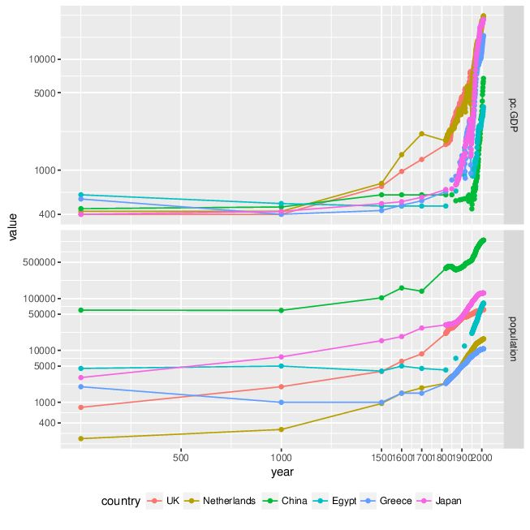{.fragment #fig-Angus11}

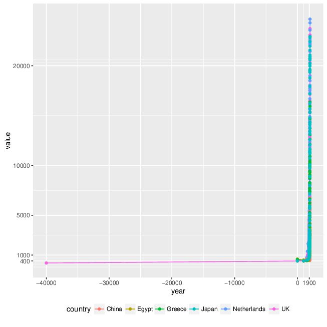{.fragment #fig-Angus12}

Source: Angus Maddison. I made up \$200 in 40000BC. 
:::

. . .

人類史上、現代(19世紀以降)が異常なことが分かります 

----

次のページで1960年からの各国の一人あたり所得が図に描かれています。どのようなパタンを予想しますか。低所得国は豊かになっているでしょうか。  

. . .

以下は2008年時点の一人あたり所得です。大きな格差です。1960年から差は縮まったでしょうか。  

::: {style="font-size: 80%;line-height: 0.8;"}
```{=latex}
\begin{tabular}{>{\scriptsize\hfil}p{.5cm}<{}>{\scriptsize\hfil}p{3cm}<{}>{\scriptsize\hfil}p{2cm}<{}>{\scriptsize\hfil}p{3cm}<{}>{\scriptsize\hfil}p{2cm}<{}}
\rowcolor{gray90}
\makebox[.5cm]{} & \makebox[3cm]{poorest} & \makebox[2cm]{poor USD} & \makebox[3cm]{richest} & \makebox[2cm]{rich USD}\\
1 & Zaire & 249 & Hong Kong & 31704\\
2 & Burundi & 479 & USA & 31178\\
3 & Niger & 514 & Norway & 28500\\
4 & Centr. Afr. Rep. & 536 & Singapore & 28107\\
5 & Comoro Islands & 549 & Ireland & 27898\\
6 & Togo & 606 & Australia & 25301\\
7 & Guinea Bissau & 617 & Canada & 25267\\
8 & Guinea & 628 & Switzerland & 25104\\
9 & Sierra Leone & 686 & Netherlands & 24695\\
10 & Haiti & 686 & Denmark & 24621
\end{tabular}
```
:::

----

::: {#fig-Angus2 layout-ncol=2}

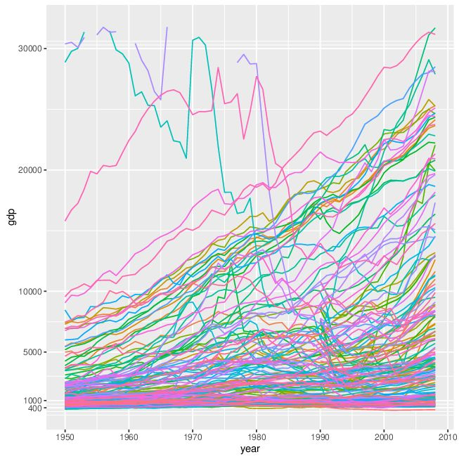{.fragment #fig-Angus21}

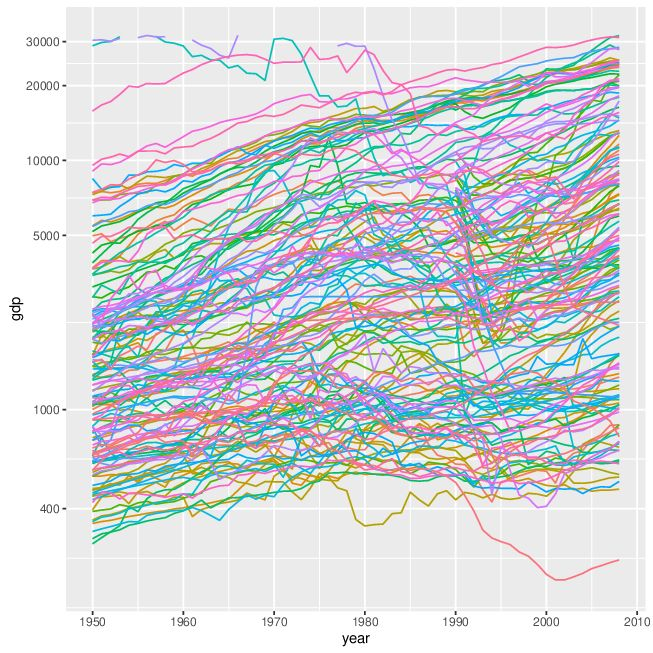{.fragment #fig-Angus22}

Source: Angus Maddison.  
:::

::: {style="font-size: 80%;line-height: 0.8;"}
* 大きな値と小さな値を同時に表示するとき、対数目盛にすると小さい値がよりばらけて見える...はずですが...  
:::

----

```{r world bank 2017 constant PPP pc GDP, message = F, warning = F, echo = F}
#### downloaded from https://data.worldbank.org/indicator/NY.GDP.PCAP.PP.KD
#### GDP per capita, PPP (constant 2017 international $) GDP per capita based on purchasing power parity (PPP). PPP GDP is gross domestic product converted to international dollars using purchasing power parity rates. An international dollar has the same purchasing power over GDP as the U.S. dollar has in the United States. GDP at purchaser's prices is the sum of gross value added by all resident producers in the country plus any product taxes and minus any subsidies not included in the value of the products. It is calculated without making deductions for depreciation of fabricated assets or for depletion and degradation of natural resources. Data are in constant 2017 international dollars.
library(data.table)
grepout <- function(str, x)
  # returns element of match (not numbers)
  x[grep(str, x, perl = T)]
y <- fread("1/data/API_NY.GDP.PCAP.PP.KD_DS2_en_csv_v2_2925849.csv", 
  header = T, skip = 2, sep = ",")
setnames(y, 
  grepout("^1|^2", colnames(y))
  , paste0("pcdgp.", grepout("^1|^2", colnames(y)))
  )
yL <- reshape(y, direction = "long", idvar = c("Country Name", "Country Code"),
  varying = grepout("^pc", colnames(y)))
yL[, c("indicator", "Indicator Name", "Indicator Code", "V67") := NULL]
setnames(yL, c("name", "code", "year", "value"))
yL <- yL[year >= 1990]
#### yL[value > 75000, .(year, num=1:.N), by = name][num==1]
library(ggplot2)
yL2 <- yL[!(code %in% code[value > 75000])]
g <- ggplot(data = yL2, 
  aes(x = year, y = value, group = code, colour = code)) +
  geom_line(size = .2) +
  geom_line(data = 
  yL2[code %in% code[value[year == 2019] > value[year == 2019 & code == "JPN"]], ]
    , size = .5)+
  geom_line(data = yL2[code == "JPN", ], size = 2, colour = "red")+
  labs(
      title = "",
      x = "年",
      y = "１人あたりGDP (2017年国際ドル表示、PPP換算)"
  ) +  
  scale_x_continuous(breaks = 1990:2020, minor_breaks = NULL)+
  theme(
    strip.text.x = element_text(color = "blue", size = 6, 
      margin = margin(0, 1.25, 0, 1.25, "cm")), 
    axis.text.x = element_text(size = 5, angle = 45, vjust = 1, hjust = 1), 
    #axis.text.x = element_text(size = 6, vjust = .5, hjust = .5), 
    axis.text.y = element_text(size = 6), 
    axis.title.x = element_text(size = 7, vjust = .5, hjust = .5), 
    axis.title.y = element_text(size = 7, vjust = .5, hjust = .5), 
    legend.position="none"
  )
cairo_pdf(
  "1/pcPPPGDP1990-2020.pdf"
  , width=14/2.54, height=8/2.54, 
  family = "Meiryo")
print(g)
whatever <- dev.off()
ggsave(
   "1/pcPPPGDP1990-2020.jpg"
  , g, width = 14, height = 8, units = "cm",
  dpi = 300
 )
glog <- g +
  scale_y_log10(breaks = c(1000, 3000, 5000, 10000, 20000, 40000, 80000))
cairo_pdf(
   "1/LogpcPPPGDP1990-2020.pdf"
  , width=14/2.54, height=8/2.54, 
  family = "Meiryo")
print(glog)
whatever <- dev.off()
ggsave(
   "1/LogpcPPPGDP1990-2020.jpg"
  , glog, width = 14, height = 8, units = "cm",
  dpi = 300
 )
```

::: {#fig-pcincome layout-ncol=2}

{.fragment .lightbox #fig-pcincome1}

{.fragment .lightbox #fig-pcincome2}

Source: World Bank [https://data.worldbank.org/indicator/NY.GDP.PCAP.PP.KD](https://data.worldbank.org/indicator/NY.GDP.PCAP.PP.KD)
:::

::: {style="font-size: 80%;line-height: 0.8;"}
* 赤が日本  
* 2019年時点で日本よりも豊かな国は太線  
* それ以外は細線  
* (1990年に20000ドル以下で日本を追い抜いたのはマルタと韓国)  
:::

----

The message is clear.  
Poor countries are not catching up the rich countries.  

. . .

なお、1990年代以降は貧しい国も先進国にキャッチアップしつつあるという研究が最近出てきています[@KremerWillisYou2022]が、事実は認識されたものの、推計方法への注文が付いており[@AcemogluMolina2021]、ゆっくりキャッチアップしつつある理由、持続するかなど、解釈にはコンセンサスができていません

<!--
* 人口大国(1980年代以降の中国、90年代以降のインド)で市場自由化が進んだことが理由  
* インドや中国で極貧層が大幅に減ったことに比べれば、先進国での所得格差の広がりは小さな問題、自由市場を堅持すべしという意見もあります  
-->

. . .

低所得国と近かった中所得国が高所得国との差を縮めると各国間の所得不平等は減るが、中所得国がさらに高所得国に近づくと低所得国と中所得国の差が広がるため、いずれは各国間の所得不平等が増すという指摘もあります[@Kanbur2022]

----

:::: {.columns}

::: {.column width="65%"}
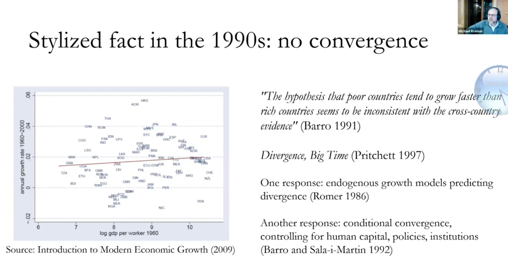
:::

::: {.column width="30%"}
* 2009年に書かれた経済成長理論の入門教科書に掲載されている図  
* convergence=収斂、キャッチアップ  
* キャッチアップするには所得の低い国ほど成長率が高い必要あり  
:::

::::

* 横軸1960年の1人当たり対数所得、縦軸1960-2000年成長率とすると、右下がりの関係が必要  
* 僅かに右上がり=キャッチアップなし

----

:::: {.columns}

::: {.column width="65%"}
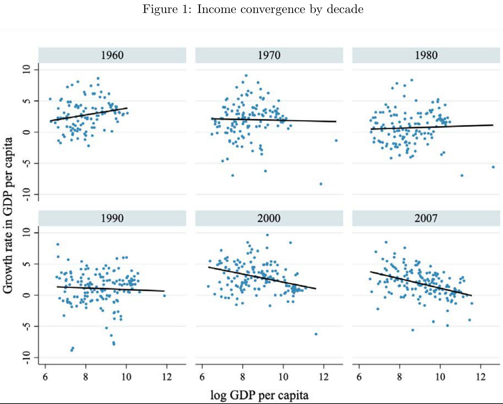

@KremerWillisYou2022
:::

::: {.column width="30%"}
* 2007: 2007-2017(COVID-19前の10年間)  
* 2000年代に入るとキャッチアップが見られる  
:::

::::

---- 

国の平均値を比べるだけだと貧困が見落とされるという指摘もあります[@PandeEnevoldsen2021]

. . . 

* 中所得国になった国(インド、バングラデシュ、ナイジェリアなどの人口大国)にも多数の貧困層がいる

. . . 

つまり、貧困問題を考えるために低所得国だけを対象にすると、多くの貧困層を見失います 

----

:::: {.columns}

::: {.column width="30%"}
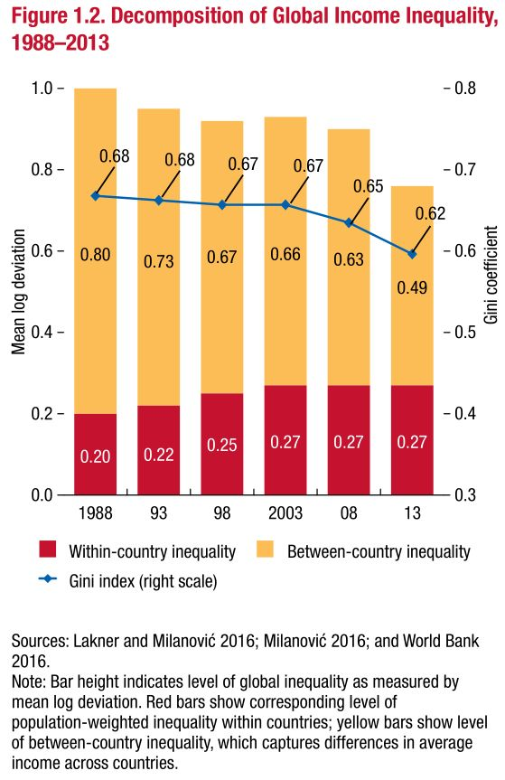  
:::

::: {.column width="70%"}
Gini coefficientジニ係数: 分配の偏りを示す指標  

* 最小値は0: 	全員が同じ所得を持つ状態
* 最大値は1: 	1人がすべての所得を持つ状態

[@IMF2017Sep](https://www.imf.org/-/media/Files/Publications/fiscal-monitor/2017/October/pdf/fm1702.ashx)  

* 全世界の所得分布のジニ係数: 0.68(1988)&rarr;0.62(2013)
* 国$c$個人$i$の(対数)所得$y_{ci}$と世界平均(対数)所得$\bar{y}$との差
=国間の差+国内の差
$$
y_{ci}-\bar{y}=\hspace{2em}\underbrace{\bar{y}_{c}-\bar{y}}_{\hspace{-2em}\scriptsize{\mbox{$c$国平均と世界平均の差}}}\hspace{4em}+\hspace{2em}\underbrace{y_{ci}-\bar{y}_{c}}_{\scriptsize{\mbox{個人$i$と$c$国平均の差}}}
$$

	* <span style = "font-size: 70%;line-height: 0.8;">国間差平均: 0.80(1988)&rarr;0.49(2013), 国内差平均: 0.20(1988)&rarr;0.27(2013)</span>
:::

::: {.fragment}
全体では格差は減ったが、国平均値の格差が減り、各国内の格差が増えた
:::
::: {.fragment}
低所得国で一部の人々が富裕になり低所得国の平均値は高まったが貧困層は残っている
:::

::::

----

::: {style="text-align: center;"}
# 貧困の罠
:::

----

[図](http://seiroito.github.io/SHLectures/lec_slides/2024/1.pdf#page=220)

----

なぜS字形? 例(他の論拠もあります)  

. . . 

発展段階・所得が低いときには生産性の伸びは低い。生産にさまざまな障害(市場の不完全性)があるため。資本蓄積の度合い(傾き)は緩やか。

:::[description-lb]
資本市場
:  借り手と貸し手が出会う機会が乏しい、資金回収リスクがあるので資金提供しにくい

保険市場
:  灌漑施設と降雨保険がないと、乾燥に強い低収益作物(アワ、ヒエ)

貸出市場
:  子どもの教育投資は家計の豊かさに依存するので、低所得家計は投資しにくい

市場に関わる制度
:  司法、行政、インフラなどが不十分で投資収益が下がる  
:::

. . .

発展段階・所得が中段階になると生産性の伸びが高まる。市場が整備され、豊かな国からの技術移転も利用できるため。資本蓄積の度合い(傾き)は急。  

. . . 

発展段階・所得が高くなると、生産性の伸びは低くなる。技術移転に頼らず自前で技術開発しないといけなくなるから。資本蓄積の度合い(傾き)は緩やか。

----

資本市場均衡線がS字直線で、極端に高い位置や低い位置にない限り、45度線と3つ交点を持つ

::: {style="font-size: 80%;line-height: 1;"}
* 厳密には、S字直線の緩やかな傾きが45度未満、急な傾きが45度以上で、Sの下部分が45度線よりも高い位置で始まり、急な傾きになる前に1つ交点を持てば、合計で3つ交点を持つ  
:::

. . . 

経済が動学的に安定な低位均衡にいると、高位均衡には自然に移らない。

* $H$に行くためには以下が必要:
	*  $S$線を引き上げて高位均衡への収束経路に乗せる制度変化。[図](http://seiroito.github.io/SHLectures/lec_slides/2024/1.pdf#page=333)
	* 経済を一気に右側に移して高位均衡への収束経路に乗せるビッグ・プッシュ。 大量の資本$k$を投下 ("マーシャル・プラン"). 
* どの制度を変化させるか? どの資本を増やすか? どうやって?


----

::: {style="text-align: center;"}
# 開発経験をどのように学ぶか
:::

----

J-PAL to the rescue!  

* Abdul Ratif Jameel Poverty Action Lab at MIT.
* \sout{Homepage: ``729 ongoing and completed randomized evaluations in 67 countries''.}  
* "1094 randomized evaluations...in 91 countries," "from clean water to microfinance to crime prevention."   
* 大変な数  
* ランダム化比較試験RCTは政策の効果を歪み無く示すことができる  
	* なぜ歪まないか? 理由はコースの後半で学びます。
* RCTはパイロット研究pilot studyです。パイロット研究はロジスティクスや費用対効果などを示すことができます。  

----

Examples: A summary of their RCTs on \href{https://www.povertyactionlab.org/policy-lessons/education/increasing-test-score-performance}{learning (web page in 2020)}.

* When access to education is extremely limited, getting children into school can lead to large learning gains (Afghanistan).
* Motivating students to go to school and learn can be very cost-effective, by scholarship (Kenya), by conditional cash transfer (Malawi).
* There is little evidence that simply increasing the number of teachers or teaching resources improves learning (India, Kenya, Kenya, Kenya). 
* Teaching children according to their actual learning levels is the most consistently effective at improving learning, and is also very cost-effective (Kenya, Kenya, India, India).

----

Examples: Learning (continued).

* Incentives for teachers can lead to significant learning gains if they are objectively administered and structured in such a way as to discourage "teaching to the test" (India, Kenya, India).
* Adding an extra teacher on a short-term contract can produce significant learning gains at a relatively low cost (Kenya).
* Grants provided to communities as part of empowerment programs can lead to better learning (Gambia, Indonesia).

----

ここで変なことは何でしょう? OK, what is wrong with this picture?

. . . 

* 途上国はインドとケニアだけではありません
* (Web pageに明記されてはいないですが) J-PALは一緒に仕事する組織が当然限られます。India = Maharashtra, Telangana, Rajasthan; Kenya = 西部の州.
* "India" $\neq$ India, "India" $=$ 少数の州. "Kenya"も同じ

. . . 

* 政策効果の因果推計causal inference (教訓the lesson learned)が他の地域に当てはまらないとき、推計は<Red>外的妥当性external validity</Red>を欠く、といいます。リストした研究内容は外的妥当性が限られています。 
* 推計が因果関係を捉えている(識別するidentify)とき、推計には<Red>内的妥当性internal validity</Red>がある、といいます。

----

* これは厳しすぎる批判かも。J-PALは重要な知見のある研究をたくさん実施。
* しかし、リスト内容からは、小規模RCTを使った方法に限界があることが分かります。
   * 比較的小さな政策が多い: 教員給与、補助教員追加、学習教材配布、家計への補助金、ワクチン接種、etc.  
   * 不可逆的政策は無理: 授業の現地語化・英語化、進級・進学基準の変更  
   * +大規模政策は無理: 学校建設、正規教員増員  
*  2019年にJ-PALのBanerjee, Duflo, Kremerがノーベル経済学賞を受賞。

. . .

彼らの研究の集大成: \textit{Poor Economics} written by \citet{BanerjeeDuflo2011book}.

. . . 

* 素晴らしい本。読みやすい。開発経済学に興味のある誰もが読むべき。

---- 

@Ravallion2012, @Rosenzweig2012 は批判:

* 小規模なエビデンスを積み上げるとビッグ・プッシュになるのか?
* 的を射ている。でも、他の研究方法と組み合わせて、ビッグ・プッシュになるようにすれば良いのでは?
   * 行政データなどの大規模データを使った観察研究でも知見はある。

. . . 

@HeckmanSmith1995, @Heckman2010bridgegaps はRCTの利用と誘導型推計を疑問視:

* 全ての政策を実験・ランダム化できるのか? できない。
* ランダム化=政策実施か? 二重盲検(double blind) RCTでないと、ランダム化バイアスrandomisation biasは必ずある。
* なぜ効果があった・無かったのか? メカニズムを示す理論はあるのか?
	* ただし、誘導型推計でも理論を検定することは可能

----

彼らによれば[@BanerjeeDuflo2011book]、彼らの研究の前は貧困には2つのアプローチがありました。

:::{description-list}
Save them.
:  助けが必要 ... a Big Push [@Sachs2006], [Milleneum Village Project](https://en.wikipedia.org/wiki/Millennium_Villages_Project)  

Can't save them.
:  放っておこう、自分たちで豊かにならないといけない[@Easterly2006]。
:::

. . . 

@BanerjeeDuflo2011book は中間を示したと主張します: 自助努力の支援方法を示した  

* *Poor Economics*以前の時代を単純化しすぎていないか、ちょっと疑問が残ります。

----

[Milleneum Villages (サイトがなくなっています!)](http://millenniumvillages.org/)はどうなったでしょうか? 

[Angelina Jolie on MVP](https://www.youtube.com/watch?v=uUHf_kOUM74)

[ODI's review page](http://www.odi.org/projects/765-millennium-villages-project-review)の引用.

. . . 

> The project is led by Professor Jeffrey Sachs of the Earth Institute, Columbia University. The five year project was launched in 2006 and targets 80 Millennium Villages across ten African countries. It provides low-cost interventions in agriculture and nutrition, health, water and sanitation, education, infrastructure and the environment to the villages at a cost of $120 per person per year.

. . . 

> (In summary) The MVP has achieved results and has demonstrated the impact of greater investment in evidence-based, low-cost interventions at village level on progress towards the MDGs. 

. . . 

レビューはポジティブな内容です。その回答Sachs et al. (2008)は感謝していました。

----

* サックスはMV Project [``is flourishing''](https://www.project-syndicate.org/commentary/jeffrey-d-sachs-defends-the-track-record-of-the-millennium-villages-project)といいます。
* Bill Gatesはサックスを賞賛しているものの[``Sachs is the Bono of economics''](https://www.project-syndicate.org/commentary/bill-gates-explains-why-the-millennium-villages-project--though-a-failure--was-worth-the-risk)、MVPの成果に批判的です。[Bono](https://www.rte.ie/archives/exhibitions/937-u2/291767-bono-remembers-the-early-years/), [Bono2](https://upload.wikimedia.org/wikipedia/commons/6/60/Bush_and_Bono.jpg)
* しかし...成果についてなぜ意見が割れるのでしょうか。だって、成果に関するデータをチェックすれば1は1、2は2なので意見を異にする点はないのでは?
* 答え: MV Projectの評価デザインに本質的な欠点がある([The Economist article](http://www.economist.com/blogs/feastandfamine/2012/05/jeffrey-sachs-and-millennium-villages))ので、見方が割れます。
	* サックスは天才なので、彼がなぜこんなデザインにしたのか不思議です。
	* もしかすると、自由にデザインを選べなかったのかも ... コースの後半で扱います。
* この講義では、欠点が何か、修正する方法を学びます。

----

* Poverty trap:  A vicious cycle that keeps the economy in poverty.
* Big Push:  A set of policies that moves the economy to a convergent path to ``high'' equilibria.
* Milleneum Development Villages:  An attempt to mimic a Big Push that intervenes the African villages in every aspect of life.
* J-PAL:  A research centre focusing on randomised controlled trials (RCTs) to produce practical policy lessons.
* internal validity:  An unbiased causal inference.
* external validity:  An unbiased causal inference with applicability beyond studied subjects.


----

## Child in the pond question:

::: {style="font-size: 50%;line-height: 0.8;"}
 <https://www.thelifeyoucansave.org.au/child-in-the-pond/>  
:::

> You are walking in an isolated park, passing by a pond, where you see a child drowning. There is no one around, and you do not have a phone to call for a help. You are good at swimming and can save the child by jumping into the water. But you have expensive shoes on. Jumping into the water will ruin them, a loss of USD 200. If you do not help the child, the child will die.

Would you jump into the pond to save the child?

----

#### References

::: {#refs}
:::
