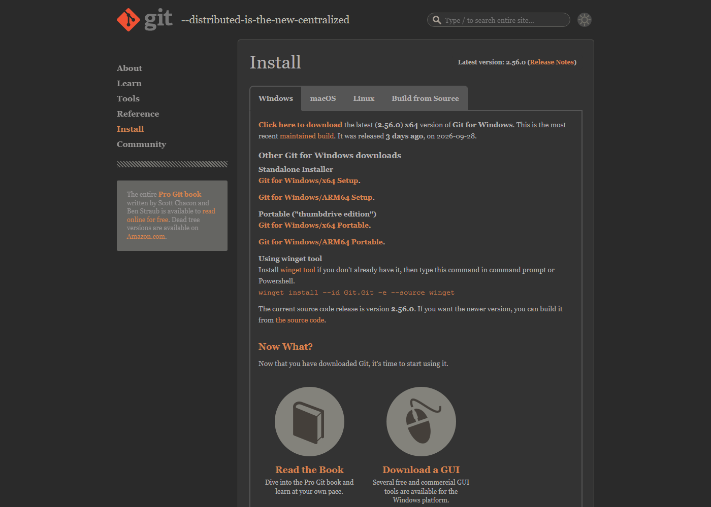

# Github

## Githubとは

* Git(手元PCのソフト)が記録した変更履歴ごと、ファイルを預かるオンラインの保存場所
* 変更履歴があるので、任意時点の状態に戻ることができる
* 複数名のファイル編集履歴を管理・統合できる
    * クラウド上の共同作業に向いている
    * 画像等も履歴は残るが、行単位の比較・統合はテキスト・ファイルのみ
* webページ・webサイトを公開することができる

## GitHubアカウントの作成

1. [github.com](https://github.com/) を開き、右上の「Sign up」を押す
1. メールアドレス、パスワード、ユーザー名(username)を入力して「Continue」
1. 登録したメールに届く確認コード(数字)を入力
1. ログイン後、右上のアイコンに自分のユーザー名が表示されれば作成完了

* ユーザー名は後で教員に送る(「招待を受ける」参照)
* 既にアカウントがあれば不要


# bash ターミナルのインストール

* 以下の git コマンドは bash ターミナルで実行する
* GUI付きのプログラムもあるが、ターミナルでの作業が便利
    * 自分がやりたいことのために、どのコマンドをどのように書くのか分からなければ、AIに尋ねる
    * 同じAIに(たとえばChatGPT)繰り返し尋ねると、今までの質問履歴を参考に回答してくれる

## Windows

* インストール: [Git for Windows](https://git-scm.com/install/windows) の「Click here to download」からインストーラーを入手して実行。Git Bash も一緒に入る

{width=70%}

* 先に作業用の親フォルダを作る: 例 エクスプローラーで `C:\test` を作る(ローカル・レポジトリ `C:\test\sandbox` は後で `git clone` が作る)
* 起動(どれか1つ)
  1. スタートメニューで「Git Bash」を検索して開く
  1. エクスプローラーで `C:\test` を右クリック →(Windows 11 は「その他のオプションを確認」→)「Open Git Bash here」
  1. スタートメニューで「Git GUI」を開く →「Create New Repository」→ `C:\test\sandbox` を選んで「Create」→ メニュー「Repository」→「Git Bash」
* プロンプトに `MINGW64` と表示されれば Git Bash
* 起動したら、作業フォルダに移動する

```bash
cd c:/test            # 初回: ここで git clone する(sandbox フォルダができる)
cd c:/test/sandbox    # 2回目以降: 起動したらまずこれ
```

## Mac

* インストール不要: 標準の「ターミナル」を使う(初期設定のシェルは zsh だが、以下のコマンドはそのまま動く)
* 起動: `⌘ + スペース` で Spotlight を開き「ターミナル」と入力。または Finder →「アプリケーション」→「ユーティリティ」→「ターミナル」
* git が無ければ `xcode-select --install` または `brew install git`([git-scm.com](https://git-scm.com/install/mac))
* 起動したら、作業フォルダに移動する(先に Finder でホームに `test` フォルダを作っておく)

```bash
cd ~/test             # 初回: ここで git clone する(sandbox フォルダができる)
cd ~/test/sandbox     # 2回目以降: 起動したらまずこれ
```

# .gitignore

トラックしないファイル指定[.gitignore](../../.gitignore)

# Procedures

黒地の枠は、練習用レポジトリで実際に得た出力(英語表示)。パスやハッシュ(`ff0073e` 等)は各自で異なる。

## 初回設定(PCごとに1回)

```bash
git config --global user.name "Your Name"
git config --global user.email "you@example.com"
```

何も表示されなければ成功

## レポジトリの取得

```bash
git clone https://github.com/<user>/<repo>.git
```

`Cloning into '<repo>'...` と表示され、`<repo>` フォルダができる

練習用レポジトリ [sandbox](https://github.com/SeiroIto/sandbox) の場合

```bash
git clone https://github.com/SeiroIto/sandbox.git
cd sandbox
```

## 他の人(別PC)の編集を取り込む

作業を始めたら、まずこれ

```bash
git pull origin main
```

```{.terminal}
From https://github.com/SeiroIto/test
 * branch            main       -> FETCH_HEAD
Updating 9c62715..556ab47
Fast-forward
 .gitignore |   2 +
 seiro.bib  | 389 +++++++++++++++++++++++++++++++++++++++++++++++++++++++++++--
 2 files changed, 384 insertions(+), 7 deletions(-)
```

## 状況確認

```bash
git status
```

```{.terminal}
On branch main

No commits yet

Untracked files:
  (use "git add <file>..." to include in what will be committed)
        01.qmd

nothing added to commit but untracked files present (use "git add" to track)
```

編集済みファイル名を指定して、次のコミットの記録対象に加える

```bash
git add 01.qmd
```

何も表示されなければ成功。`git status` で確認すると

```{.terminal}
On branch main

No commits yet

Changes to be committed:
  (use "git rm --cached <file>..." to unstage)
        new file:   01.qmd
```

すべての編集済みファイルを、次のコミットの記録対象に加える

```bash
git add .
```

編集を確定(備忘録用の確定メッセージを付加)

```bash
git commit -m "added VibeCodingExample.qmd"
```

```{.terminal}
[main (root-commit) ff0073e] added VibeCodingExample.qmd
 1 file changed, 5 insertions(+)
 create mode 100644 01.qmd
```

## 履歴

```bash
git log --oneline -n 10
```

```{.terminal}
ff0073e added VibeCodingExample.qmd
```

## 編集内容の確認(add前)

```bash
git diff
```

```{.terminal}
diff --git a/01.qmd b/01.qmd
index 0886b05..410288c 100644
--- a/01.qmd
+++ b/01.qmd
@@ -3,3 +3,5 @@ title: "01"
 ---
 
 # はじめに
+
+本文を追加
```

## add の取り消し

```bash
git restore --staged 01.qmd
```

何も表示されなければ成功。`git status` で確認すると

```{.terminal}
On branch main
Changes not staged for commit:
  (use "git add <file>..." to update what will be committed)
  (use "git restore <file>..." to discard changes in working directory)
        modified:   01.qmd

no changes added to commit (use "git add" and/or "git commit -a")
```

## remoteとlocalの比較

```bash
git fetch
git diff HEAD origin/main --stat
```

```{.terminal}
From https://github.com/SeiroIto/test
   9c62715..556ab47  main       -> origin/main
 .gitignore |   2 +
 seiro.bib  | 389 +++++++++++++++++++++++++++++++++++++++++++++++++++++++++++--
 2 files changed, 384 insertions(+), 7 deletions(-)
```

全ての編集の比較(`-` はremoteにあってlocalにない行)
```bash
git diff origin/main
```

```{.terminal}
diff --git a/.gitignore b/.gitignore
index f68b506..2a539d4 100644
--- a/.gitignore
+++ b/.gitignore
@@ -11,8 +11,6 @@
 /posts/DelabastitaRubens/*_*
 /posts/DelabastitaRubens/Monopsony*
 /posts/DelabastitaRubens/seiro*
-/posts/VothCapprettiniTrew/.claude
-/posts/VothCapprettiniTrew/figtab/_*
 /**/*.zip
...
```

## localの編集をremoteに反映させる


```bash
git push origin main
```

出力例(取得したものではない)

```{.terminal}
Enumerating objects: 5, done.
Counting objects: 100% (5/5), done.
Delta compression using up to 8 threads
Compressing objects: 100% (3/3), done.
Writing objects: 100% (3/3), 320 bytes | 320.00 KiB/s, done.
Total 3 (delta 1), reused 0 (delta 0), pack-reused 0
remote: Resolving deltas: 100% (1/1), completed with 1 local object.
To https://github.com/<user>/<repo>.git
   abc1234..def5678  main -> main
```

# 練習: sandbox レポジトリ

[github.com/SeiroIto/sandbox](https://github.com/SeiroIto/sandbox) の `EditMe.md` は自由に編集してよいファイル

* 他の人と同じ行を編集すると衝突(conflict)するので、`# Your playground` の下に**自分の名前入りの行を1行追加**する
* 編集・push するには、事前にレポジトリへの招待(collaborator)を受けて承諾しておく(下記)

## 招待を受ける(初回のみ)

1. GitHub アカウントを作る(「GitHubアカウントの作成」参照)
1. 自分の GitHub ユーザー名を教員(伊藤)に送る
1. 教員が sandbox レポジトリに招待する
1. GitHub から届く招待メール(または github.com 右上の通知)を開き、"Accept invitation" を押す
1. 承諾後、[sandbox](https://github.com/SeiroIto/sandbox) を開いて `EditMe.md` に鉛筆アイコンが表示されていれば準備完了

## A. ブラウザだけで試す

1. [EditMe.md](https://github.com/SeiroIto/sandbox/blob/main/EditMe.md) を開き、鉛筆アイコン(Edit this file)を押す
1. `# Your playground` の下に1行追加(例: `* 山田: こんにちは`)
1. "Commit changes" を押す(押さずに閉じると編集は消える)
1. [History](https://github.com/SeiroIto/sandbox/commits/main) で自分のコミットを確認

## B. 手元PCから試す

* こちらが GitHub の本来の使い方(特に他の人と共同で作業するとき)
* 以下のコマンドは bash ターミナルで実行する(起動方法は「bash ターミナルのインストール」)

* `git clone` は親フォルダ `C:\test` で実行する: clone が `sandbox` フォルダを作るので、`C:\test\sandbox` の中で実行すると不要な `C:\test\sandbox\sandbox` ができてしまう

```bash
cd /c/test                                           # 親フォルダ C:\test に移動
git clone https://github.com/SeiroIto/sandbox.git   # 初回のみ。C:\test\sandbox ができる
cd sandbox
git pull origin main                                 # 他の人の編集を取り込む
```

`EditMe.md` をエディタで開き、`# Your playground` の下に1行追加して保存

```bash
git status                   # modified: EditMe.md と表示される
git diff                     # 追加した行が + 付きで表示される
git add EditMe.md
git commit -m "added my line to EditMe.md"
git pull origin main         # push 直前にもう一度取り込む
git push origin main
```

* ブラウザで [EditMe.md](https://github.com/SeiroIto/sandbox/blob/main/EditMe.md) を再読込し、自分の行が反映されていれば成功
* `git log --oneline -n 10` で、他の人のコミットも並んでいることを確認
* push が `rejected` と表示されたら、他の人が先に push している。`git pull origin main` してから再度 `git push origin main`

