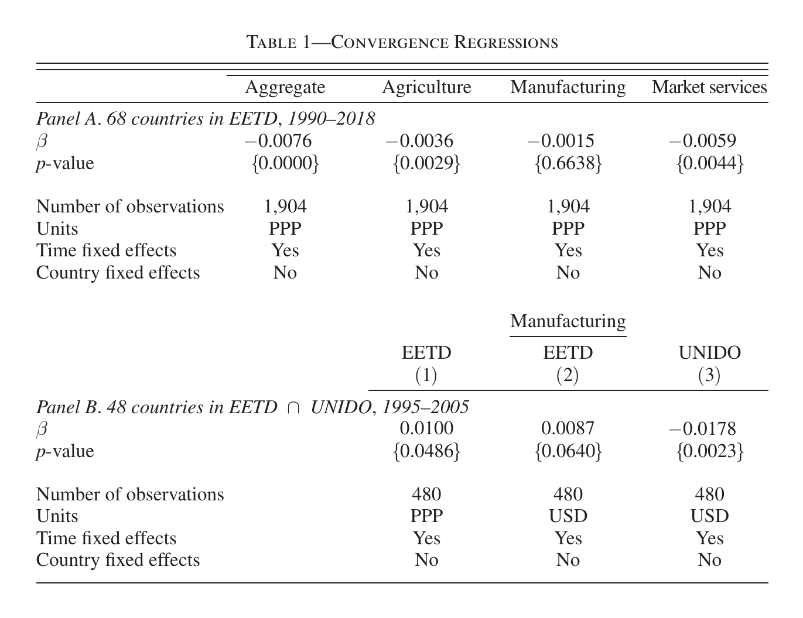
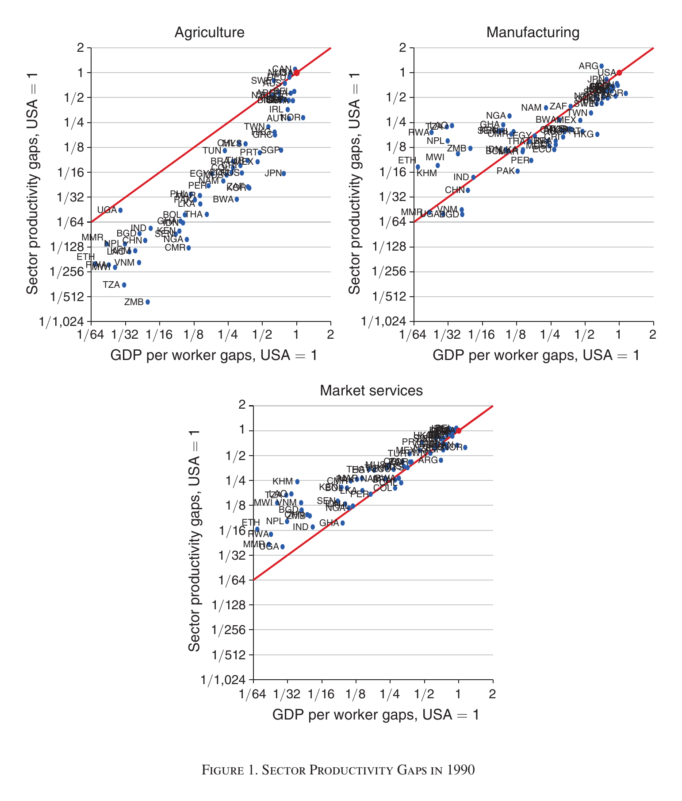

# The disagreement to be reconciled

* [Rodrik (2013)](https://doi.org/10.1093/qje/qjs047) found unconditional convergence in manufacturing labour productivity using [UNIDO INDSTAT](https://stat.unido.org/data/database-descriptions) data, at 2--3 % per year and 2.9 % in his baseline.
* [Herrendorf, Rogerson & Valentinyi (2026)](https://doi.org/10.1257/aeri.20250071) build a 68-country 1990--2018 dataset from the GGDC [Economic Transformation Database](https://www.rug.nl/ggdc/structuralchange/etd/) extended with sectoral PPPs from the [Productivity Level Database 2023](https://www.rug.nl/ggdc/productivity/pld/releases/pld-2023), and find none.
* Their headline manufacturing estimate is β = −0.0015 with p = 0.6638, against significant convergence for aggregate, agriculture and market services (@fig-table1, p. 310).
* Sections III and IV ask which of measurement, sample, period, or data coverage accounts for the gap.

{#fig-table1 width=95%}

{#fig-gaps width=85%}

# Section III --- measurement, sample, period

## The role of productivity measurement

* Rodrik had no manufacturing PPPs, so he converted value added per worker at exchange rates, assuming the law of one price (p. 313).
* The PLD 2023 shows statistically significant departures from the law of one price in all three benchmark years (Supplemental Appendix A.3.3, p. 313).
* Redoing the authors' own 68-country 1990--2018 sample with Rodrik's USD method gives β = −0.0053, p = 0.0420 (p. 313).
* That is economically trivial: a country at 0.1 of the frontier in 1990 reaches only 0.137 of it by 2018 (p. 313).
* Verdict: the law-of-one-price assumption does bias toward finding convergence, but it is not the first-order explanation (p. 313).

## The role of sample and period

* The two studies overlap on 48 countries over 1995--2005 (p. 314).
* On that common sample UNIDO gives β = −0.0178, p = 0.0023 --- convergence, though below Rodrik's 2--3 % per year range and his 2.9 % baseline (@fig-table1 Panel B, p. 310; p. 314).
* On the same 48 countries EETD gives β = +0.0100 at PPP (p = 0.0486) and +0.0087 in USD (p = 0.0640) --- divergence, the opposite sign (@fig-table1 Panel B, p. 310).
* Holding sample and period fixed therefore widens the disagreement rather than closing it (p. 314).

## Where inside the regression the two datasets part company

* Productivity growth rates correlate only 0.26 between the two datasets (@fig-eetdunido Panel C, p. 314).
* Initial productivity levels correlate 0.82 overall, but only 0.34 among the 22 countries below 20 % of the US level in 1995 (p. 314).
* Substituting EETD initial levels into the UNIDO regression: β = −0.0058, p = 0.2537 --- significance gone (fn. 25, p. 314).
* Substituting EETD growth rates instead: β = 0.0088, p = 0.1615 --- significance gone (fn. 25, p. 314).

{#fig-eetdunido width=90%}

# Section IV --- differences in coverage

## What the coverage ratio is

* The GGDC aims at comprehensive coverage including self-employment and informal enterprises; UNIDO surveys restrict coverage by firm-size threshold and official registration (p. 314).
* Coverage ratio = UNIDO manufacturing employment divided by GGDC manufacturing employment, per country-year, on the 30 countries in ETD and UNIDO over 1990--2018 (p. 315).

## Coverage differs across countries

* More than 40 % of those countries have average coverage below 50 %, and three-quarters below 75 % (p. 315).
* Coverage varies widely even among countries at similar development levels, so selection of firms into the UNIDO surveys makes cross-country comparison unreliable (pp. 315--316).

## Coverage also moves within countries over time

* Coverage in 1990 versus 2018 correlates 0.52, with large deviations both above and below the 45-degree line (@fig-coverage Panel A, p. 316).
* Points below the line are the concern, since informality should fall as countries develop (p. 316).
* Change in coverage and UNIDO productivity growth are systematically negatively related, correlation −0.502 (@fig-coverage Panel B, p. 316).
* Mechanism 1: fewer informal workers inside formal firms raises measured employment and lowers measured productivity (p. 317).
* Mechanism 2: lower coverage means stronger selection, excluding smaller and less productive firms (p. 317).
* The decisive test: on the 48-country 1995--2005 sample, dropping countries whose coverage ratio fell by at least 9 percentage points makes the UNIDO convergence coefficient insignificant (p. 317).
* The authors' reading: the evidence for unconditional convergence may well be spurious, driven by inconsistent data measurement (p. 317).

## An external check on the coverage ratio

* The coverage ratio correlates strongly positively with the [ILO informality rate](https://ilostat.ilo.org/topics/informality/) across 15 countries and 161 country-year observations (@fig-coverage Panel C, p. 317).
* ILO formality sits above the coverage ratio, consistent with UNIDO missing formal employment at firms below its survey threshold (p. 317).
* Peru and Sri Lanka show large and variable gaps, driven by swings in UNIDO employment, so UNIDO is not consistent over time within countries either (p. 317).

{#fig-coverage width=90%}

# What exactly moves in the survey frame, and why it manufactures convergence

## What the frame is

* The frame is the list of firms a national industrial survey actually enumerates, and UNIDO INDSTAT compiles those national surveys (INDSTAT Rev2 is the source Rodrik used, p. 304).
* UNIDO's frame is restricted two ways: a firm-size threshold, and whether the firm is officially registered (p. 314).

## The three things that move

* Registration status --- informal and unregistered firms enter the frame as they formalise.
* Firm size --- small firms cross the size cutoff as they grow, and move in or out when the cutoff itself is revised.
* Informal workers inside already-enumerated formal firms --- these move in and out of reported employment without any firm entering or leaving the frame (p. 317).
* Net movement is what the coverage ratio measures, and it correlates only 0.52 between 1990 and 2018 (@fig-coverage Panel A, p. 316).

## Why a moving frame moves measured productivity

* Productivity is value added divided by employment, and both are measured only inside the frame, so the frame moving changes measured productivity with no change in real productivity.
* Channel 1 --- a falling share of informal workers inside formal firms raises measured employment, and therefore lowers measured productivity (p. 317).
* Channel 2 --- falling coverage drops the smallest and least productive firms out of the frame, so average measured productivity jumps up (p. 317).
* Both channels run the same way: coverage down implies measured productivity growth up.
* That is what the data show --- change in coverage against UNIDO productivity growth, correlation −0.502 (@fig-coverage Panel B, p. 316).

## Why that looks exactly like convergence

* A β-convergence regression asks whether a low initial level predicts fast subsequent growth.
* The frame problem is worst precisely where such regressions get their identification --- among the 22 countries below 20 % of the US level in 1995, UNIDO and GGDC initial levels correlate only 0.34, against 0.82 in the full sample (p. 314).
* A poor country whose coverage ratio falls is therefore recorded with a low initial level and a spuriously high growth rate.
* Low measured initial level paired with spuriously high measured growth is indistinguishable from genuine catch-up.
* The test that settles it: dropping the countries whose coverage ratio fell by 9 percentage points or more makes UNIDO's convergence coefficient insignificant (p. 317).
* The step "the decliners were supplying the low-level, high-growth observations" is an inference from that exclusion test; the paper reports the test, not that decomposition.
* The EETD escapes the problem by construction --- it targets total manufacturing including self-employment and informal enterprises, so its denominator does not move as registration and size thresholds shift (p. 314).

# Where that leaves the reconciliation

* Measuring in USD rather than PPP explains a little of the gap, but not the bulk of it (p. 313).
* Sample and period explain none of it --- holding both fixed makes the two datasets disagree more, not less (p. 314).
* What explains it is coverage: the UNIDO survey frame moves with development, and that movement is itself correlated with measured productivity growth (p. 317).
* Rodrik's convergence coefficient does not survive dropping the countries whose coverage moved most (p. 317).

# Sources

## The two papers

* Herrendorf, Berthold, Richard Rogerson, and Ákos Valentinyi. 2026. "Unconditional Convergence in Manufacturing: A Reassessment." *American Economic Review: Insights* 8 (3): 303--319. <https://doi.org/10.1257/aeri.20250071>
* Replication package: Herrendorf, Rogerson & Valentinyi. 2026. Data and Code, AEA / ICPSR. <https://doi.org/10.3886/E233162V1>
* Rodrik, Dani. 2013. "Unconditional Convergence in Manufacturing." *Quarterly Journal of Economics* 128 (1): 165--204. <https://doi.org/10.1093/qje/qjs047>

## The datasets under dispute

* GGDC/UNU-WIDER Economic Transformation Database (ETD), the base for the authors' EETD. <https://www.rug.nl/ggdc/structuralchange/etd/>
* de Vries, Gaaitzen, et al. 2021. "The Economic Transformation Database (ETD): Content, Sources, and Methods." UNU-WIDER Technical Note 2/2021. <https://doi.org/10.35188/UNU-WIDER/WTN/2021-2>
* GGDC Productivity Level Database, 2023 edition (PLD 2023), source of the sectoral PPPs. <https://www.rug.nl/ggdc/productivity/pld/releases/pld-2023>
* UNIDO INDSTAT, the industrial statistics database behind Rodrik's estimates. <https://stat.unido.org/data/database-descriptions>
* ILOSTAT informality statistics, the external check in Section IV.C. <https://ilostat.ilo.org/topics/informality/>

## Note on the exhibits

* @fig-table1, @fig-gaps, @fig-eetdunido and @fig-coverage are clipped from the published article for teaching use, at 300 dpi with a 0.5 cm white margin on all four sides.
* The article itself is the authoritative source; see the DOI above.
