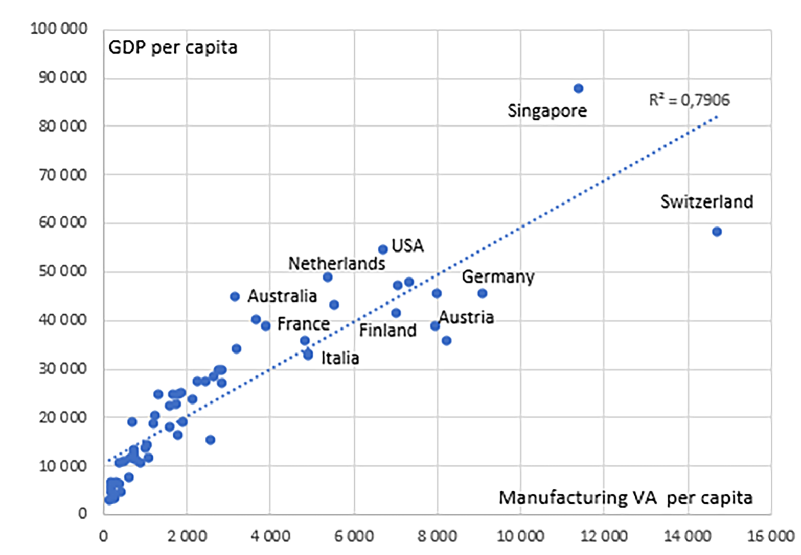
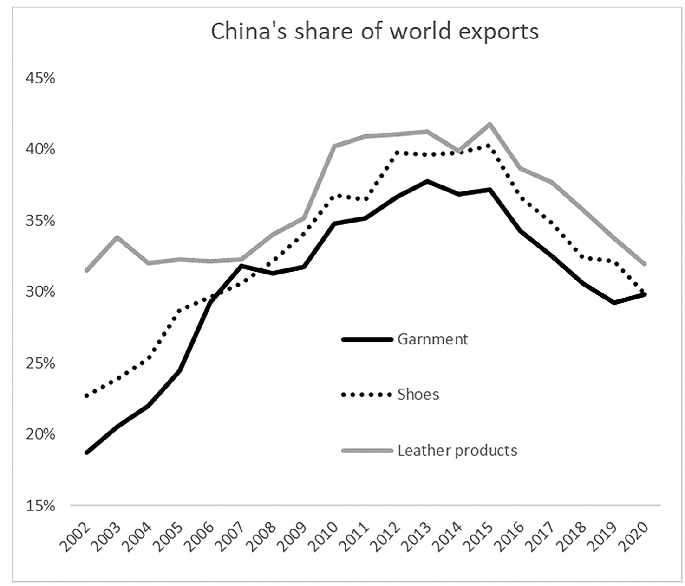
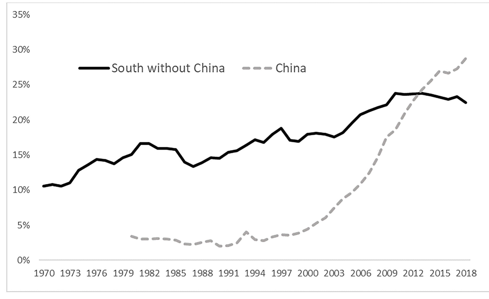
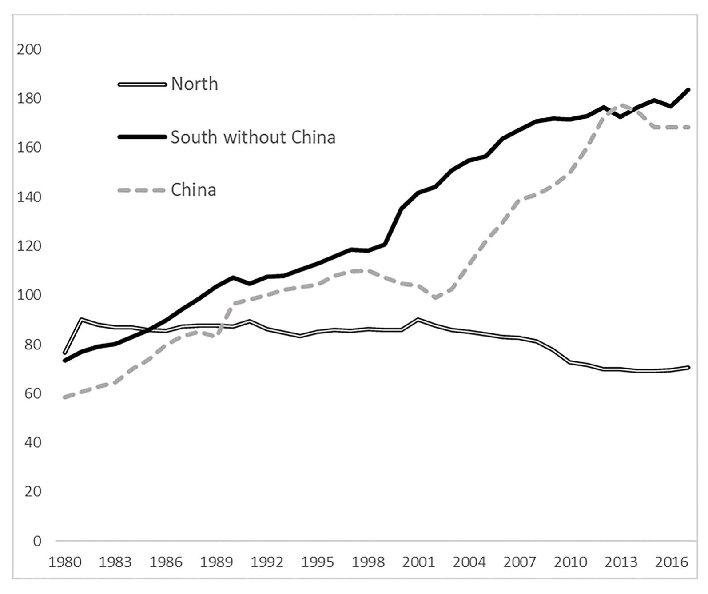

```{r}
#| label: setup
library(tinytable)
library(data.table)
```

# Main points

* Rodrik (2016) and the premature-deindustrialisation literature: developing
  countries now peak in manufacturing earlier and poorer than the early
  industrialisers, so industrialisation is spent as a growth strategy.
* Lautier tests that on 158 developing countries over 1970--2018 and does not
  find it (p. 172, abstract p. 168).
* No regression, no counterfactual. The whole contribution is a hand-assembled
  database, so the database is what this note assesses.
* Two things make it a different object from Rodrik's: 158 developing countries
  instead of 28, and an estimate of **informal** manufacturing jobs.
* It cannot be inspected. Data availability reads "Data will be made available
  on request" (p. 176).

{#fig-vagdp width=92%}

# What the data found

Output:

* South share of world manufacturing value added: 15 % (1975) to 51 % (2018)
  (pp. 172--173).
* South excluding China: 11 % (1970) to 22--24 % in the last decade
  (p. 173, @fig-vastructure).
* Manufacturing share of GDP, South: 13.5 % (1970) to 20.4 % (2018). North falls
  28.5 % to 13.9 % over the same years (@tbl-vashare).
* Concentration barely moves: the top 3 producers hold 46--49 % of world output
  at every date from 1970 on, against a 1913 peak of 60 % (@tbl-conc).

Employment:

* World manufacturing employment: 291 million (1991) to 421 million (2017);
  formal jobs 146 million to 224 million (@tbl-empl).
* Manufacturing share of total employment is flat worldwide at 13--14 % since
  1991. South rises 11.5 % to 13.4 %; North falls 17.1 % to 10.7 %
  (@tbl-empl).
* Developing countries plus China hold 82 % of world manufacturing employment
  (p. 174).
* Informal manufacturing jobs reach about 200 million worldwide by 2017, against
  224 million formal (p. 173).

China, separately:

* Since 2010 formal manufacturing employment stops growing in China, while 10
  million jobs are added outside China over 2010--2017 (p. 174).
* Counting informal work, China loses 4 million manufacturing jobs over
  2012--2017 (p. 174).
* China's share of world garment, shoe and leather-product exports peaks in
  2013--2015, then falls to roughly 30 % by 2020 (@fig-chinaexp; read off the
  figure, no table given).

{#fig-chinaexp width=92%}

{#fig-vastructure width=92%}

{#fig-worldempl width=92%}

```{r}
#| label: tbl-vashare
#| tbl-cap: "Manufacturing VA in GDP, 1970-2018, current prices. Lautier (2024) Table 1, p. 172. \"na\" = no reliable figure available."
va <- data.table(
  Group = c("South", "North", "World", "SS Africa", "South Asia", "S-East Asia",
            "Latin America", "MENA", "China"),
  `1970` = c("13.5", "28.5", "25.9", "16.2", "14.1", "15.3", "22.7", "7.7", "na"),
  `1975` = c("14.2", "26.5", "24.1", "18.1", "16.2", "16.0", "23.6", "7.1", "na"),
  `1980` = c("17.3", "25.2", "23.6", "18.3", "17.1", "18.5", "21.8", "6.7", "31.0"),
  `1985` = c("17.7", "23.1", "22.2", "18.3", "17.1", "19.0", "22.5", "7.9", "27.1"),
  `1990` = c("17.9", "21.9", "21.4", "16.9", "17.9", "23.1", "21.8", "9.8", "24.5"),
  `1995` = c("17.8", "19.7", "19.6", "16.7", "18.2", "24.1", "18.3", "10.5", "21.6"),
  `2000` = c("17.0", "18.1", "18.1", "14.6", "16.7", "25.8", "18.0", "9.1", "20.9"),
  `2005` = c("18.7", "15.9", "17.0", "13.2", "16.9", "25.6", "17.2", "8.5", "32.1"),
  `2010` = c("19.3", "14.6", "16.6", "10.3", "17.7", "23.2", "15.5", "8.5", "31.6"),
  `2018` = c("20.4", "13.9", "17.0", "10.6", "16.2", "21.4", "14.2", "9.5", "29.1")
)
tab <- tt(va, width = 1, notes = "Per cent of GDP. Rows 4-9 are developing areas. SS Africa = Sub-Saharan Africa; MENA = Middle East and North Africa. Source: UNStats plus the author's completion.")
style_tt(tab, j = 2:11, align = "r")
```

```{r}
#| label: tbl-empl
#| tbl-cap: "World manufacturing employment. Lautier (2024) Table 3, p. 174."
em <- data.table(
  Measure = c("World total (million)", "of which formal jobs (million)",
              "Manufacturing share of total employment, South",
              "Manufacturing share of total employment, North",
              "Manufacturing share of total employment, World"),
  `1991` = c("291", "146", "11.5 %", "17.1 %", "13.7 %"),
  `1995` = c("304", "163", "11.4 %", "16.0 %", "13.3 %"),
  `2000` = c("320", "169", "11.5 %", "15.3 %", "13.1 %"),
  `2005` = c("357", "187", "12.2 %", "12.8 %", "13.5 %"),
  `2010` = c("388", "212", "13.3 %", "11.6 %", "13.9 %"),
  `2017` = c("421", "224", "13.4 %", "10.7 %", "13.7 %")
)
tab <- tt(em, width = 1, notes = "Sources: UNIDO Industrial Statistics, ILO, Groningen Growth and Development Centre data, and the author's completion.")
style_tt(tab, j = 2:7, align = "r")
```

```{r}
#| label: tbl-conc
#| tbl-cap: "World concentration of manufacturing production. Lautier (2024) Table 2, p. 174."
cc <- data.table(
  `Leading economies` = c("Top 3", "Top 5"),
  `1860` = c("48 %", "62 %"), `1913` = c("60 %", "74 %"),
  `1970` = c("46 %", "54 %"), `1990` = c("48 %", "56 %"),
  `2010` = c("48 %", "58 %"), `2018` = c("49 %", "58 %")
)
tab <- tt(cc, width = 0.8, notes = "Share of world manufacturing production held by the largest 3 and 5 producers. Sources: Bairoch (1982) and the author's data.")
style_tt(tab, j = 2:7, align = "r")
```

# The database

Two series built from scratch for 1970--2018: manufacturing value added and
manufacturing employment.

* Residual gaps filled by linear interpolation; completed series checked for
  discrepancies (§3.1 p. 171; §4.1 p. 173).
* "North" = Europe including USSR/Russia, USA, Canada, Australia, New Zealand,
  Japan --- the industrialised world of the late 1960s. "South" = world less
  North (§3.1, p. 171).

```{r}
#| label: tbl-sources
#| tbl-cap: "Data sources assembled by Lautier (2024), §3.1 (p. 171) and §4.1 (p. 173)"
src <- data.table(
  Series = c("Value added", "Value added", "Value added", "Value added",
             "Value added", "Value added",
             "Employment", "Employment", "Employment", "Employment",
             "Employment"),
  Source = c("UN Statistics Division national accounts",
             "Groningen Growth and Development Centre (GGDC)",
             "World Bank WDI",
             "UNIDO Industrial Statistics (Indstat 2019 CD-ROM)",
             "Asian Development Bank",
             "National country sources",
             "UNIDO Industrial Statistics (Indstat 2019 CD-ROM)",
             "ILO",
             "GGDC and Asian Development Bank",
             "Population and manufacturing censuses",
             "Labour Force Surveys (country level)"),
  Role = c("Main source; current prices; >200 countries; 1970-2018",
           "Gap filling; 42 countries, of which 32 developing",
           "Gap filling",
           "Gap filling; VA and employment since 1970, gaps for several countries",
           "Gap filling; near-complete coverage of Asia",
           "Gap filling where international bases are silent",
           "Main source; formal jobs only; >150 countries",
           "Jobs not captured by industry surveys",
           "Additional coverage",
           "Basis for the total-employment benchmark",
           "Basis for the total-employment benchmark")
)
tt(src, width = 0.95)
```

# Strength 1: the sample settles a sample-selection dispute

* Rodrik (2016): 42 countries, only 28 developing --- 11 Sub-Saharan Africa,
  2 North Africa, 6 Asia, 9 Latin America (p. 170).
* Lautier: 158 developing countries for output (p. 172), 145 for employment
  (p. 173), over 200 in the full value-added base (abstract, p. 168).
* Roughly six times the developing-country sample on the same question.
* Rodrik carves out "Asian countries and manufactures exporters" as insulated
  from the trend, which leaves the average resting on non-competitive producers
  (p. 170).
* Span: 49 years, against the 1990--2010 window the diagnosis usually rests on
  (p. 170).

# Strength 2: informal manufacturing employment is estimated, not ignored

The sharpest data contribution. UNIDO Indstat comes from industry surveys and
counts formal jobs only (§4.1, p. 173) --- the wrong instrument where most
manufacturing work is informal.

Construction:

* Censuses and Labour Force Surveys give a country's manufacturing employment
  total.
* UNIDO gives the formal count for the same country.
* The gap is the informal estimate.
* Missing countries: the formal--informal ratio is interpolated from the nearest
  year, or borrowed from a country with similar manufacturing characteristics
  (§4.1, p. 173).

What it changes:

* Estimated informal-to-formal ratios: 3.5 India, 2 Indonesia, 1 Bangladesh
  (p. 173).
* India's manufacturing workforce: 14.0 million formal, plus 49 million informal
  = 63 million (Appendix 1, p. 176).
* The 82 % and the 200-million informal figures are not computable without this
  step (pp. 173--174).

# Strength 3: value added and employment together

* Manufacturing's share of world GDP at current prices falls; its share of world
  employment is flat at 13--14 % since 1991 (@tbl-empl).
* On the value-added series alone, the first number reads as decline.
* With both, the gap is composition: jobs moved North to South, where labour
  productivity is lower, so the same employment produces less measured value
  added (p. 173).
* Relative manufacturing prices also fell continuously, which mechanically
  depresses the current-price share (p. 172, citing Haraguchi et al. 2017).

# Strength 4: China is carried as a separate aggregate

* China alone can drive any developing-world average: 14 % of developing-country
  manufacturing output in 1990, 44 % in 2010 (p. 173).
* The paper therefore splits the South into "China" and "South without China"
  and reports every headline result both ways (§3.3, pp. 172--173).
* This is what makes the central finding legible: since 2010 formal employment
  stops growing in China but keeps growing at the same pace elsewhere in the
  South. Pooled, the two movements would partly cancel (p. 174).

# Strength 5: the measurement problems are stated, not buried

* **China (Box 1, p. 175).** The Ministry of Labor covers the urban sector; the
  Ministry of Agriculture covers Town and Village enterprises, Special Economic
  Zone enterprises and rural enterprises. The two sets are not harmonised, and
  both have made large revisions without explanation. The US Bureau of Labor
  Statistics sent experts in 2005 and gave up. BLS estimates put Chinese
  manufacturing employment at 114 million in 2015, about 20 % above the official
  figure used in UNIDO and therefore here.
* **Ex-socialist economies.** Ex-USSR and ten East-European economies are
  excluded from the employment assessment for the whole period: the 1990
  break-ups created discontinuities and pre-transition output was over-stated
  (§4.1 and fn. 13, p. 173).
* **Informal figures are called approximations** in the text itself: "By nature,
  these jobs are difficult to capture and these figures are only approximation"
  (p. 173).

# Limits

* **Interpolation is doing real work.** Remaining gaps in both series are
  linearly interpolated (p. 171) and some informal-to-formal ratios are borrowed
  from other countries (p. 173). No sensitivity analysis reports how much of a
  trend rests on imputed cells.
* **Value added is at current prices.** The paper acknowledges that at constant
  prices the manufacturing output share has varied much less since 1970
  (p. 172), but does not deflate its own series.
* **Descriptive only.** No regression, no counterfactual, no identification. It
  answers Rodrik's descriptive claim; it cannot speak to why industrialisation
  succeeds or fails.
* **Not reproducible as published.** "Data will be made available on request"
  (p. 176). For a paper whose sole contribution is a hand-assembled database
  with judgement calls at every gap-filling step, this is the most serious
  weakness.

# Bottom line

* The strength is coverage plus the informal sector. A 158-country, 49-year
  panel that counts informal manufacturing jobs is a different object from a
  28-country, 20-year panel of formal value-added shares, and it supports a
  different conclusion.
* The weakness is that the object cannot be inspected: every imputation, every
  borrowed ratio, every national-source splice is taken on the author's word.

# Reference

Lautier, M. (2024). Manufacturing still matters for developing countries.
*Structural Change and Economic Dynamics*, 70, 168--177.
