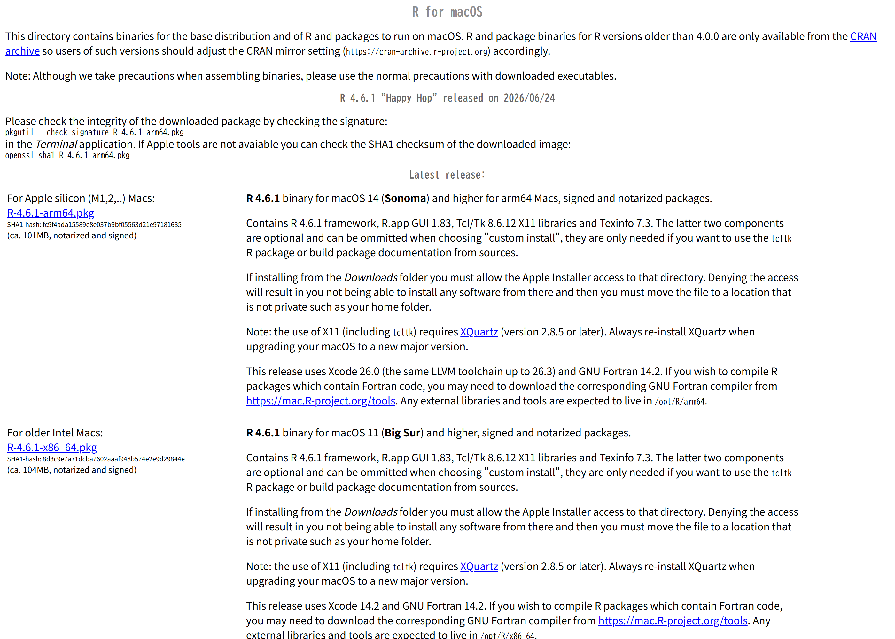
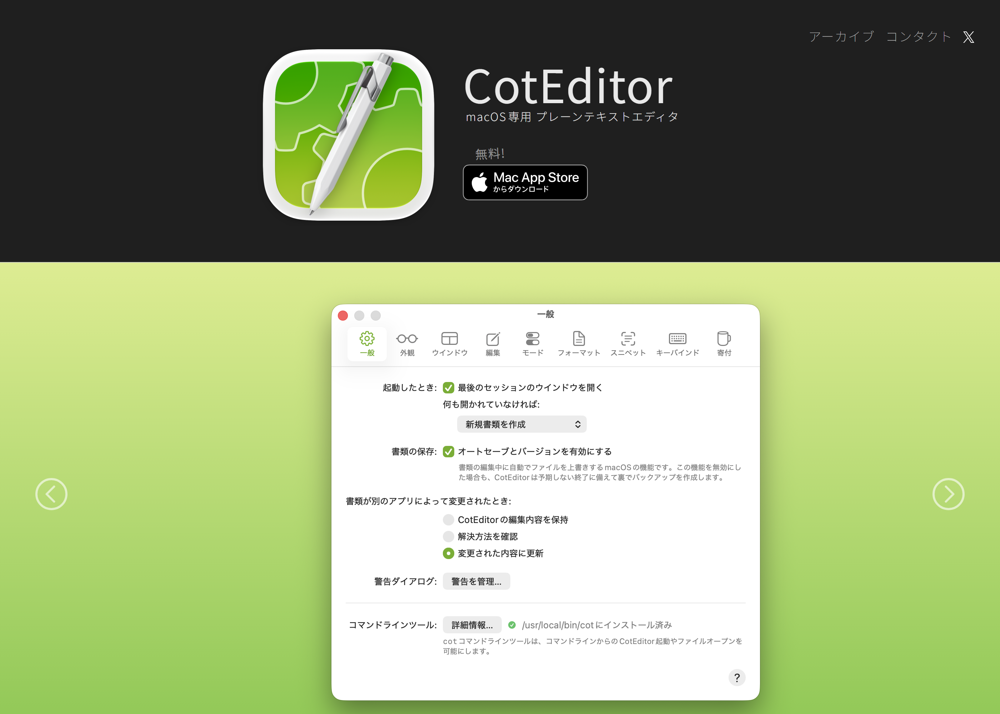
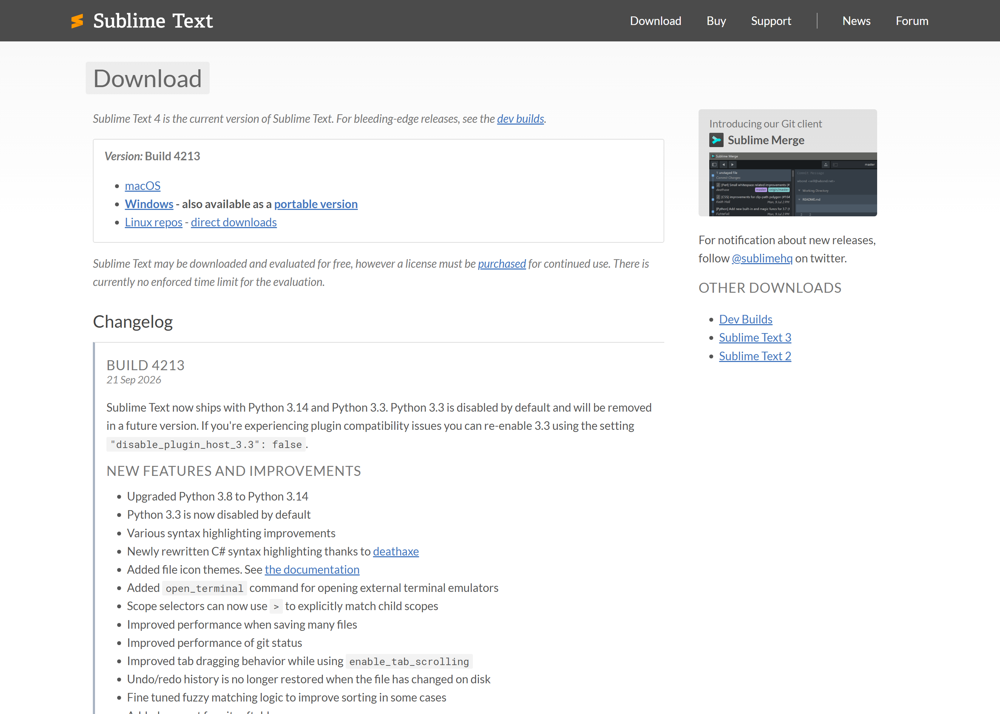
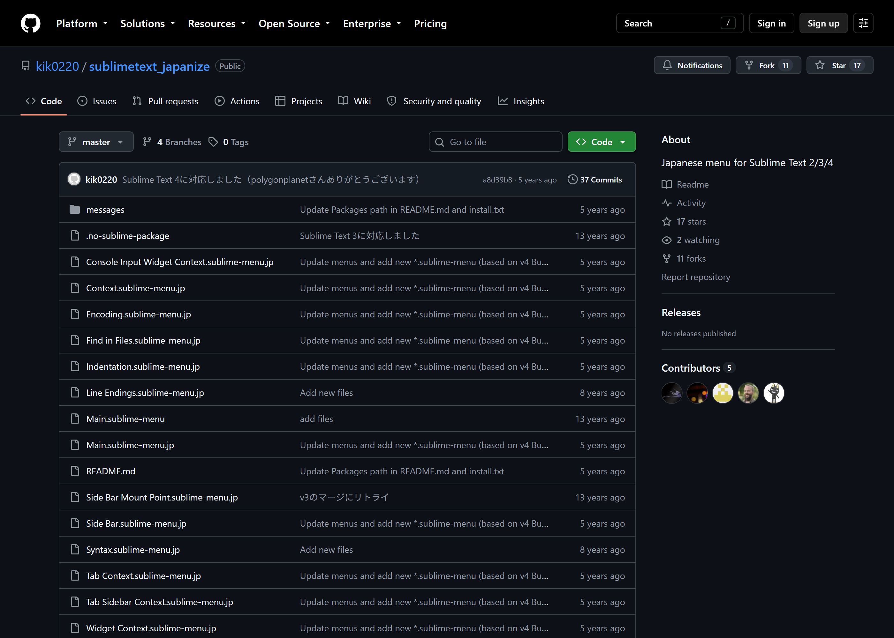

上から順に実施してください。使う道具は4つで、互いに独立しています。
| 道具 | 役割 |
|---|---|
| R | 計算と作図 |
| テキストエディタ | `.qmd` ファイルを書く |
| ターミナル | コマンドを打つ |
| Quarto | `.qmd` を html / pdf / docx に変換する |

# ターミナルとは

* 画面にコマンドを1行打ち込み、Enter で実行するための窓
* マウスで押すボタンの代わりに、名前を打って命令する
* Mac には最初から「ターミナル」が入っています。追加のインストールは不要です

開き方: `⌘ + スペース` で Spotlight を出し、`ターミナル` と打って Enter。

よく使う4つだけ覚えれば足ります。

| 打つもの | すること |
|---|---|
| `cd フォルダ名` | そのフォルダへ移動する |
| `cd ..` | 1つ上のフォルダへ戻る |
| `ls` | いまのフォルダの中身を並べる |
| `exit` | ターミナルを閉じる |

貼り付けは `⌘ + V` です。

# インストレーション

## ターミナル

Mac には最初から入っています。追加のインストールは不要です。
履歴の使い方は「設定」の「ターミナル用履歴表示」を見てください。

## R

### バイナリ(実行ファイル)

<https://cran.r-project.org/bin/macosx/> を開き、自分の Mac に合う `.pkg` を落とします。

*  (アップルメニュー) → 「この Mac について」→「チップ」欄を見る
  * `Apple M1` / `M2` / `M3` / `M4` など → **arm64** と書かれた `.pkg`
  * `Intel` → **x86_64** と書かれた `.pkg`

落ちてきた `.pkg` を開き、すべて既定のまま進みます。

{width=85%}

起動は、アプリケーションフォルダの「**R**」です。`R Console` という窓が出ます。これが R GUI です。

### ライブラリ

R GUI の `R Console` 窓に、次の1行を貼って Enter。数分かかります。

```r
install.packages(c("quarto", "rmarkdown", "knitr", "ggplot2"))
```

途中でミラーサイトを聞かれたら `Japan` のどれかを選びます。

### Pandoc

rmarkdown は変換に Pandoc を使います。
入っているか確かめます。

```r
rmarkdown::pandoc_available()
```

`FALSE` なら <https://pandoc.org/installing.html> から macOS 用の `.pkg`
を入れ(Homebrew なら `brew install pandoc`)、R を開き直します。`TRUE` なら次へ。

Homebrew で入れた場合、アプリケーションフォルダから起動した R からは Pandoc が
見つからず、`FALSE` のままになることがあります。そのときは `.pkg` で入れ直すか、
「実行方法」の RMarkdown の項にある1行で Quarto の Pandoc を使ってください。

## Quarto

### 実行ファイル

<https://quarto.org/docs/download/> を開き、表の **macOS** 行の `.pkg` を落とします。
開いて、すべて既定のまま進みます。

{width=85%}

入ったか確かめます。ターミナルに貼って Enter。

```
quarto check
```

### Homebrewを使う方法

Homebrew は、ターミナルからアプリを入れる・更新するための道具です。

1. Homebrew を入れる([公式](https://brew.sh/ja/))。ターミナルに貼って Enter。
   途中で Mac のパスワードを聞かれます(打っても画面には出ません)。

   ```
   /bin/bash -c "$(curl -fsSL https://raw.githubusercontent.com/Homebrew/install/HEAD/install.sh)"
   ```

2. 終わりに `Next steps:` と表示されたら、その下に字下げして出るコマンド
   (ふつうは3行)をそのまま貼って Enter。`brew` を使えるようにする設定です
3. Quarto を入れる([Homebrew の Quarto ページ](https://formulae.brew.sh/cask/quarto))

   ```
   brew install --cask quarto
   ```

4. 後で新しい版に上げるときは `brew upgrade --cask quarto`

### Pandoc

Quarto には Pandoc が同梱されています。Quarto のために別途入れる必要はありません。

## テキスト・エディタ

どちらか1つで足ります。両方入れる必要はありません。

```{r}
#| label: tbl-editors
#| tbl-cap: "CotEditor と Sublime Text の比較"
library(tinytable)
cmp <- data.frame(
  `くらべる点` = c(
    "料金", "画面の言語", "入れ方", "R の色分け", "Markdown の色分け",
    "向いている人"),
  `CotEditor` = c(
    "無料", "日本語 (Mac の言語設定に従う)", "App Store / 公式サイト",
    "最初から入っている", "最初から入っている",
    "Mac だけで使う人、設定を増やしたくない人"),
  `Sublime Text` = c(
    "有料ライセンス。無期限試用できる", "英語。Japanize で日本語メニューにできる",
    "公式サイトの .dmg", "最初から入っている", "最初から入っている",
    "Windows / Linux でも同じエディタを使いたい人"),
  check.names = FALSE)
tab <- tt(cmp, width = c(0.30, 0.275, 0.275), theme = "striped")
tab <- style_tt(tab, align = "rll")
tab <- style_tt(tab, i = 0, align = "c", background = "#EAF4FB")
tab
```

出典: [CotEditor 公式](https://coteditor.com/)、[Sublime Text 公式](https://www.sublimetext.com/)、
各エディタに同梱の色分け定義
([CotEditor](https://github.com/coteditor/CotEditor/tree/main/CotEditor/Resources/Syntaxes)、
[Sublime Text](https://github.com/sublimehq/Packages))。

### CotEditor

<https://coteditor.com/> から、または App Store で `CotEditor` を検索して入れます。
画面は日本語です。

{width=85%}

### Sublime Text

<https://www.sublimetext.com/download> の **Mac** 用を落とし、
`.dmg` の中の Sublime Text をアプリケーションフォルダへ入れます。

{width=85%}

#### メニューを日本語にする (Japanize)

[Japanize](https://github.com/kik0220/sublimetext_japanize) の手順です。

1. Sublime Text で `⌘ + Shift + P` → `Install Package Control` を実行する
2. もう一度 `⌘ + Shift + P` → `Package Control: Install Package` → `Japanize` を選ぶ
3. `Sublime Text` → `Settings` → `Browse Packages…` で Packages フォルダを開く
   (場所は `~/Library/Application Support/Sublime Text/Packages/`)
4. `Japanize` フォルダの `*.jp` ファイルを、すべて `Default` フォルダへコピーする
   (`Default` が無ければ作る)
5. コピーしたファイルの名前から `.jp` を取り、元のファイルと置き換える
6. `Japanize` フォルダの `Main.sublime-menu` を `User` フォルダへコピーする

{width=85%}

# 設定

このセクションは便利機能なので省略可能です。

## 色分け(強調)表示

R と Markdown の色分けは、どちらのエディタにも最初から入っています。
残るのは `.qmd` を Markdown として扱わせることだけです。

### CotEditor

設定 → フォーマット → シンタックス → `Markdown` を選んで編集 →
拡張子の一覧に `qmd` を足す。

### Sublime Text

1. `.qmd` ファイルを1つ開く
2. 表示 (View) → シンタックス (Syntax) →
   「現在の拡張子で開くファイルすべて」(Open all with current extension as…) → `Markdown`

### reveal.js について

reveal.js 専用の色分けファイルはありません。スライドの記法
(`----`、`::: {.fragment}`) は markdown の色分けでそのまま色が付きます。

## 文字コード

どちらのエディタも保存の既定は UTF-8 です。変える必要はありません。

## ターミナル用履歴表示

Mac のターミナル (zsh) は、追加のインストールなしで履歴を使えます。

| 操作 | すること |
|---|---|
| `↑` `↓` | 前後のコマンドを1つずつ呼び出す |
| `Ctrl + R` | 打った文字を含む過去のコマンドを検索する (もう一度押すと次の候補) |
| `history` | 過去のコマンドを番号つきで並べる |

## R の設定


# 実行方法

## quarto

`bunsho.qmd` を作業フォルダに置いた状態で、どちらかを実行します。

### R GUI から

`R Console` 窓に貼ります。

```r
Sys.setenv(QUARTO_PATH = "/Applications/quarto/bin/quarto")
setwd("~/Documents/quarto")
quarto::quarto_render("bunsho.qmd")
```

1行目で R に Quarto の場所を教えます(アプリケーションフォルダから起動した R 向け)。

### ターミナルから

```
cd ~/Documents/quarto
quarto render bunsho.qmd
```

同じフォルダに `bunsho.html` ができます。ダブルクリックで開きます。

## RMarkdown (.Rmd) と litedown (.md)

Quarto を使わず、R だけで `.Rmd` や `.md` を html にする方法です。
どちらも `R Console` 窓に貼って実行します。

| ファイル | パッケージ | 関数 | Pandoc |
|---|---|---|---|
| `.Rmd` | rmarkdown | `rmarkdown::render()` | 必要 |
| `.Rmd` | litedown | `litedown::fuse()` | 不要 |
| `.md` | litedown | `litedown::mark()` | 不要 |

### RMarkdown (.Rmd)

Quarto を入れていれば、Pandoc も一緒に入っています。ただし rmarkdown は
それを自動では見つけません。`rmarkdown::pandoc_available()` が `FALSE` のときは、
Pandoc を別に入れる代わりに、次の1行で Quarto の Pandoc を使わせることができます
(R を開くたびに1回)。

```r
Sys.setenv(RSTUDIO_PANDOC = dirname(list.files("/Applications/quarto/bin/tools", pattern = "^pandoc$", recursive = TRUE, full.names = TRUE)[1]))
rmarkdown::pandoc_available()
```

`TRUE` と出れば準備完了です。

```r
setwd("~/Documents/quarto")
rmarkdown::render("bunsho.Rmd")
```

### litedown (.Rmd / .md)

litedown は Pandoc なしで動きます。最初に1回だけ入れます。

```r
install.packages("litedown")
```

R コードを含む `.Rmd` は `fuse()`、R コードのない `.md` は `mark()` です。

```r
setwd("~/Documents/quarto")
litedown::fuse("bunsho.Rmd")
litedown::mark("memo.md")
```

どの方法でも、同じフォルダに同じ名前の `.html` (`bunsho.html`、`memo.html`) ができます。

# 例

## 作例1: 本文・Rコード・図

[作例1を開く](../CommonFiles/examples/example_basic.html) ・
[qmd を見る](../CommonFiles/examples/example_basic.qmd)

```{r}
#| results: asis
cat("`````markdown", readLines("../CommonFiles/examples/example_basic.qmd"), "`````", sep = "\n")
```

## 作例2: Tufte 風(傍注レイアウト)

本文は作例1と同じで、ヘッダだけが違います。

[作例2を開く](../CommonFiles/examples/example_tufte.html) ・
[qmd を見る](../CommonFiles/examples/example_tufte.qmd)

```{r}
#| results: asis
cat("`````markdown", readLines("../CommonFiles/examples/example_tufte.qmd"), "`````", sep = "\n")
```