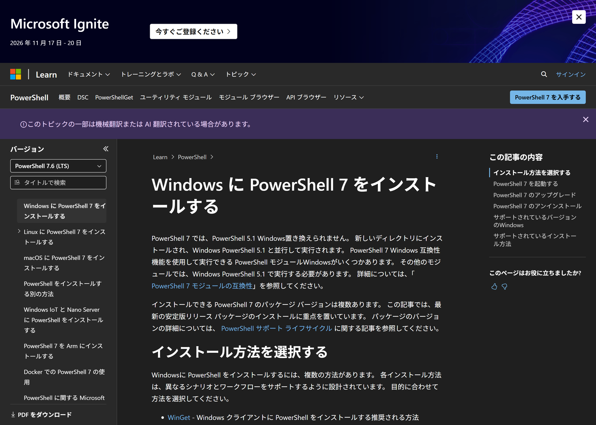
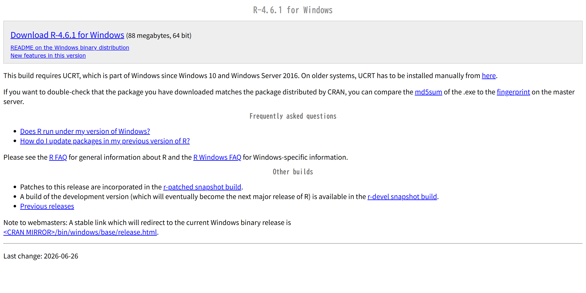
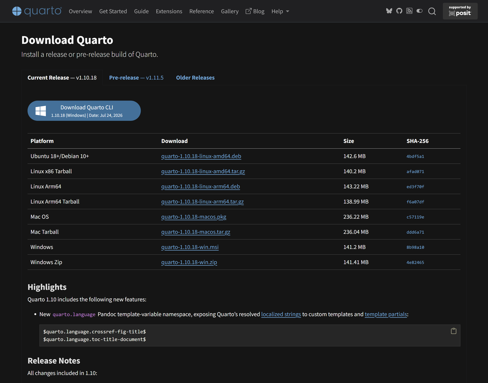
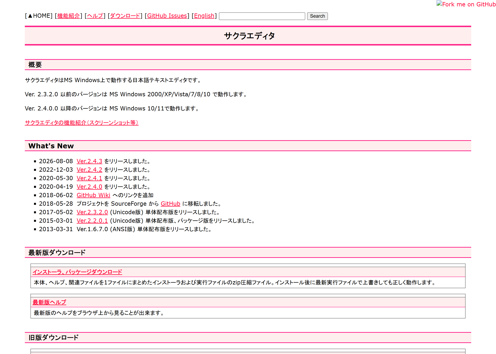
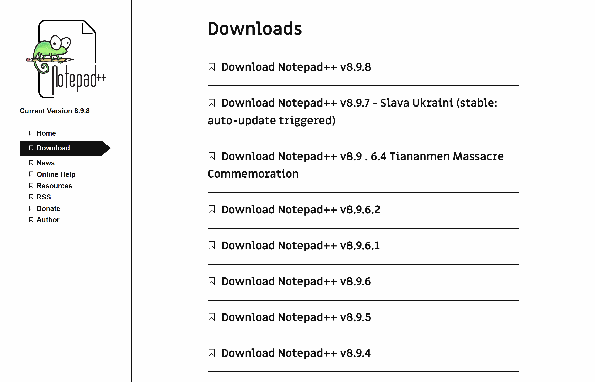
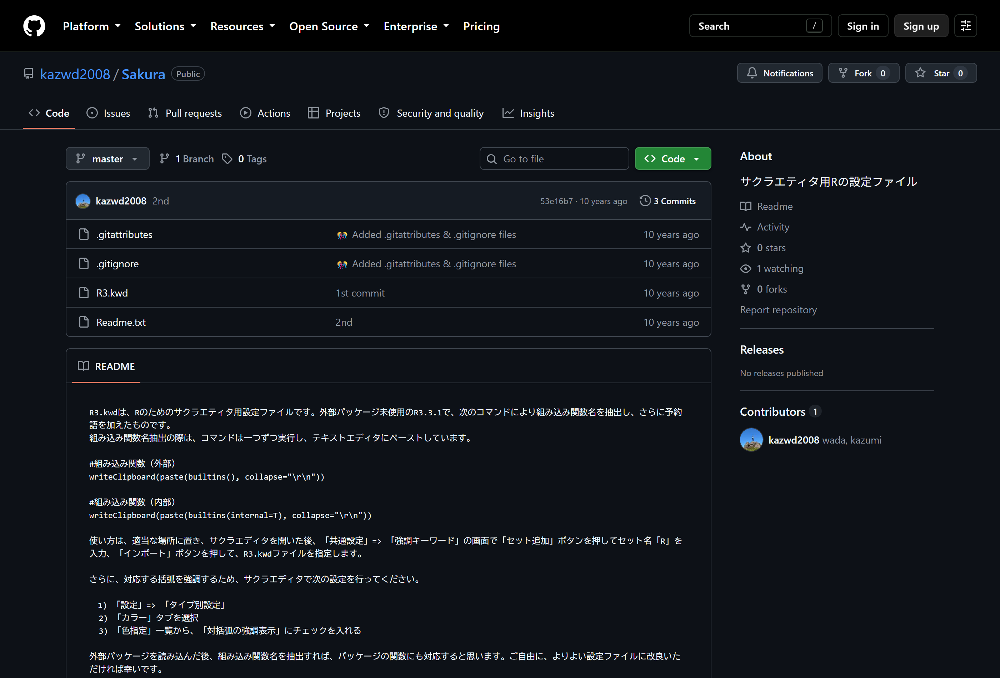
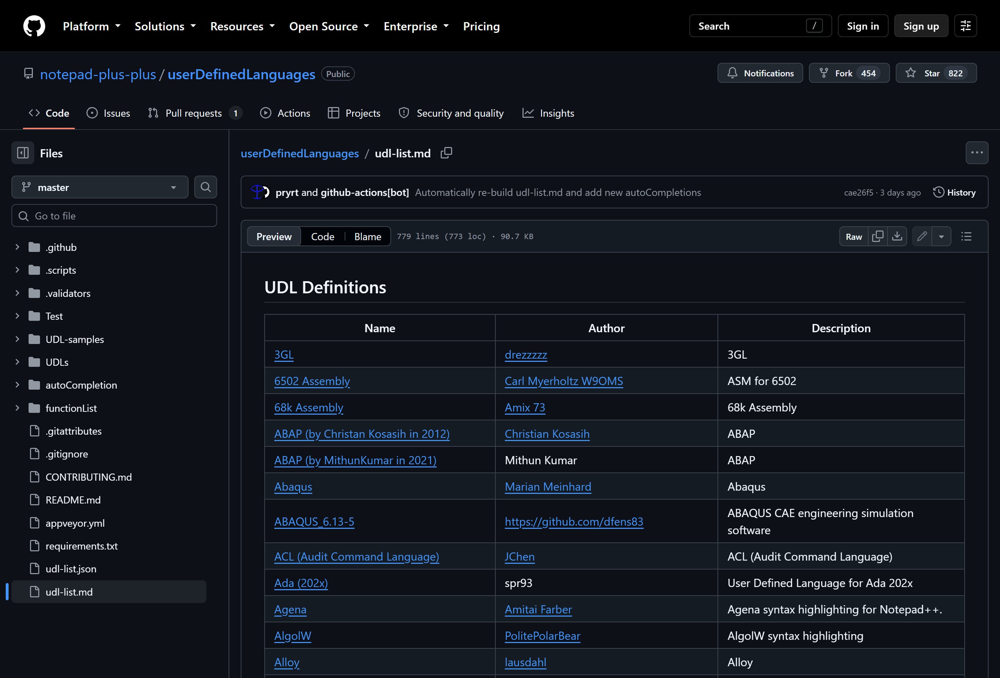
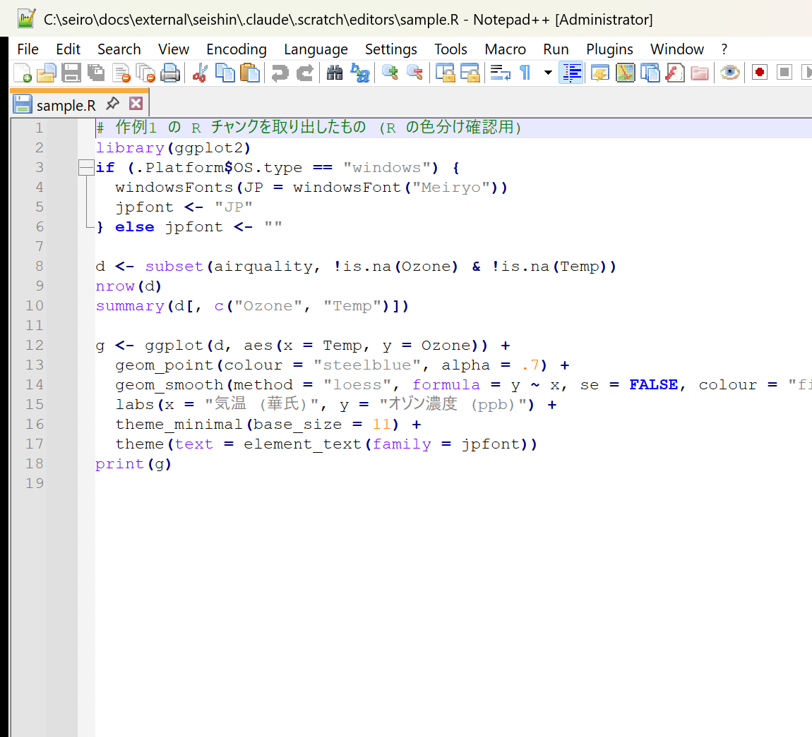
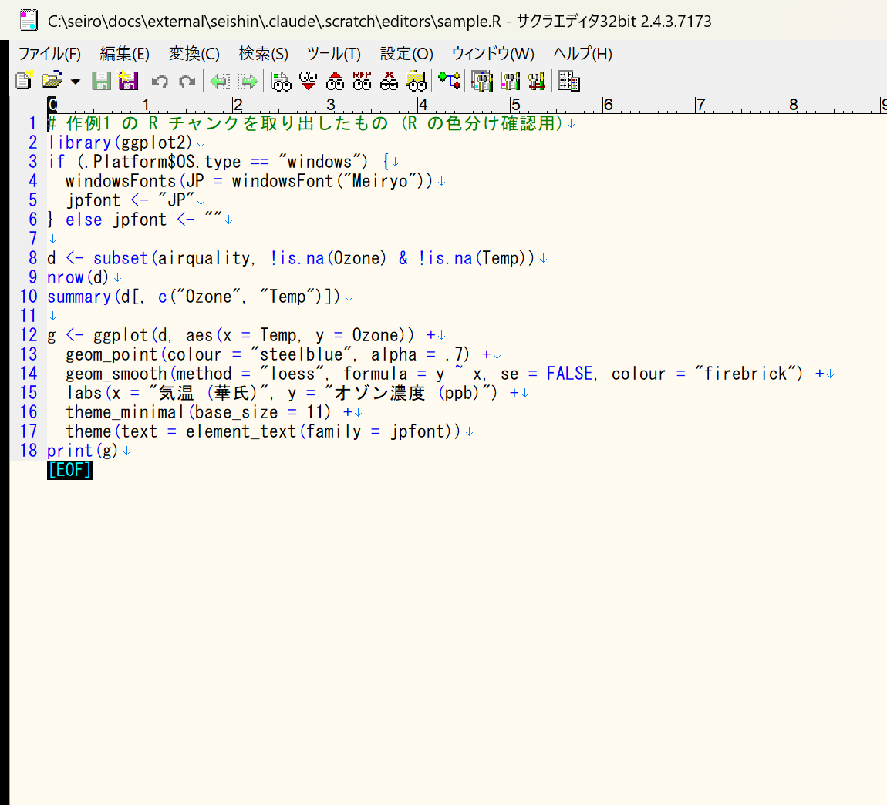
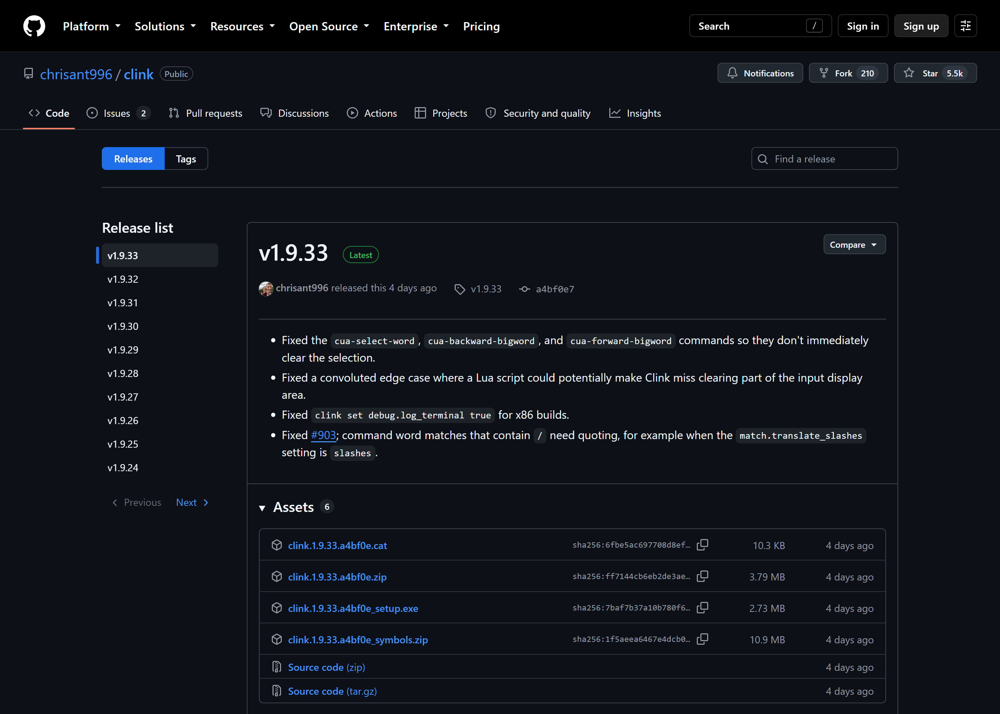

上から順に実施してください。使う道具は4つで、互いに独立しています。
| 道具 | 役割 |
|---|---|
| R | 計算と作図 |
| テキストエディタ | `.qmd` ファイルを書く |
| ターミナル | コマンドを打つ |
| Quarto | `.qmd` を html / pdf / docx に変換する |

# ターミナルとは

* 画面にコマンドを1行打ち込み、Enter で実行するための窓
* マウスで押すボタンの代わりに、名前を打って命令する
* Windows には2種類ある — **PowerShell**（新しい）と **コマンドプロンプト `cmd`**（古い）

開き方: Windows キーを押し、`powershell` または `cmd` と打って Enter。

よく使う4つだけ覚えれば足ります。

| 打つもの | すること |
|---|---|
| `cd フォルダ名` | そのフォルダへ移動する |
| `cd ..` | 1つ上のフォルダへ戻る |
| `dir` | いまのフォルダの中身を並べる |
| `exit` | ターミナルを閉じる |

貼り付けは右クリックです。

# インストレーション

## ターミナル

一度打ったコマンドを一覧から選べます。PowerShell と コマンドプロンプトで
やり方が違うので、使う方だけ読んでください。

|  | PowerShell | コマンドプロンプト |
|---|---|---|
| 必要なもの | PowerShell 7 (PSReadLine 同梱) | clink |
| 履歴を一覧から選ぶ | ↑↓ で選べる一覧。既定は切、下の1行で入 | `F7` または `Ctrl+Alt+↑` |
| 履歴を検索 | `Ctrl+R` | `Ctrl+R` |

### PowerShell 7

[入手先](https://learn.microsoft.com/ja-jp/powershell/scripting/install/installing-powershell-on-windows)。
ターミナルに貼り付けても入ります。

```powershell
winget install --id Microsoft.PowerShell -e
```

{width=85%}


### コマンドプロンプト


履歴の一覧が出ます。

## R

### バイナリ(実行ファイル)

<https://cran.r-project.org/bin/windows/base/> を開き、いちばん上の
**Download R-x.x.x for Windows** を押します。落ちてきた `.exe` を実行し、
すべて既定のまま進みます。

* multiple window (single windowではない)を選ぶことをお薦めします

{width=85%}

起動は、スタートメニューの「**R x64 4.x.x**」です。黒い窓ではなく、
`R Console` という白い窓が出ます。これが R GUI です。

### ライブラリ

R GUI の `R Console` 窓に、次の1行を貼って Enter。数分かかります。

```r
install.packages(c("quarto", "rmarkdown", "knitr", "ggplot2"))
```

途中でミラーサイトを聞かれたら `Japan` のどれかを選びます。

### Pandoc

rmarkdown は変換に Pandoc を使います。
入っているか確かめます。

```r
rmarkdown::pandoc_available()
```

`FALSE` なら <https://pandoc.org/installing.html> から Windows 用の `.msi`
を入れ、R を開き直します。`TRUE` なら次へ。


## Quarto

### 実行ファイル

<https://quarto.org/docs/download/> を開き、**Download Quarto CLI** を押します。
落ちてきた `.msi` を実行し、すべて既定のまま進みます。

{width=85%}

入ったか確かめます。ターミナルに貼って Enter。

```
quarto check
```

### Pandoc

Quarto には Pandoc が同梱されています。Quarto のために別途入れる必要はありません。

## テキスト・エディタ

どちらか1つで足ります。両方入れる必要はありません。

```{r}
#| label: tbl-editors
#| tbl-cap: "サクラエディタと Notepad++ の比較"
library(tinytable)
cmp <- data.frame(
  `くらべる点` = c(
    "ライセンス", "最新版 (2026年9月時点)", "対応 Windows", "画面の言語", "入れ方",
    "最初から色が付く言語", "R の色分け", "Markdown の色分け", "文字コード",
    "拡張のしかた", "複数ファイル検索 (Grep)", "向いている人"),
  `サクラエディタ` = c(
    "zlib", "2.4.3 (2026年8月)", "32bit 版のみ配布", "日本語のみ",
    "インストーラ zip / 実行ファイル zip",
    "R と Markdown は自分で追加する",
    "R3.kwd を強調キーワードに取り込む",
    ".rkw と .col の 2 ファイル",
    "Shift_JIS, ISO-2022-JP, EUC-JP, UTF-16, UTF-8, UTF-7",
    "マクロ (VBScript / JScript)", "あり",
    "英語の画面を避けたい人"),
  `Notepad++` = c(
    "GPLv3 以降", "8.9.8", "64bit / 32bit / ARM64", "90 言語。既定は英語、設定で日本語に",
    "インストーラ / portable zip (展開するだけ)",
    "78 言語。ただし R は入っていない",
    "R_by-halpo.xml をユーザー定義言語に取り込む",
    "UDL の xml 1 ファイル",
    "UTF-8 ほか。「エンコード」メニューから選ぶ",
    "プラグイン 140 以上 (10 個は最初から)", "あり",
    "設定ファイルを少なくしたい人、USB メモリで持ち歩きたい人"),
  check.names = FALSE)
tab <- tt(cmp, width = c(0.30, 0.275, 0.275), theme = "striped")
tab <- style_tt(tab, align = "rll")
tab <- style_tt(tab, i = 0, align = "c", background = "#EAF4FB")
tab
```

出典: [Notepad++ (Wikipedia)](https://en.wikipedia.org/wiki/Notepad%2B%2B)、
[Sakura (Wikipedia)](https://en.wikipedia.org/wiki/Sakura_(text_editor))、
両者の配布ページ。

@tbl-editors のどちらを選んでも、この先の手順は実質的に同じです。

### サクラエディタ

<https://sakura-editor.github.io/> の「インストーラ、パッケージダウンロード」から
落として実行します。画面は日本語です。

{width=85%}

### Notepad++ ポータブル版

<https://notepad-plus-plus.org/downloads/> の最新版を開き、
**portable x64 (zip)** を落とします。zip を好きなフォルダに展開するだけで、
インストールは不要です。

{width=85%}

日本語表示は `Settings` → `Preferences` → `General` → `Localization` → `日本語`。

# 設定

このセクションは便利機能なので省略可能です。

## 色分け(強調)表示

`.qmd` の中の R コードと markdown に色が付きます。使うエディタの欄だけ読んでください。

### サクラエディタ

**R**

1. <https://github.com/kazwd2008/Sakura> を開く
2. `R3.kwd` を押し、`Download raw file` で保存する
3. サクラエディタ → 設定 → 共通設定 → 強調キーワード
4. 「セット追加」を押し、セット名に `R` と入れる
5. 「インポート」を押し、保存した `R3.kwd` を選ぶ

{width=85%}

**Markdown**

[解説記事](https://keitetsu.blogspot.com/2021/03/markdown.html)の手順です。

1. <https://github.com/KeitetsuWorks/Sakura_Monokai> を開き、`Code` →
   `Download ZIP` で保存して展開する
2. サクラエディタ → 設定 → タイプ別設定一覧 → 「インポート」
3. 展開したフォルダの `markdown_monokai/markdown_monokai.ini` を選ぶ
   (バージョンの確認が出たら「OK」)
4. 「インポート確認」で「読込先:」を「新規追加」にして「OK」
5. 「ファイルをインポートしました。」と出れば完了。一覧に Markdown (md) が加わります

{width=85%}

**`.qmd` を markdown 扱いにする**

設定 → タイプ別設定一覧 → Markdown のタイプを選ぶ → 「設定」→
「ファイル拡張子」に `qmd` を足す。

### Notepad++

**R**

1. <https://github.com/notepad-plus-plus/userDefinedLanguages/blob/master/udl-list.md>
   を開き、`R language` 行の `R_by-halpo.xml` を保存する
2. Notepad++ → 言語 → ユーザー定義言語 → 定義をインポート
3. 保存した xml を選び、Notepad++ を再起動する

{width=85%}

**Markdown**

同じ手順で
[`markdown.default.udl.xml`](https://raw.githubusercontent.com/Edditoria/markdown-plus-plus/master/udl/markdown.default.udl.xml)
を入れます。

**`.qmd` を markdown 扱いにする**

設定 → スタイル設定 → 左下の「ユーザー定義拡張子」に `qmd` を足す。

### 設定が効いたかの確認

設定後のエディタで `.qmd` と R ファイルを開くと、次のように色が付きます。

::: {layout-ncol=2}






:::

### reveal.js について

reveal.js 専用の色分けファイルはありません。スライドの記法
(`----`、`::: {.fragment}`) は markdown の色分けでそのまま色が付きます。

## 文字コード

日本語が化けないように、保存形式をUTF-8に固定します。

* サクラエディタ: 設定 → タイプ別設定 → 「ウィンドウ」タブ → 文字コードセット → `UTF-8`
* Notepad++: エンコード → `UTF-8` (BOM なし)

## ターミナル用履歴表示

### PowerShell


一覧表示設定(今セッションのみ)

```powershell
Set-PSReadLineOption -PredictionSource History -PredictionViewStyle ListView
```

一覧表示設定(今セッション+以降)

```powershell
if (!(Test-Path $PROFILE)) { New-Item -ItemType File -Path $PROFILE -Force }
Add-Content $PROFILE 'Set-PSReadLineOption -PredictionSource History -PredictionViewStyle ListView'
```

### コマンド・プロンプト用clink

[入手先](https://github.com/chrisant996/clink/releases)。`clink.<版>.setup.exe` を
落として実行します。

```powershell
winget install --id chrisant996.Clink -e
```

{width=85%}

入れたあとは `F7` で一覧表示設定(1セッション限り)

## R の設定


# 実行方法

## quarto

`bunsho.qmd` を作業フォルダに置いた状態で、どちらかを実行します。

### R GUI から

`R Console` 窓に貼ります。

```r
setwd("C:/Users/自分の名前/Documents/quarto")
quarto::quarto_render("bunsho.qmd")
```

### ターミナルから

```
cd C:\Users\自分の名前\Documents\quarto
quarto render bunsho.qmd
```

同じフォルダに `bunsho.html` ができます。ダブルクリックで開きます。

## RMarkdown (.Rmd) と litedown (.md)

Quarto を使わず、R だけで `.Rmd` や `.md` を html にする方法です。
どちらも `R Console` 窓に貼って実行します。

| ファイル | パッケージ | 関数 | Pandoc |
|---|---|---|---|
| `.Rmd` | rmarkdown | `rmarkdown::render()` | 必要 |
| `.Rmd` | litedown | `litedown::fuse()` | 不要 |
| `.md` | litedown | `litedown::mark()` | 不要 |

### RMarkdown (.Rmd)

Quarto を入れていれば、Pandoc も一緒に入っています。ただし rmarkdown は
それを自動では見つけません。`rmarkdown::pandoc_available()` が `FALSE` のときは、
Pandoc を別に入れる代わりに、次の1行で Quarto の Pandoc を使わせることができます
(R を開くたびに1回)。

```r
Sys.setenv(RSTUDIO_PANDOC = dirname(list.files(file.path(dirname(quarto::quarto_path()), "tools"), pattern = "^pandoc(\\.exe)?$", recursive = TRUE, full.names = TRUE)[1]))
rmarkdown::pandoc_available()
```

`TRUE` と出れば準備完了です。

```r
setwd("C:/Users/自分の名前/Documents/quarto")
rmarkdown::render("bunsho.Rmd")
```

### litedown (.Rmd / .md)

litedown は Pandoc なしで動きます。最初に1回だけ入れます。

```r
install.packages("litedown")
```

R コードを含む `.Rmd` は `fuse()`、R コードのない `.md` は `mark()` です。

```r
setwd("C:/Users/自分の名前/Documents/quarto")
litedown::fuse("bunsho.Rmd")
litedown::mark("memo.md")
```

どの方法でも、同じフォルダに同じ名前の `.html` (`bunsho.html`、`memo.html`) ができます。

# 例

## 作例1: 本文・Rコード・図

[作例1を開く](../CommonFiles/examples/example_basic.html) ・
[qmd を見る](../CommonFiles/examples/example_basic.qmd)

```{r}
#| results: asis
cat("`````markdown", readLines("../CommonFiles/examples/example_basic.qmd"), "`````", sep = "\n")
```

## 作例2: Tufte 風(傍注レイアウト)

本文は作例1と同じで、ヘッダだけが違います。

[作例2を開く](../CommonFiles/examples/example_tufte.html) ・
[qmd を見る](../CommonFiles/examples/example_tufte.qmd)

```{r}
#| results: asis
cat("`````markdown", readLines("../CommonFiles/examples/example_tufte.qmd"), "`````", sep = "\n")
```
