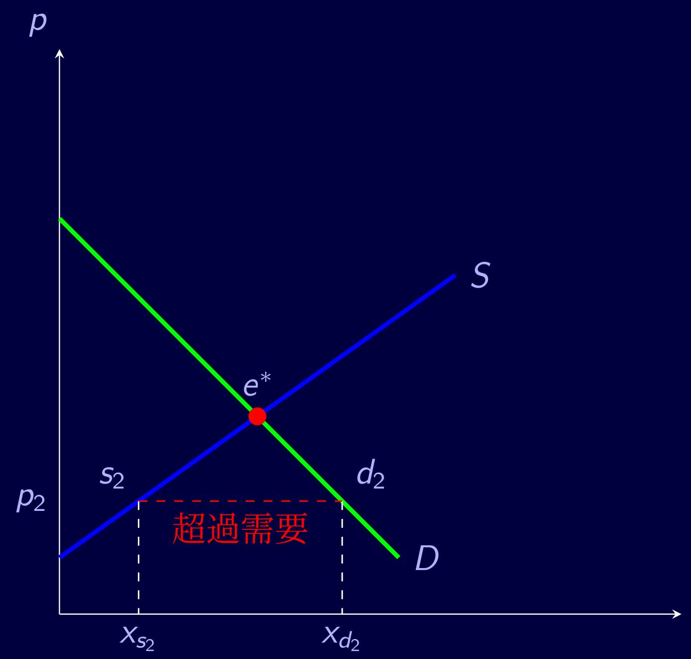
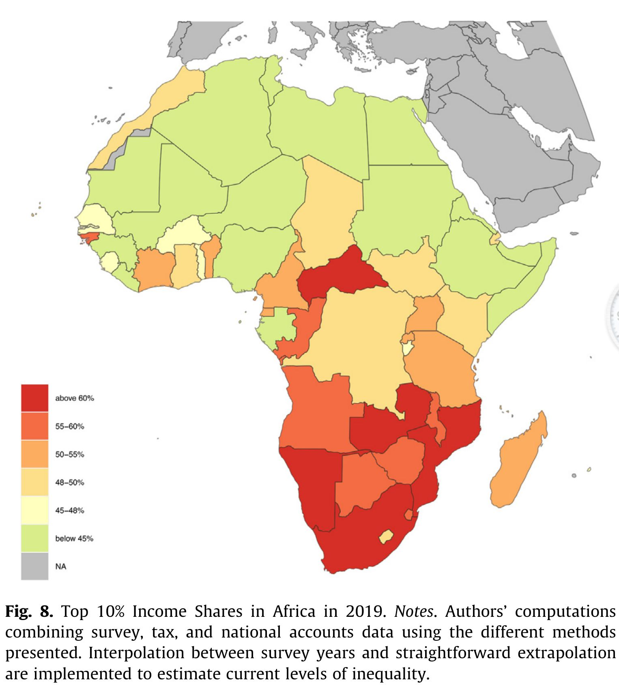
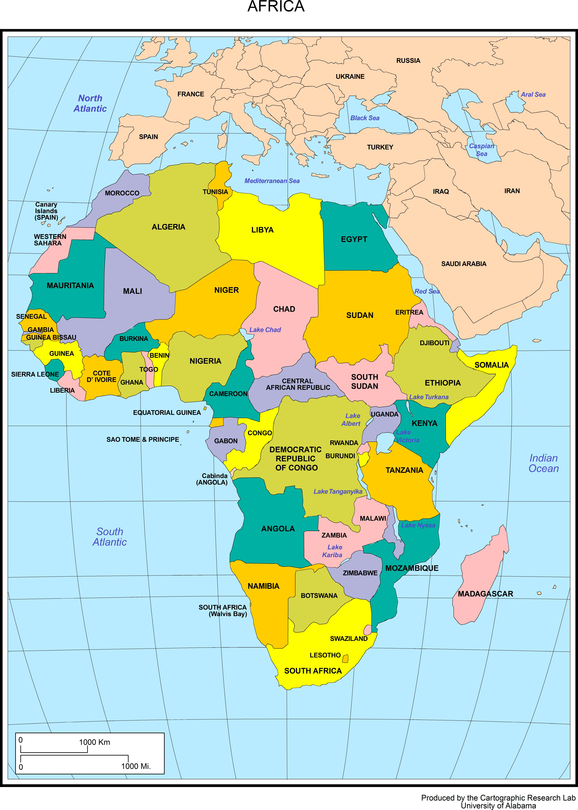
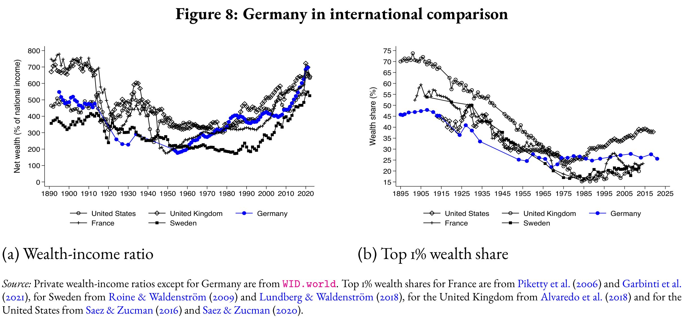
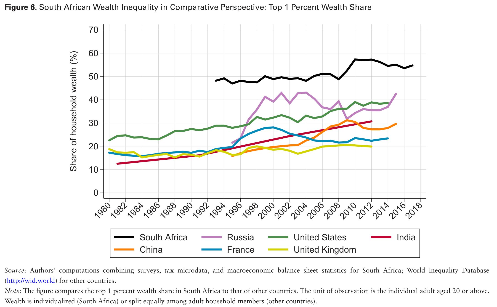

:::::: {.columns}
::::{.column width="50%"}

::: {.fragment fragment-index=2}
{height=600}
:::

::: {.fragment fragment-index=3}
これも価格が安すぎる例です\
(少し前の銀座三越)
:::

::::

::::{.column width="50%"}

::: {.fragment .fade-out fragment-index="1,4"}
{height=700}
:::

::::
:::::::

* 均衡価格よりも低ければ「安すぎ」です
* ハイ・ブランドかどうか、価格水準が高いかは本質的ではありません

----

<div class=big-code>
::: {.callout-note appearance="minimal"}
事例については理解することができたのですが、グラフの理解が難しいように思いました。初歩的な疑問で恐縮なのですが、そもそもの計算式についてこれらが何を示しているのかを理解できれば、講義の内容もより理解できると思うのですが、毎回の講義でどの程度理解できていれば良いのでしょうか。
:::
</div>

一人あたりGDPは難しくないので、キャッチアップの図でしょうか。少し説明が足りなかったかもしれません。

* 貧しい国が豊かな国と同じような所得になるためには、貧しい国の一人あたりGDP成長率が豊かな国よりも高くなる必要があります。
* 横軸に一人あたりGDP、縦軸に一人あたりGDP成長率にとると、左(一人あたりGDPが小さい国)ほど高い位置、ということです。
* 左に行くほど高い=右下がり=負の傾き
* 右辺に一人あたりGDP$y_{t}$、左辺にその次の年の一人あたりGDP成長率$\Delta y_{t+1}$をとっても、キャッチアップするには負の傾きが必要です
$$
\Delta y_{t+1}=a+b*y_{t}+e_{t}
$$
* $b<0$ならば、キャッチアップ過程にあるという解釈と矛盾しません

----

<div class=big-code>
::: {.callout-note appearance="minimal"}
今回もかなり理解するのに苦戦しました。前期にラテンアメリカ地域論という授業を履修しておりそこでもその土地の生産性や経済などを表す数値や単位？が出て来たので少し理解しやすかったです。全世界的にこういった富の割合などを数値化してみようとなり始めたのはいつ頃なのか、また何を目的に始まったのか気になりました。
:::
</div>

* RPにはどの部分が理解しづらかったかを書いていただくと、具体的に返答できるので有り難いです
* 土地の(各穀物別)生産性はFAOが[詳細なデータを公開](https://gaez.fao.org/pages/crop-summary)しています

----

<div class=big-code>
::: {.callout-note appearance="minimal"}
今回もかなり理解するのに苦戦しました。前期にラテンアメリカ地域論という授業を履修しておりそこでもその土地の生産性や経済などを表す数値や単位？が出て来たので少し理解しやすかったです。全世界的にこういった富の割合などを数値化してみようとなり始めたのはいつ頃なのか、また何を目的に始まったのか気になりました。
:::
</div>

* 富の配分を数値化する試みは比較的新しいです
* 全世界の所得分配については、ILO、世界銀行、各国政府が地道に収集してきた家計調査データを使い、各国間で比較可能なデータを作っている研究者がいます[@Gethin2025]

:::::: {.columns}
::::{.column width="30%"}
::: {.fragment}
{height=300}
:::
::::

::::{.column width="20%"}
::: {.fragment}
{height=300}
:::
::::

::::{.column width="50%"}
::: {.fragment}
不平等: 南高北低
:::
::::
:::::::


----

<div class=big-code>
::: {.callout-note appearance="minimal"}
今回もかなり理解するのに苦戦しました。前期にラテンアメリカ地域論という授業を履修しておりそこでもその土地の生産性や経済などを表す数値や単位？が出て来たので少し理解しやすかったです。全世界的にこういった富の割合などを数値化してみようとなり始めたのはいつ頃なのか、また何を目的に始まったのか気になりました。
:::
</div>

:::::: {.columns}
::::{.column width="48%"}
::: {.fragment}
{height=300}
:::
::::

::::{.column width="48%"}
::: {.fragment}
{height=300}
:::
::::

:::::::


* 富の配分は一国のみで分析[@ChatterjeeCzajkaGethin2022; @BhartiChancelPikettySomanchi2026]
    * 国税庁が金融資産、一部実物資産(不動産路線価)、相続資産などの情報を所有
    * 何を含めるか、金額区分など、税制設計が違うために各国横並び比較は難しい
    * 非公開株、動産はフロー(利潤や所得)のみが捕捉、ストック(資産価値)は把握不可
    * 超富裕層は富を素直に申告しないことも原因です


----

<div class=big-code>
::: {.callout-note appearance="minimal"}
今回もかなり理解するのに苦戦しました。前期にラテンアメリカ地域論という授業を履修しておりそこでもその土地の生産性や経済などを表す数値や単位？が出て来たので少し理解しやすかったです。全世界的にこういった富の割合などを数値化してみようとなり始めたのはいつ頃なのか、また何を目的に始まったのか気になりました。
:::
</div>


* 資産分配が研究され始めたのは、おそらく @Piketty2014; @PikettySaez2014 以降です
* Capital in the 21st Century刊行と前後して2010年代から経済格差が問題視されるようになってきました
* この時期に格差に焦点が当てられたきっかけは分かりません
* しかし、1980年代から所得上位層とそれ以下の所得層の格差が拡大してきました
* 2009年以降のGreat Recession(リーマン危機)で、世界的に中低所得者が困っていたためかもしれません

----


<div class=big-code>
::: {.callout-note appearance="minimal"}
プロテスタンティズムの倫理や名誉革命といった、これまで経済の発展の要因として提示されてきた理論を、安易に受け入れるのではなく、実際にデータを用いて検討し、その整合性を確かめるという話が大変興味深かった。また、こういった検証や分析を比較的可能にするという点で、プログラミングを使用する意義を実感した。さらに、BTB政策の事例を通じて、開発経済学と行動経済学の違いは何か疑問に思った。
:::
</div>

* 誤解はないと思いますが...ウェーバーの「プロテスタンティズムの倫理」は(当時としては)緻密な数量論証です。名誉革命を産業革命の引き金とする研究[@NorthWeingast1989]も、史料を綿密に分析した数量論証です。
* しかし、特定の制度変更に成長促進効果があった、という因果関係を論証するには粗すぎるデータと分析方法です
* @BouscasseNakamuraSteinsson2025 は労働生産性を推計し、成長の開始期と加速期を見出すことで、時期が外れている仮説を除外し、整合的な仮説を絞り込みました
* BTB政策は行動経済学と直接の関係はありません
* BTB政策は経済学の有用性を示す例として挙げました
* 行動経済学はそれまでの経済学と異なる分析枠組みを提示し、その成果が開発経済学でも取り入れられています

----

<div class=big-code>
::: {.callout-note appearance="minimal"}
今回の授業から政策の目的が正しくても、期待した効果が得られるとは限らないと感じた。中国の塾授業料規制は、教育費を抑えて少子化を改善する狙いがある。しかし、塾の収益が減ると、講師の減少や塾の撤退につながる可能性がある。将来を考えると、子育て支援には金銭面だけでなく、仕事と育児を両立できる環境づくりも必要だと思った。アメリカの「Ban the Box政策」も、犯罪歴のある人の就職を支援する一方、企業が人種や年齢から犯罪歴を推測し、差別を広げる可能性が示されていた。ただし、その後の研究では異なる結果もあり、**一つの研究だけで判断しない姿勢が大切**だと感じた。両国の事例から、政策を評価するには、**善意だけでなく、人や企業の反応と実際の効果を確認する必要がある**と学んだ。
:::
</div>

* 中国の「少子化対策」(?)としての塾授業料規制は、誰もが「効果無さそう」
* ボックスをなくすBTBは多くの人に支持されました
    * ボックスが元収監者の社会復帰を妨げているため
* しかし、ボックスがなぜあったのか、誰がどのように利用していたのかをBTB支持者は考えなかったため、ボックスをなくして以前よりも悪い状態にした可能性があります
* 既存の政策には存在理由があるので、政策を変更するならばその影響を考えるべき
* 善意は一時的、部分的にしか動員できない
* 善意なしで目標を達成する手段を考えるべき
    * 人々や企業の自己中心的な(効用最大化、利潤最大化)行動を前提にした手段

----

<div class=big-code>
::: {.callout-note appearance="minimal"}
ボックス禁止政策の事例では、犯罪歴という情報を制限することで企業が人種や年齢など別の情報からリスクを推測し、統計的差別につながる可能性が示されていました。...(中略)...想定されたメカニズムから起こり得る現象を予測し、実際のデータにその傾向が表れているかを確認することで、原因と結果の関係を検討していました。...(中略)...**原因やメカニズムから予測を立て、データと照らし合わせながらその妥当性を検討**していくところまでが一連の流れなのだと思いました。
:::
</div>

仮説・理論 &rarr; 検証可能な関係 &rarr; データを使った仮説検定 &rarr; 解釈・結論


:::::: {.columns}
::::{.column width="50%"}
::: {.fragment}
データがないと何も始まらないので、実際には以下の手順も多い
:::

1. データを見て何が推計できるか知る
1. 仮説・理論をたてる
1. 仮説検定
1. 解釈・結論
::::

::::{.column width="50%"}
::: {.fragment}
下記の手順だったのに、左の順番でやったように書いてはいけない(<span class="OrangeULine">h</span>ypothesize <span class="OrangeULine">a</span>fter the <span class="OrangeULine">r</span>esults are <span class="OrangeULine">k</span>nown, harking)\
&larr;QRP(<span class="OrangeULine">q</span>uestionable <span class="OrangeULine">r</span>esearch <span class="OrangeULine">p</span>ractice)
:::

1. データを見て何が推計できるか知る
1. 仮説検定
1. 仮説・理論をたてる
1. 解釈・結論
::::
:::::::

* 仮説が支持されるのを分かっているから検定にならないためです
* 仮説を検定して、これに整合的な理論はこれです、と正直に書く(探索的)研究はok


----

<div class=big-code>
::: {.callout-note appearance="minimal"}
結婚や出産には育児費用だけでなく、仕事や時間などの機会費用もあるため、経済的な支援だけでは十分ではないと思いました。少子化対策には、子どもを持ちたい人が安心して結婚、出産できる社会環境を整えることが重要だと考えます。
:::
</div>

* 男女が合意して子どもを産む決断をすることを踏まえると、さまざまなジェンダー格差が障壁となることが想像できます
* 過去の家庭内分業形態での女性のキャリアパス
    * 昭和: 寿退社&rarr;家事+出産&rarr;家事+育児&rarr;老後
    * 平成: 結婚+家事&rarr;時短+家事+出産&rarr;(時短)+家事+育児&rarr;老後
* 女性の就学年数&uarr;, 労働力&darr;, 実質賃金上昇率&darr; &rArr; 女性の平均初婚年齢&uarr;, 出生率&darr;
* 男性の育休日数が短い、女性が(平日の)保育園入園前育児をほぼすべて負担
    * 男性は出世(キャリア)に響くため
    * 女性はそもそも「復職」できていないから出世を考慮する余地すらない
* 「残業が...」を理由に男性が家事・育児を分担しない
    * 職場が残業日を決めればよい&rarr;予定を決めて分担
    * テレワーク

----

<div class=big-code>
::: {.callout-note appearance="minimal"}
結婚や出産には育児費用だけでなく、仕事や時間などの機会費用もあるため、経済的な支援だけでは十分ではないと思いました。少子化対策には、子どもを持ちたい人が安心して結婚、出産できる社会環境を整えることが重要だと考えます。
:::
</div>

* 育児中従業員の処遇が十分で、社内のジェンダー格差がなければ、女性が出産に反対する傾向は緩む
    * 権利化(育休、時短勤務などの制度)や旗振り(女性管理職登用目標)はあるが、運用は?
* 一企業だけで対応すると他企業との競争に負けるかも&rarr;社会全体で対応
    * 各企業: 優秀な人を雇うために対応したい
    * 協調の失敗coordination failure
    * 実際: 競争力のある(生産性が高い、市場支配力がある)企業から対応が進むはず

----

<div class=big-code>
::: {.callout-note appearance="minimal"}
初めて開発経済学というものに触れる...(中略)...誰もおいていかないという気持ちから生まれた学問なのかなと思い非常に興味がわいた。
:::
</div>

* 開発経済学自体は純粋な学問的興味によって蓄積が進みました
* しかし、予算を提供する政府などには、第2次大戦後当初は植民地支配という負債の返済、反共産化、人道的支援などの動機があったと思います
* 現在: 市場開拓・育成、政治的安定、気候変動対策、グローバル・ヘルス対策など
* 研究者の間では\
先進国の人口&darr;\
&rArr; 世界の高学歴人口&darr;\
&rArr; 世界の技術革新&darr; \
&rArr; 世界の成長率&darr;\
という懸念があります
* 人口が増える地域=途上国から高学歴者を補うことも視野にあるかも
    * 世界全体(1980-2019, @Gethin2025 ): \
    就学年数&uarr; &rArr; 下位20%ｰ40%所得階層の所得&uarr;の40-70%を説明\
    なので貧困層の底上げにもなる


----

<div class=big-code>
::: {.callout-note appearance="minimal"}
日本では、そもそも前科がある人の雇用に関して大きな関心が持たれていない印象が強く、日本とアメリカの異文化が背景にあるのだろうと考えます。この点については、日本での雇用環境との違いを再認識する機会になりました。アメリカでの職業差別に対する政策が抱えるジレンマに触れることで、日本の雇用慣行に関する考え方も一度見直す必要があるのではないかとも思いました。
:::
</div>

断片的な情報しか知りませんが、日本でも犯罪歴のある人が再就職して生計を立てることは困難です  

アメリカとの差は、

* 銃やドラッグがアメリカほど蔓延しておらず、犯罪発生率が低いこと  
* 人種の違いが少ないので、人種差別の件数が少なく顕在化していないこと  

. . .

国際比較可能なデータを見つけたので、次ページで殺人犠牲者数比率(10万人あたり)を比較しました

----

```{r read homicide data, eval = T, results = "hide"}
grepout <- function(str, x)
  # returns element of match (not numbers)
  x[grep(str, x, perl = T)]
library(data.table)
hd <- fread("02/HomicideData.tsv", skip = 2, header = T)
#### Change column name: Unit of measurement => Units
#### Change column name: Iso3_code => iso3
setnames(hd, c(grepout("Uni", colnames(hd)), "Iso3_code"), c("Units", "iso3"))
#### Character columns => factor columns
chacol <- colnames(hd)[grepl("cha", sapply(hd, class))]
hd[, (chacol) := lapply(.SD, factor), .SDcol = chacol]
#### Choose data:
####   Total for Sex, Age, Dimension, Category
####   Units = Rates per 10000, Indicator != Regional estimates
####   iso3 must be 3 characters long (>3 is a region of a country)
hdt <- hd[grepl("T", Sex) & grepl("T", Age) & grepl("T", Dimension) & 
  grepl("T", Category) & grepl("Rate", Units) & !grepl("Reg", Indicator) & 
  nchar(as.character(iso3)) == 3, ]
summary(hdt)
#### Drop unused levels in factors
hdt[, (chacol) := lapply(.SD, droplevels), .SDcol = chacol]
summary(hdt)
#### Use only number of victims
hdt <- hdt[grepl("Vic", Indicator), ]
hdt[, (chacol) := lapply(.SD, droplevels), .SDcol = chacol]
```
年ごとの標本サイズを調べます
```{r, eval = T}
table(hdt[, Year])
```

最近年で標本サイズが大きい2020年を選んで描画

:::::{.columns}

::::{.column width="70%"}
```{r plot homicide in 2020, eval = T, width = 800}
#### Tabulate num of observations by year: 
####   2020 is most recent among large number of obs
setkey(hdt, Year, VALUE)
setorder(hdt, Year, -VALUE)
library(ggplot2)
hdt2 <- hdt[grepl("2020", Year), .(iso3, VALUE)]
hdt2[, iso3 := factor(iso3, levels = 
reorder(iso3, -VALUE)
)]
ggplot(data = hdt2[c(1:39, grep("JPN", iso3)), ], 
    aes(x = iso3, y = VALUE)) +
  geom_col() +
  theme(
    axis.text.x = element_text(size = 10, angle = 45, hjust = 1, vjust = 1)
  )
```


::: {style="font-size: 50%;"}
出所: <https://dataunodc.un.org/dp-intentional-homicide-victims>
:::
::::

::::{.column width="30%"}
* 日本よりも相当多い(20倍以上)  
::::

:::::

----

データを読んで整形するRのコード

```{r echo = F}
knitr::opts_chunk$set(
  tidy = FALSE, cache.extra = packageVersion('tufte'), 
  margin_references = TRUE,
  #### remove leading hashes in html output
  comment = NA, eval = F, 
  echo = "fenced", cache = F, 
  class.source = "SeiroBenign", class.output = "SeiroLightGreen"
  )

```

::: {style="font-size: 100%;"}
```{r read UN homicide data, eval = F}
grepout <- function(str, x)
  # returns element of match (not numbers)
  x[grep(str, x, perl = T)]
library(data.table)
hd <- fread("02/HomicideData.tsv", skip = 2, header = T)
#### Change column name: Unit of measurement => Units
#### Change column name: Iso3_code => iso3
setnames(hd, c(grepout("Uni", colnames(hd)), "Iso3_code"), c("Units", "iso3"))
#### Character columns => factor columns
chacol <- colnames(hd)[grepl("cha", sapply(hd, class))]
hd[, (chacol) := lapply(.SD, factor), .SDcol = chacol]
#### Choose data:
####   Total for Sex, Age, Dimension, Category
####   Units = Rates per 10000, Indicator != Regional estimates
####   iso3 must be 3 characters long (>3 is a region of a country)
hdt <- hd[grepl("T", Sex) & grepl("T", Age) & grepl("T", Dimension) & 
  grepl("T", Category) & grepl("Rate", Units) & !grepl("Reg", Indicator) & 
  nchar(as.character(iso3)) == 3, ]
summary(hdt)
#### Drop unused levels in factors
hdt[, (chacol) := lapply(.SD, droplevels), .SDcol = chacol]
summary(hdt)
#### Use only number of victims
hdt <- hdt[grepl("Vic", Indicator), ]
hdt[, (chacol) := lapply(.SD, droplevels), .SDcol = chacol]
```
:::

----


年ごとの標本サイズ

```{r, eval = F}
table(hdt[, Year])
```

描画

```{r plot UN homicide in 2020, eval = F, width = 800}
#### Tabulate num of observations by year: 
####   2020 is most recent among large number of obs
setkey(hdt, Year, VALUE)
setorder(hdt, Year, -VALUE)
library(ggplot2)
hdt2 <- hdt[grepl("2020", Year), .(iso3, VALUE)]
hdt2[, iso3 := factor(iso3, levels = 
reorder(iso3, -VALUE)
)]
ggplot(data = hdt2[c(1:39, grep("JPN", iso3)), ], 
    aes(x = iso3, y = VALUE)) +
  geom_col() +
  theme(
    axis.text.x = element_text(size = 10, angle = 45, hjust = 1, vjust = 1)
  )
```

----
